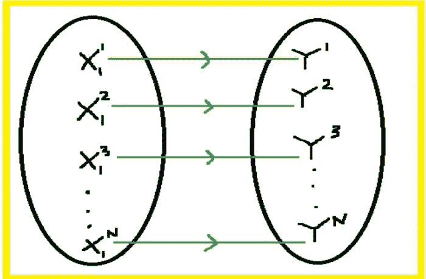
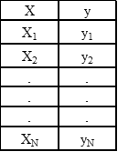
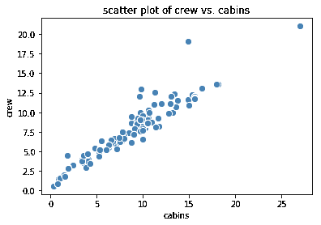
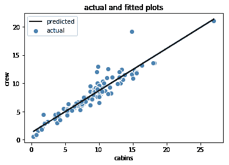
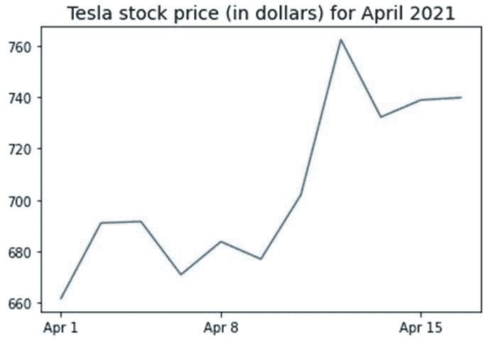
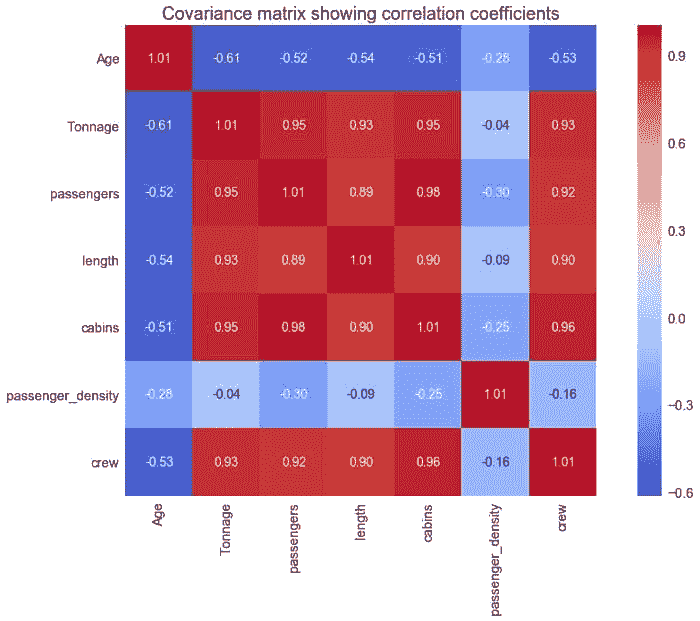

# 数据科学中的函数理解

> 原文：[`www.kdnuggets.com/2022/06/understanding-functions-data-science.html`](https://www.kdnuggets.com/2022/06/understanding-functions-data-science.html)

作者提供的图像

## 主要要点

+   大多数希望进入数据科学领域的初学者总是担心数学要求。

+   数据科学是一个非常量化的领域，要求高水平的数学能力。

+   但要开始，你只需掌握几个数学主题。

+   本文讨论了函数在数据科学和机器学习中的重要性。

* * *

## 我们的前三个课程推荐

 1\. [谷歌网络安全证书](https://www.kdnuggets.com/google-cybersecurity) - 快速进入网络安全职业生涯。

 2\. [谷歌数据分析专业证书](https://www.kdnuggets.com/google-data-analytics) - 提升你的数据分析技能

 3\. [谷歌 IT 支持专业证书](https://www.kdnuggets.com/google-itsupport) - 支持你的组织 IT

* * *

# 函数

大多数基础数据科学都集中在寻找***特征***（***预测变量***）与***目标变量***（***结果***）之间的关系。预测变量也称为***自变量***，而目标变量是***因变量***。

函数的重要性在于它们可以用于预测目的。如果能找到描述*X*与*y*之间关系的函数，即*y = f (X)*，那么对于任何新的*X*值，就可以预测对应的*y*值。

为了简化，我们将假设目标变量取连续值，即我们将关注回归问题。本文讨论的相同原则也适用于目标变量仅取离散值的分类问题，例如 0 或 1。本文将重点讨论线性函数，因为它们构成了数据科学和机器学习中大多数线性模型的基础。

## 1\. 单一预测变量的线性函数

假设我们有一个一维数据集，包含一个特征（X）和一个结果（*y*），并且假设数据集中有*N*个观测值：

**表 1**. 带有单一预测变量的简单一维数据集。

目标是找到*X*与*y*之间的关系。首先需要生成一个散点图，以便我们了解*X*与*y*之间的关系类型。它是线性的、二次的，还是周期性的？例如，使用游轮数据集 [**cruise_ship_info.csv**](https://github.com/bot13956/ML_Model_for_Predicting_Ships_Crew_Size)，并取*X = 舱位*和*y = 船员*，散点图如下所示：

**图 1**。船员与舱位的散点图 | 作者提供的图像

从**图 1**中，我们观察到预测变量（*舱位*）和目标变量（*船员*）之间存在大致的线性关系。一个简单的线性模型拟合数据如下所示：

其中*w0*和*w1*是可以通过简单线性回归获得的权重。当进行简单线性回归时，结果图示在**图 2**中，*R2 分数*为 0.904。

**图 2**。船员与舱位的实际和拟合图 | 作者提供的图像

有时，预测变量和目标变量之间没有明显的可预测关系。在这种情况下，不能使用函数来量化关系，例如，**图 3**所示。

**图 3**。2021 年 4 月前 16 天的特斯拉股价 | 作者提供的图像

## 2\. 带有多个预测变量的线性函数

在前面的例子中，我们使用了*X = 舱位*和*y = 船员*。现在假设我们想使用整个数据集（参见**表 1**）。

**表 2**：显示了数据集 [cruise_ship_info.csv](https://github.com/bot13956/ML_Model_for_Predicting_Ships_Crew_Size) 的前 5 行。

在这种情况下，我们的预测变量是一个向量 X = *(年龄，吨位，乘客，长度，舱位，乘客密度)*，并且* y = 船员*。

由于我们的目标变量现在依赖于 6 个预测变量，我们需要计算并可视化协方差矩阵，以查看哪些变量与目标变量有强相关性（参见**图 4**）。

协方差矩阵图显示相关系数

从上面的协方差矩阵图（**图 4**）中，我们看到“*船员*”变量与 4 个预测变量（X = (*吨位*，*乘客*，*长度*，*舱位*)）有强相关性（相关系数约为 0.6）。因此，我们可以建立一个多重回归模型，如下所示：

其中*X*是特征矩阵，*w0*是截距，*w1*、*w2*、*w3*和*w4*是回归系数。有关该问题的多元回归模型的完整 Python 实现，请参见这个 GitHub 库：[`github.com/bot13956/Machine_Learning_Process_Tutorial`](https://github.com/bot13956/Machine_Learning_Process_Tutorial)

# 总结

+   大多数数据科学问题归结为找到描述特征与目标变量之间关系的数学函数。

+   如果可以确定这个函数，那么它可以用于预测给定预测值的新目标值。

+   大多数数据科学问题可以近似为线性模型（单个或多个预测变量）。

**[本杰明·O·泰奥](https://www.linkedin.com/in/benjamin-o-tayo-ph-d-a2717511/)**是一位物理学家、数据科学教育者和作家，同时也是 DataScienceHub 的所有者。此前，本杰明曾在中央俄克拉荷马大学、大峡谷大学和匹兹堡州立大学教授工程学和物理学。

### 更多相关主题

+   [KDnuggets™ 新闻 22:n03，1 月 19 日：深入了解 13 个数据…](https://www.kdnuggets.com/2022/n03.html)

+   [你应该了解的五大 SQL 窗口函数，用于数据科学面试](https://www.kdnuggets.com/2022/01/top-five-sql-window-functions-know-data-science-interviews.html)

+   [数据科学家必知的 10 个基本 Pandas 函数](https://www.kdnuggets.com/10-essential-pandas-functions-every-data-scientist-should-know)

+   [7 个 Pandas 绘图函数，用于快速数据可视化](https://www.kdnuggets.com/7-pandas-plotting-functions-for-quick-data-visualization)

+   [解锁数据洞察：有效分析的关键 Pandas 函数](https://www.kdnuggets.com/unlocking-data-insights-key-pandas-functions-for-effective-analysis)

+   [损失函数：解释说明](https://www.kdnuggets.com/2022/03/loss-functions-explainer.html)
