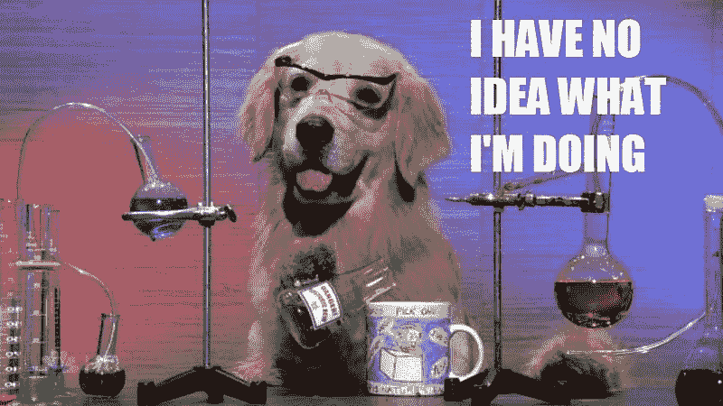
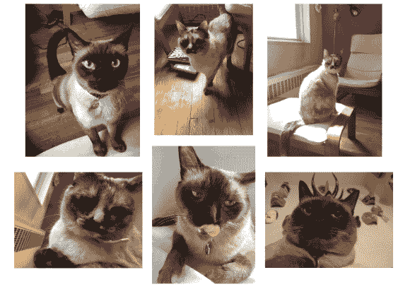
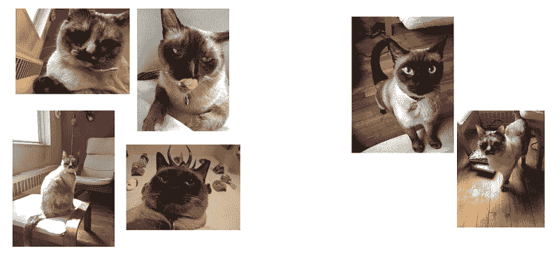
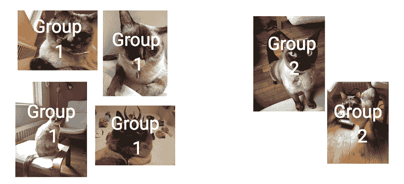
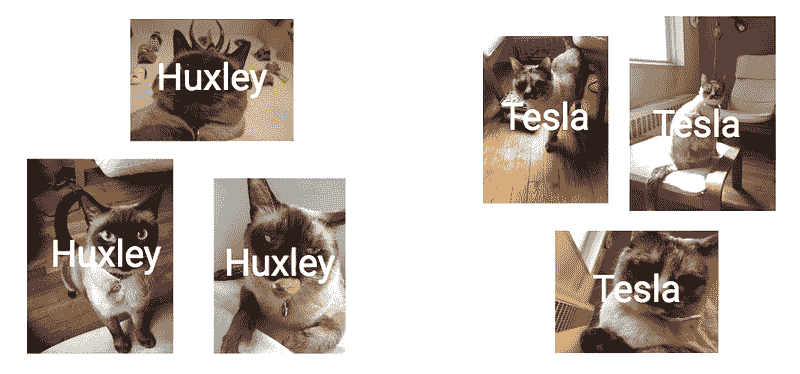

# 无监督学习揭秘

> 原文：[`www.kdnuggets.com/2018/08/unsupervised-learning-demystified.html`](https://www.kdnuggets.com/2018/08/unsupervised-learning-demystified.html)

 评论

无监督学习听起来可能像是“*让孩子们自己学会不要碰热烤箱*”的华丽说法，但实际上它是一种从数据中挖掘灵感的模式发现技术。它与机器在没有成人监督的情况下跑来跑去、形成自己对事物的看法无关。让我们揭开谜底吧！

如果这让你感到熟悉，无监督机器学习可能是你的新朋友。

本文适合初学者，但假设你对**到目前为止的故事**有所了解：

+   机器学习就是关于[通过示例对事物进行标记](https://hackernoon.com/the-simplest-explanation-of-machine-learning-youll-ever-read-bebc0700047c)。

+   如果你通过提供你所寻找的答案来训练你的系统，那就是在进行[监督学习](https://towardsdatascience.com/explaining-supervised-learning-to-a-kid-c2236f423e0f)。

+   要[开始](https://hackernoon.com/imagine-a-drunk-island-advice-for-finding-ai-use-cases-8d47495d4c3f)监督学习，你需要知道你想要什么标签。（无监督学习则不然。）

+   标准术语包括[实例、特征、标签、模型和算法](https://towardsdatascience.com/explaining-supervised-learning-to-a-kid-c2236f423e0f)。

### **什么是无监督学习？**

你的任务？随意将这六张图片分成两组。

查看上面的六个[实例](https://towardsdatascience.com/explaining-supervised-learning-to-a-kid-c2236f423e0f)。缺少了什么？这些照片没有标签。不用担心，你的大脑在无监督学习方面很厉害。我们来试试吧。

想想你希望如何将这些图像分成两组。没有错误的答案。准备好了吗？

### **对数据进行聚类**

在一个实时课堂上，谷歌员工会喊出像“*坐着还是站着*”、“*能看到木地板还是不能*”、“*猫自拍还是非猫自拍*”这样的答案。我们来检查第一个答案。

将图像分成两类的一种方法是：坐着与站立。嗯，“坐着”与站立。

### **无监督学习的秘密标签**

如果你选择根据猫是否站立来定义你的聚类，你的系统输出的标签是什么？毕竟，机器学习就是关于[对事物进行标记](https://hackernoon.com/the-simplest-explanation-of-machine-learning-youll-ever-read-bebc0700047c)的。

如果你认为“*坐着与站着*”是标签，那就再想想吧！那是你用来创建集群的配方（模型）。无监督学习中的标签要无聊得多：比如“*组 1 和组 2*”或“*A 或 B*”或“*0 或 1*”。它们只是表示群组成员关系，没有额外的人类可解释（或诗意）的意义。

无监督学习的标签仅仅表示集群成员关系。它们没有更高的人类可解释的意义，尽管这可能令人失望。

这里发生的只是算法根据相似性对事物进行分组。相似性度量由算法选择决定，但为什么不尝试尽可能多的算法呢？毕竟，你不知道自己在寻找什么，这没关系。把无监督学习看作是“*物以类聚*”的一种数学版本。

像一个 [罗夏墨迹测验](https://en.m.wikipedia.org/wiki/Rorschach_test)，结果在于帮助你做梦。

不要过于认真地对待你看到的内容。

### **再看一眼！**

作为这两只独立猫咪的骄傲母亲，我感到遗憾，在我教了这个课程约 50 次的过程中，只有一个观众注意到了：“*猫 1 与猫 2*。” 相反，得到的回答却是“*坐着、站着*”或“*木地板缺失/存在*”或有时甚至是“*丑猫与漂亮猫*。”（哎呀。）

原来这些是我两只独立猫咪的照片！也许你看出来了，但大多数观众没看出来……除非我给他们标签（监督他们的学习）。如果我一开始就用名字标签展示数据，然后让你对下一张照片进行分类，我敢打赌你会觉得任务很简单。

### **总结经验**

想象一下我是一名初学者数据科学家，刚刚开始进行无监督学习，自然对自己两只猫很感兴趣。当我查看这些数据时，我无法忽视我的猫咪。因为我的小可爱对我来说如此重要，我期望我的无监督机器学习系统能恢复唯一值得关心的东西。哎呀！

在这十年之前，计算机甚至无法与世界上最优秀的模式发现者——人脑竞争。这对人来说很简单！那么，为什么成千上万的谷歌员工看到这些未标记的照片却错过了“*猫 1 与猫 2*”的答案呢？

> 把无监督学习看作是“物以类聚”的一种数学版本。

仅仅因为某些东西对我有趣，并不意味着我的模式发现器能找到它。即使模式发现器很棒，我也没有告诉它我在寻找什么，所以为什么要期望我的[学习算法](https://www.youtube.com/watch?v=iLu9XyZ55oI&feature=youtu.be&t=0h5m12s)能提供它呢？这不是魔法！如果我不告诉它正确的答案是什么……我就接受结果，不会感到不满。我能做的只是看看系统返回的簇，并看看是否觉得它们有启发。如果我不喜欢它们，我就不断运行不同的无监督算法（“观众中的其他人，为我换个方式分割”），直到有趣的东西出现。

> 结果如同罗夏墨迹图，帮助你做梦。

这个过程不一定会产生令人振奋的成果，但尝试一下也无妨。毕竟，探索未知本该是一种冒险。好好享受吧！

在未来的节目中，我们将探讨如果你忘记标签只是灵感而不应过于认真对待，甚至不应被视为可由人解释的，可能会发生的警示故事。（提示：可能会提到在一片吐司中发现埃尔维斯的故事。）它们只是用来给你一些关于下一个可能感兴趣的方向的想法。

***总结：*** 无监督学习通过将相似的事物分组，帮助你从数据中找到灵感。定义相似性的方式有很多，所以不断尝试算法和设置，直到一个酷炫的模式引起你的注意。

**个人简介： [Cassie Kozyrkov](https://twitter.com/quaesita)** 是谷歌首席决策智能工程师。❤️ 统计学，机器学习/人工智能，数据，双关语，艺术，戏剧，决策科学。所有观点均为个人意见。

[原文](https://hackernoon.com/unsupervised-learning-demystified-4060eecedeaf)。经许可转载。

**相关：**

+   数据科学家需要知道的 5 种聚类算法

+   K 均值在现实生活中的应用：聚类锻炼课程

+   使用 K 均值算法进行聚类

* * *

## 我们的前三大课程推荐

 1\. [谷歌网络安全证书](https://www.kdnuggets.com/google-cybersecurity) - 快速进入网络安全领域的职业生涯

 2\. [谷歌数据分析专业证书](https://www.kdnuggets.com/google-data-analytics) - 提升你的数据分析技能

 3\. [谷歌 IT 支持专业证书](https://www.kdnuggets.com/google-itsupport) - 支持你所在组织的 IT 工作

* * *

### 更多相关主题

+   [无监督解缠表示学习在类别不平衡数据集中的应用](https://www.kdnuggets.com/2023/01/unsupervised-disentangled-representation-learning-class-imbalanced-dataset-elastic-infogan.html)

+   [探索无监督学习指标](https://www.kdnuggets.com/2023/04/exploring-unsupervised-learning-metrics.html)

+   [使用 scikit-learn 进行聚类：无监督学习教程](https://www.kdnuggets.com/2023/05/clustering-scikitlearn-tutorial-unsupervised-learning.html)

+   [揭开无监督学习的面纱](https://www.kdnuggets.com/unveiling-unsupervised-learning)

+   [无监督学习实践：K 均值聚类](https://www.kdnuggets.com/handson-with-unsupervised-learning-kmeans-clustering)

+   [一个学习数据科学、机器学习和深度学习的全面计划](https://www.kdnuggets.com/2023/01/mwiti-solid-plan-learning-data-science-machine-learning-deep-learning.html)
