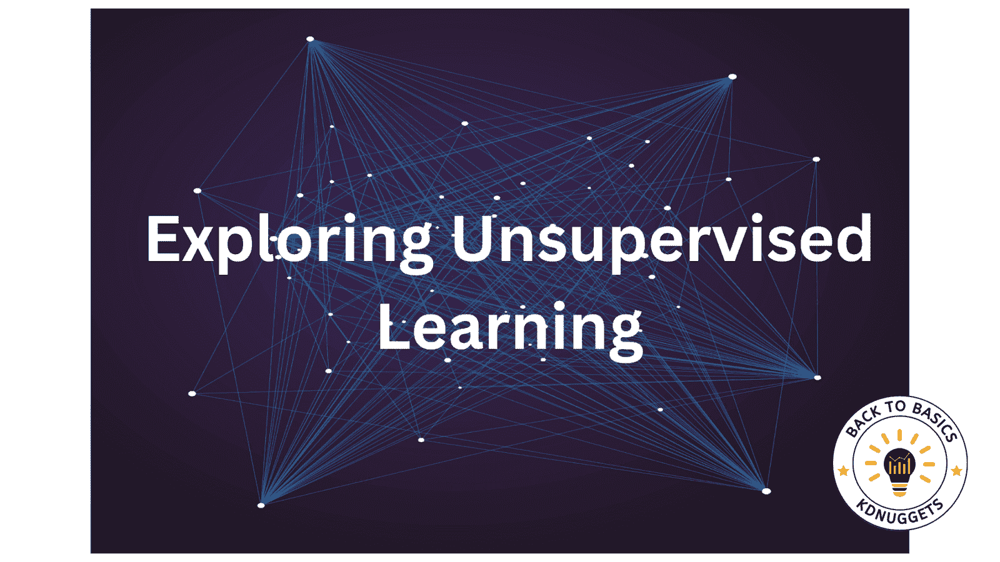
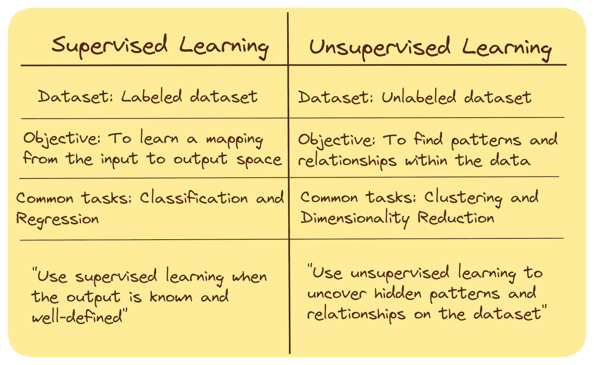

# 揭示无监督学习

> 原文：[`www.kdnuggets.com/unveiling-unsupervised-learning`](https://www.kdnuggets.com/unveiling-unsupervised-learning)

作者提供的图片

# 什么是无监督学习？

* * *

## 我们的前三大课程推荐

 1\. [谷歌网络安全证书](https://www.kdnuggets.com/google-cybersecurity) - 快速进入网络安全领域的职业生涯。

 2\. [谷歌数据分析专业证书](https://www.kdnuggets.com/google-data-analytics) - 提升你的数据分析技能

 3\. [谷歌 IT 支持专业证书](https://www.kdnuggets.com/google-itsupport) - 支持你所在组织的 IT

* * *

在机器学习中，**无监督学习**是一种在*未标记*数据集上训练算法的范式。因此，没有监督或标记输出。

在无监督学习中，目标是发现数据本身的模式、结构或关系，而不是基于标记的示例进行预测或分类。这涉及探索数据的内在结构，以获取洞察并理解复杂信息。

本指南将介绍无监督学习。我们将首先探讨监督学习和无监督学习之间的差异，为后续讨论奠定基础。接着，我们将介绍关键的无监督学习技术及其中的流行算法。

# 监督学习与无监督学习

监督学习和无监督学习是人工智能和数据分析领域中使用的两种不同方法。以下是它们关键差异的简要总结：

## 训练数据

在监督学习中，算法在**标记数据集**上进行训练，其中输入数据与对应的期望输出（标签或目标值）配对。

无监督学习则涉及处理**未标记的数据集**，其中没有预定义的输出标签。

## 目标

监督学习算法的目标是**学习关系**——**映射**——从输入到输出空间。一旦学会了这种映射，我们可以使用模型预测未见数据点的输出值或类别标签。

在无监督学习中，目标是**发现模式**、结构或关系，通常用于将数据点聚类到组中、进行探索性分析或特征提取。

## 常见任务

**分类**（为一个未见过的数据点分配一个类别标签——众多预定义类别之一）和**回归**（预测连续值）是监督学习中的常见任务。

**聚类**（将相似的数据点分组）和**降维**（在保留重要信息的同时减少特征数量）是无监督学习中的常见任务。我们将在稍后详细讨论这些内容。

## 何时使用

有监督学习广泛用于期望输出已知且定义明确的情况，例如垃圾邮件检测、图像分类和医学诊断。

无监督学习在对数据没有或仅有有限的先验知识时使用，其目标是揭示隐藏的模式或从数据本身中获得洞察。

以下是差异的总结：

有监督学习与无监督学习 | 图片由作者提供

**总结**：有监督学习侧重于从标记数据中学习，以进行预测或分类，而无监督学习则试图发现未标记数据中的模式和关系。两种方法各有其应用——根据数据的性质和当前问题。

# 无监督学习技术

如讨论所述，在无监督学习中，我们拥有输入数据并被要求在这些数据中寻找有意义的模式或表示。无监督学习算法通过识别数据点之间的相似性、差异和关系来实现这一点，而不提供预定义的类别或标签。

在本讨论中，我们将介绍两种主要的无监督学习技术：

+   聚类

+   降维

## 什么是聚类？

聚类涉及根据某种*相似性度量*将相似的数据点分组到一起。算法旨在找到数据中的自然组或类别，其中同一簇中的数据点*彼此更相似*，而与其他簇中的数据点相比则不那么相似。

一旦我们将数据集分成不同的簇，我们实际上可以对它们进行标记。如有需要，我们可以在聚类后的数据集上执行有监督学习。

## 什么是降维？

降维是指减少数据中特征——维度——数量的技术，同时保留重要信息。高维数据可能复杂且难以处理，因此降维有助于简化数据以便进行分析。

聚类和降维都是无监督学习中强大的技术，提供了宝贵的洞察力，并简化了复杂数据以便于进一步分析或建模。

在本文的剩余部分，让我们回顾重要的聚类和降维算法。

# 聚类算法：概述

如前所述，聚类是无监督学习中的一种基本技术，它涉及将相似的数据点分组到簇中，在同一簇内的数据点彼此之间比与其他簇中的数据点更相似。聚类有助于识别数据中的自然划分，这可以提供关于模式和关系的见解。

有各种算法用于聚类，每种算法都有其自身的方法和特性：

## K-Means 聚类

K-Means 聚类是一个简单、稳健且常用的算法。它通过根据每个簇中数据点的均值迭代更新簇质心，将数据划分为预定义数量的簇（K）。

它通过迭代精细化簇分配，直到收敛。

以下是 K-Means 聚类算法的工作原理：

1.  初始化 K 个簇的质心。

1.  根据选择的距离度量，将每个数据点分配到最近的簇质心。

1.  通过计算每个簇中数据点的均值来更新质心。

1.  重复步骤 2 和 3，直到收敛或达到定义的迭代次数。

## 层次聚类

层次聚类创建一个树状结构——一个**树形图**——的数据点，捕捉不同粒度层次的相似性。凝聚层次聚类是最常用的层次聚类算法。它从单独的数据点作为独立簇开始，并根据连接准则（如距离或相似性）逐渐合并它们。

以下是凝聚层次聚类算法的工作原理：

1.  从 `n` 个簇开始：每个数据点作为自己的簇。

1.  将最近的数据点/簇合并为一个更大的簇。

1.  重复 2 直到剩下一个簇或达到定义的簇数量。

1.  结果可以借助树形图进行解释。

## 基于密度的空间聚类（DBSCAN）

DBSCAN 根据邻域中数据点的密度识别簇。它可以发现任意形状的簇，并且还可以识别噪声点和检测离群点。

该算法包括以下（简化以包含关键步骤）：

1.  选择一个数据点，并找到其指定半径内的邻居。

1.  如果点有足够的邻居，通过包括其邻居的邻居来扩展簇。

1.  对所有点重复此操作，形成由密度连接的簇。

# 降维算法概述

降维是减少数据集中特征（维度）数量的过程，同时保留重要信息。高维数据可能复杂、计算开销大且容易过拟合。降维算法有助于简化数据表示和可视化。

## 主成分分析（PCA）

主成分分析——或 PCA——将数据转换到新的坐标系统，以最大化主成分方向的方差。它在尽可能保留方差的同时减少数据维度。

这里是你如何进行 PCA 进行降维：

1.  计算输入数据的协方差矩阵。

1.  对协方差矩阵进行特征值分解。计算协方差矩阵的特征向量和特征值。

1.  按特征值的降序排序特征向量。

1.  将数据投影到特征向量上，以创建低维表示。

## t-分布随机邻域嵌入（t-SNE）

我第一次使用 t-SNE 是为了可视化词嵌入。t-SNE 用于通过将高维数据降低到低维表示来进行可视化，同时保持局部成对相似性。

以下是 t-SNE 的工作原理：

1.  构建概率分布来测量高维和低维空间中数据点之间的成对相似性。

1.  使用梯度下降来最小化这些分布之间的差异。迭代地移动低维空间中的数据点，调整其位置以最小化成本函数。

此外，还有一些深度学习架构如自编码器可以用于降维。自编码器是设计用来编码然后解码数据的神经网络，有效地学习输入数据的压缩表示。

# 无监督学习的一些应用

让我们深入探讨无监督学习的一些应用。以下是一些例子：

## 客户细分

在营销中，企业使用无监督学习将客户群体细分为具有相似行为和偏好的组。这有助于定制营销策略、活动和产品供应。例如，零售商将客户分类为“预算购物者”、“奢侈品买家”和“偶尔购买者”等组。

## 文档聚类

你可以在文档语料库上运行聚类算法。这有助于将相似的文档分组，从而有助于文档的组织、搜索和检索。

## 异常检测

无监督学习可以用于识别数据中的稀有和异常模式——异常值。异常检测在欺诈检测和网络安全中有应用，以检测异常——异常行为。通过识别不寻常的消费模式来检测欺诈性信用卡交易是一个实际的例子。

## 图像压缩

聚类可以用于图像压缩，将图像从高维颜色空间转换为更低维的颜色空间。这通过用单个中心点表示相似的像素区域，从而减少图像存储和传输的大小。

## 社交网络分析

你可以分析社交网络数据——基于用户互动——以揭示社区、影响者和互动模式。

## 主题建模

在自然语言处理领域，主题建模任务用于从文本集合中提取主题。这有助于对大文本语料库中的主要主题进行分类和理解。

比如，我们有一批新闻文章的语料库，并且我们事先没有这些文档及其对应的类别。我们可以对这批新闻文章进行主题建模，以识别诸如政治、科技和娱乐等主题。

## 基因组数据分析

无监督学习在生物医学和基因组数据分析中也有应用。例如，通过根据基因的表达模式对基因进行聚类，以发现与特定疾病的潜在关联。

# 结论

我希望这篇文章能帮助你理解无监督学习的基础知识。下次你处理实际数据集时，尝试找出当前的学习问题，并评估是否可以将其建模为监督学习或无监督学习问题。

如果你正在处理具有高维特征的数据集，尝试在构建机器学习模型之前应用降维技术。继续学习！

**[Bala Priya C](https://www.linkedin.com/in/bala-priya/)** 是一位来自印度的开发者和技术写作专家。她喜欢在数学、编程、数据科学和内容创作的交集处工作。她的兴趣和专长领域包括 DevOps、数据科学和自然语言处理。她喜欢阅读、写作、编程和咖啡！目前，她正在通过撰写教程、操作指南、观点文章等，与开发者社区分享她的知识。

### 更多相关主题

+   [在类别不平衡数据集上进行无监督解缠表示学习](https://www.kdnuggets.com/2023/01/unsupervised-disentangled-representation-learning-class-imbalanced-dataset-elastic-infogan.html)

+   [探索无监督学习指标](https://www.kdnuggets.com/2023/04/exploring-unsupervised-learning-metrics.html)

+   [使用 scikit-learn 进行聚类：无监督学习教程](https://www.kdnuggets.com/2023/05/clustering-scikitlearn-tutorial-unsupervised-learning.html)

+   [无监督学习实战：K-Means 聚类](https://www.kdnuggets.com/handson-with-unsupervised-learning-kmeans-clustering)

+   [揭示 CTGAN 的潜力：利用生成式 AI 生成合成数据](https://www.kdnuggets.com/2023/04/unveiling-potential-ctgan-harnessing-generative-ai-synthetic-data.html)

+   [揭示 Midjourney 5.2：AI 图像生成的飞跃](https://www.kdnuggets.com/2023/06/unveiling-midjourney-52-leap-forward.html)
