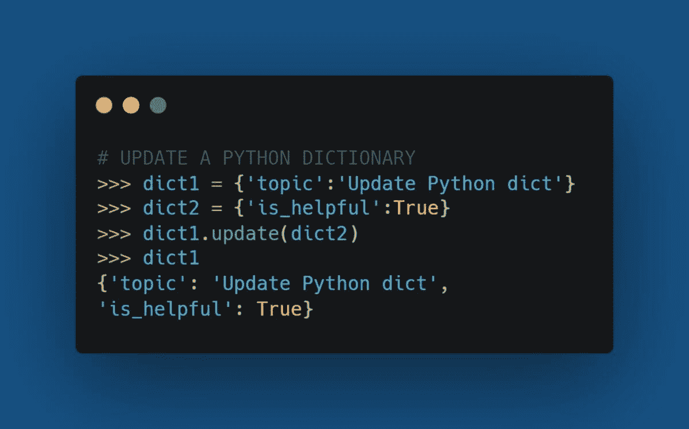
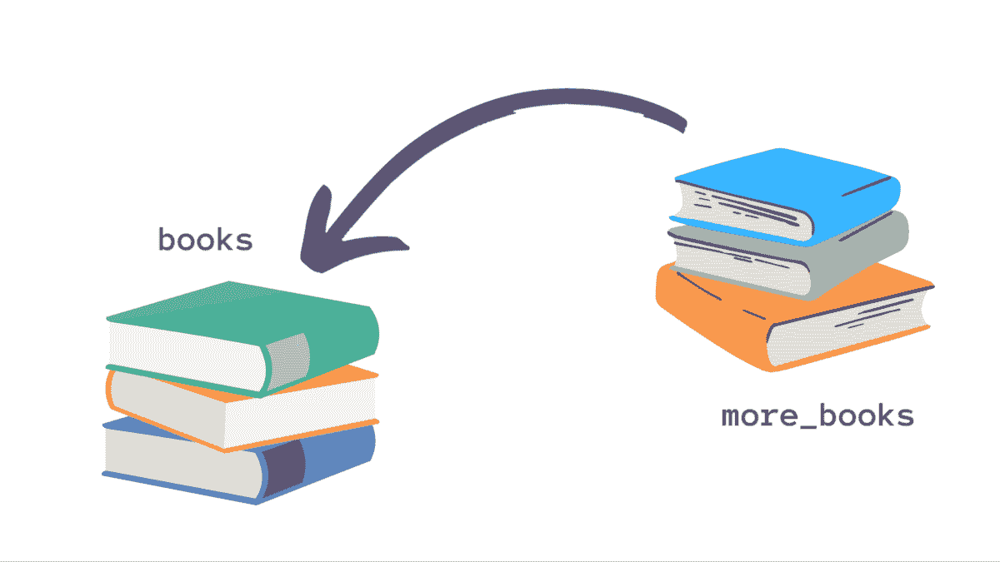

# 如何更新 Python 字典

> 原文：[`www.kdnuggets.com/2023/02/update-python-dictionary.html`](https://www.kdnuggets.com/2023/02/update-python-dictionary.html)



作者提供的图片

在 Python 中，字典是一个有用的内置数据结构，它允许你定义元素之间的键值对映射。你可以使用键来检索相应的值。你也可以随时更新字典中的一个或多个键。

* * *

## 我们的前三大课程推荐

 1\. [Google 网络安全证书](https://www.kdnuggets.com/google-cybersecurity) - 快速进入网络安全职业。

 2\. [Google 数据分析专业证书](https://www.kdnuggets.com/google-data-analytics) - 提升你的数据分析技能

 3\. [Google IT 支持专业证书](https://www.kdnuggets.com/google-itsupport) - 支持你所在组织的 IT

* * *

为此，你可以使用 for 循环或内置字典 `update()` 方法。在本指南中，你将学习这两种方法。

# 使用 For 循环更新 Python 字典

考虑以下字典 `books`：

```py
books = {'Fluent Python':50,
         'Learning Python':58}
```

在上面的字典中，书名（流行的 Python 编程书籍）是键，价格（美元）是值。请注意，`books` 字典是为本教程创建的，价格不对应实际价格。 :)

现在考虑另一个字典 `more_books`：

```py
more_books = {'Effective Python':40,
              'Think Python':29}
```



作者提供的图片

假设你想用 `more_books` 字典中的键值对更新 `books` 字典。你可以使用以下 for 循环来完成：

+   遍历 `more_books` 字典的键并访问其值，并且

+   更新 `books` 字典，将键值对添加到其中。

```py
for book in more_books.keys():
    books[book] = more_books[book]
print(books)
```

我们看到 `books` 字典已经更新，以包含 `more_books` 字典的内容。

```py
{
    "Fluent Python": 50,
    "Learning Python": 58,
    "Effective Python": 40,
    "Think Python": 29,
} 
```

你还可以在 `more_books` 字典上使用 `items()` 方法获取所有的键值对，遍历它们并更新 `books` 字典：

```py
for book, price in more_books.items():
    books[book] = price
print(books)
```

```py
{
    "Fluent Python": 50,
    "Learning Python": 58,
    "Effective Python": 40,
    "Think Python": 29,
}
```

# update() 方法的语法

使用 `update()` 字典方法的一般语法如下：

```py
dict.update(iterable)
```

在这里：

+   `dict` 是你想要更新的 Python 字典，并且

+   `iterable` 指的是任何包含键值对的 Python 可迭代对象。这可以是另一个 Python 字典或其他可迭代对象，如列表和元组。列表或元组中的每一项应包含两个元素：一个用于键，一个用于值。

# 使用 update() 更新 Python 字典

现在让我们重新初始化 `books` 和 `more_books` 字典：

```py
books = {'Fluent Python':50,
         'Learning Python':58}
more_books = {'Effective Python':40,
              'Think Python':29}
```

要更新 `books` 字典，你可以调用 `update()` 方法并传入 `more_books`，如下所示：

```py
books.update(more_books)
print(books)
```

我们看到`books`字典已经更新，包含了`more_books`字典的内容。这个方法使你的代码保持可维护。

```py
{
    "Fluent Python": 50,
    "Learning Python": 58,
    "Effective Python": 40,
    "Think Python": 29,
}
```

> **注意**：`update()`方法会原地更新原始字典。通常，使用`dict1.update(dict2)`会更新字典`dict1`（原地），而不会返回一个新的字典。因此，`update()`方法调用的返回类型是 None。

## 使用其他可迭代对象的内容更新 Python 字典

接下来，让我们看看如何用另一个*非*字典的可迭代对象中的元素来更新 Python 字典。我们有一个名为`some_more_books`的书籍及其价格列表，示例如下。在每个元组中，索引 0 处的元素表示键，索引 1 处的元素对应值。

```py
some_more_books = [('Python Cookbook',33),('Python Crash Course',41)]
```


作者图片

你可以像之前一样在`books`字典上使用`update()`方法。

```py
books.update(some_more_books)
print(books)
```

我们看到`books`字典已按预期更新。

```py
{
    "Fluent Python": 50,
    "Learning Python": 58,
    "Effective Python": 40,
    "Think Python": 29,
    "Python Cookbook": 33,
    "Python Crash Course": 41,
}
```

## 在存在重复键的情况下更新字典

到目前为止，你已经用另一个字典和一个元组列表中的键值对更新了一个现有的 Python 字典。在我们考虑的例子中，这两个字典没有任何共同的键。

**当有一个或多个重复的键时会发生什么？** 字典中对应重复键的值将被覆盖。

让我们考虑`and_some_more`，这是一个包含键值对元组的列表。请注意，它包含了‘Fluent Python’，这一项已经存在于`books`字典中。

```py
and_some_more = [('Fluent Python',45),('Python for Everybody',30)]
```


作者图片

当你现在对`books`字典调用`update()`方法并传入`and_some_more`时，你会看到键‘Fluent Python’对应的值现在已经更新为 45。

```py
and_some_more = [('Fluent Python',45),('Python for Everybody',30)]
books.update(and_some_more)
print(books)
```

```py
{
    "Fluent Python": 45,
    "Learning Python": 58,
    "Effective Python": 40,
    "Think Python": 29,
    "Python Cookbook": 33,
    "Python Crash Course": 41,
    "Python for Everybody": 30,
} 
```

# 结论

总结来说，Python 的字典方法`update()`可以用另一个字典或其他可迭代对象中的键值对来更新一个 Python 字典。该方法会修改原始字典，并且返回类型为 None。你也可以使用这个方法来合并两个 Python 字典。然而，如果你想要一个*新的*字典，包含两个字典的内容，则不能使用此方法。

**[Bala Priya C](https://twitter.com/balawc27)** 是一位技术作家，喜欢创作长篇内容。她的兴趣领域包括数学、编程和数据科学。她通过撰写教程、操作指南等与开发者社区分享她的学习成果。

### 更多相关主题

+   [数据科学、统计学和机器学习词典](https://www.kdnuggets.com/2022/05/data-science-statistics-machine-learning-dictionary.html)

+   [通过《快速 Python 数据科学》提升你的 Python 技能！](https://www.kdnuggets.com/2022/06/manning-step-python-game-fast-python-data-science.html)

+   [优化 Python 代码性能：深入探讨 Python 性能分析工具](https://www.kdnuggets.com/2023/02/optimizing-python-code-performance-deep-dive-python-profilers.html)

+   [Python 枚举：如何在 Python 中构建枚举](https://www.kdnuggets.com/python-enum-how-to-build-enumerations-in-python)

+   [使用 Python 和 Scikit-learn 简化决策树的可解释性](https://www.kdnuggets.com/2017/05/simplifying-decision-tree-interpretation-decision-rules-python.html)

+   [Python 中的稀疏矩阵表示](https://www.kdnuggets.com/2020/05/sparse-matrix-representation-python.html)
