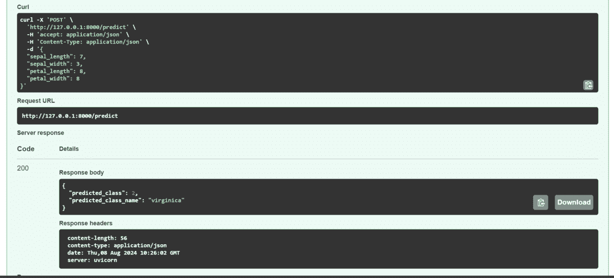

# 使用 FastAPI 构建机器学习驱动的 Web 应用程序

> 原文：[`www.kdnuggets.com/using-fastapi-for-building-ml-powered-web-apps`](https://www.kdnuggets.com/using-fastapi-for-building-ml-powered-web-apps)


图片由作者提供 | Canva

在本教程中，我们将学习一些关于 FastAPI 的知识，并用它来构建机器学习（ML）模型推理的 API。然后，我们将使用 Jinja2 模板创建一个合适的 web 界面。这是一个简短但有趣的项目，你可以在有限的 API 和 web 开发知识的基础上自行构建。

* * *

## 我们的前三大课程推荐

 1\. [Google 网络安全证书](https://www.kdnuggets.com/google-cybersecurity) - 快速进入网络安全职业的快车道。

 2\. [Google 数据分析专业证书](https://www.kdnuggets.com/google-data-analytics) - 提升你的数据分析能力

 3\. [Google IT 支持专业证书](https://www.kdnuggets.com/google-itsupport) - 在 IT 领域支持你的组织

* * *

## 什么是 FastAPI？

[FastAPI](https://fastapi.tiangolo.com/#installation) 是一个流行且现代的 web 框架，用于用 Python 构建 API。它旨在快速高效地利用 Python 的标准类型提示来提供最佳的开发体验。它易于学习，只需少量代码即可开发高性能的 API。FastAPI 被 Uber、Netflix 和微软等公司广泛使用来构建 API 和应用程序。其设计使其特别适合创建机器学习模型推理和测试的 API 端点。我们甚至可以通过集成 Jinja2 模板来构建一个合适的 web 应用程序。

## 模型训练

我们将对最受欢迎的 Iris 数据集进行随机森林分类器的训练。训练完成后，我们将显示模型评估指标并将模型保存为 pickle 格式。

**train_model.py:**

```py
from sklearn.datasets import load_iris
from sklearn.model_selection import train_test_split
from sklearn.ensemble import RandomForestClassifier
from sklearn.metrics import accuracy_score, classification_report
import joblib

# Load the iris dataset
iris = load_iris()
X, y = iris.data, iris.target

# Split the data into training and testing sets
X_train, X_test, y_train, y_test = train_test_split(
    X, y, test_size=0.2, random_state=42
)

# Train a RandomForest classifier
clf = RandomForestClassifier(n_estimators=100, random_state=42)
clf.fit(X_train, y_train)

# Evaluate the model
y_pred = clf.predict(X_test)
accuracy = accuracy_score(y_test, y_pred)
report = classification_report(y_test, y_pred, target_names=iris.target_names)

print(f"Model Accuracy: {accuracy}")
print("Classification Report:")
print(report)

# Save the trained model to a file
joblib.dump(clf, "iris_model.pkl")
```

```py
$ python train_model.py
```

```py
Model Accuracy: 1.0
Classification Report:
              precision    recall  f1-score   support

      setosa       1.00      1.00      1.00        10
  versicolor       1.00      1.00      1.00         9
   virginica       1.00      1.00      1.00        11

    accuracy                           1.00        30
   macro avg       1.00      1.00      1.00        30
weighted avg       1.00      1.00      1.00        30
```

## 使用 FastAPI 构建机器学习 API

接下来，我们将安装 FastAPI 和 Unicorn 库，我们将使用它们来构建模型推理 API。

```py
$ pip install fastapi uvicorn
```

在 `app.py` 文件中，我们将：

1.  从上一步加载保存的模型。

1.  创建用于输入和预测的 Python 类。确保指定数据类型。

1.  然后，我们将创建预测函数并使用 `@app.post` 装饰器。这个装饰器在 URL 路径 `/predict` 定义了一个 POST 端点。当客户端向此端点发送 POST 请求时，该函数将被执行。

1.  预测函数从 `IrisInput` 类中获取值，并将其作为 `IrisPrediction` 类返回。

1.  使用 `uvicorn.run` 函数运行应用程序，并提供主机 IP 和端口号，如下所示。

**app.py:**

```py
from fastapi import FastAPI
from pydantic import BaseModel
import joblib
import numpy as np
from sklearn.datasets import load_iris

# Load the trained model
model = joblib.load("iris_model.pkl")

app = FastAPI()

class IrisInput(BaseModel):
    sepal_length: float
    sepal_width: float
    petal_length: float
    petal_width: float

class IrisPrediction(BaseModel):
    predicted_class: int
    predicted_class_name: str

@app.post("/predict", response_model=IrisPrediction)
def predict(data: IrisInput):
    # Convert the input data to a numpy array
    input_data = np.array(
        [[data.sepal_length, data.sepal_width, data.petal_length, data.petal_width]]
    )

    # Make a prediction
    predicted_class = model.predict(input_data)[0]
    predicted_class_name = load_iris().target_names[predicted_class]

    return IrisPrediction(
        predicted_class=predicted_class, predicted_class_name=predicted_class_name
    )

if __name__ == "__main__":
    import uvicorn

    uvicorn.run(app, host="127.0.0.1", port=8000)
```

运行 Python 文件。

```py
$ python app.py
```

FastAPI 服务器正在运行，我们可以通过点击链接访问它。

```py
INFO:     Started server process [33828]
INFO:     Waiting for application startup.
INFO:     Application startup complete.
INFO:     Uvicorn running on http://127.0.0.1:8000 (Press CTRL+C to quit)
```

它将带我们到包含首页的浏览器。首页上没有任何内容，只有 `/predict` POST 请求。因此没有显示任何内容。


我们可以通过 SwaggerUI 界面测试我们的 API。我们可以通过在链接后添加 “/docs” 来访问它。


我们可以点击“/predict”选项，编辑值并运行预测。最后，我们将在响应体部分获得响应。如我们所见，结果是“Virginica”。我们可以通过 SwaggerUI 直接测试模型，并确保它在部署到生产环境之前正常工作。



## 为 Web 应用构建用户界面

我们将创建自己的用户界面，简单易用，像其他 Web 应用一样显示结果，而不是使用 Swagger UI。为此，我们需要在应用中集成 Jinja2Templates。Jinja2Templates 允许我们使用 HTML 文件构建一个合适的 Web 界面，使我们能够自定义网页的各种组件。

1.  通过提供 HTML 文件所在的目录来初始化 Jinja2Templates。

1.  定义一个异步路由，作为对根 URL ("/") 的 HTML 响应服务 "index.html" 模板。

1.  修改 `predict` 函数的输入参数，使用 Request 和 Form。

1.  定义了一个异步 POST 端点 "/predict"，接受用于鸢尾花测量的表单数据，使用机器学习模型预测鸢尾花种类，并返回使用 TemplateResponse 渲染的 "result.html" 预测结果。

1.  其余的代码类似。

```py
from fastapi import FastAPI, Request, Form
from fastapi.responses import HTMLResponse
from fastapi.templating import Jinja2Templates
from pydantic import BaseModel
import joblib
import numpy as np
from sklearn.datasets import load_iris

# Load the trained model
model = joblib.load("iris_model.pkl")

# Initialize FastAPI
app = FastAPI()

# Set up templates
templates = Jinja2Templates(directory="templates")

# Pydantic models for input and output data
class IrisInput(BaseModel):
    sepal_length: float
    sepal_width: float
    petal_length: float
    petal_width: float

class IrisPrediction(BaseModel):
    predicted_class: int
    predicted_class_name: str

@app.get("/", response_class=HTMLResponse)
async def read_root(request: Request):
    return templates.TemplateResponse("index.html", {"request": request})

@app.post("/predict", response_model=IrisPrediction)
async def predict(
    request: Request,
    sepal_length: float = Form(...),
    sepal_width: float = Form(...),
    petal_length: float = Form(...),
    petal_width: float = Form(...),
):
    # Convert the input data to a numpy array
    input_data = np.array([[sepal_length, sepal_width, petal_length, petal_width]])

    # Make a prediction
    predicted_class = model.predict(input_data)[0]
    predicted_class_name = load_iris().target_names[predicted_class]

    return templates.TemplateResponse(
        "result.html",
        {
            "request": request,
            "predicted_class": predicted_class,
            "predicted_class_name": predicted_class_name,
            "sepal_length": sepal_length,
            "sepal_width": sepal_width,
            "petal_length": petal_length,
            "petal_width": petal_width,
        },
    )

if __name__ == "__main__":
    import uvicorn

    uvicorn.run(app, host="127.0.0.1", port=8000)
```

接下来，我们将在与 `app.py` 相同的目录下创建一个名为 `templates` 的目录。在 `templates` 目录下创建两个 HTML 文件：`index.html` 和 `result.html`。

如果你是 Web 开发人员，你将很容易理解 HTML 代码。对于初学者，我会解释发生了什么。这段 HTML 代码创建了一个用于预测鸢尾花种类的网页，允许用户输入 "Sepal" 和 "Petal" 的测量值，并通过 POST 请求将其提交到 "/predict" 端点。

**index.html:**

```py
<!DOCTYPE html>

<html>

<head>

<title>Iris Flower Prediction</title>

</head>

<body>

<h1>Predict Iris Flower Species</h1>

<form action="/predict" method="post">

<label **for**="sepal_length">Sepal Length:</label>

<input type="number" step="any" id="sepal_length" name="sepal_length" required><br>

<label **for**="sepal_width">Sepal Width:</label>

<input type="number" step="any" id="sepal_width" name="sepal_width" required><br>

<label **for**="petal_length">Petal Length:</label>

<input type="number" step="any" id="petal_length" name="petal_length" required><br>

<label **for**="petal_width">Petal Width:</label>

<input type="number" step="any" id="petal_width" name="petal_width" required><br>

<button type="submit">Predict</button>

</form>

</body>

</html>
```

`result.html` 代码定义了一个显示预测结果的网页，展示输入的花萼和花瓣测量值以及预测的鸢尾花种类。它还显示了预测的类别名称和类别 ID，并有一个按钮可以带你回到首页。

**result.html:**

```py
<!DOCTYPE html>

<html>

<head>

<title>Prediction Result</title>

</head>

<body>

<h1>Prediction Result</h1>

<p>Sepal Length: {{ sepal_length }}</p>

<p>Sepal Width: {{ sepal_width }}</p>

<p>Petal Length: {{ petal_length }}</p>

<p>Petal Width: {{ petal_width }}</p>

<h2>Predicted Class: {{ predicted_class_name }} (Class ID: {{ predicted_class }})</h2>

<a href="/">Predict Again</a>

</body>

</html>
```

再次运行 Python 应用文件。

```py
$ python app.py 
```

```py
INFO:     Started server process [2932]
INFO:     Waiting for application startup.
INFO:     Application startup complete.
INFO:     Uvicorn running on http://127.0.0.1:8000 (Press CTRL+C to quit)
INFO:     127.0.0.1:63153 - "GET / HTTP/1.1" 200 OK
```

当你点击链接时，你不会看到空白屏幕；相反，你将看到用户界面，你可以在其中输入 "Sepal" 和 "Petal" 的长度和宽度。


点击“预测”按钮后，你将被带到下一页，在那里结果将会显示。你可以点击“再次预测”按钮来用不同的值测试你的模型。


所有源代码、数据、模型和信息都可以在 [kingabzpro/FastAPI-for-ML](https://github.com/kingabzpro/FastAPI-for-ML) GitHub 仓库中找到。请不要忘记给它加星 ⭐。

## 结论

许多大公司现在使用 FastAPI 为他们的模型创建端点，使他们能够在系统中无缝地部署和集成这些模型。FastAPI 快速、易于编写代码，并且提供了各种功能以满足现代数据堆栈的需求。在这个领域获得工作的关键是尽可能多地构建和记录项目。这将帮助你获得进行初步筛选所需的经验和知识。招聘人员将评估你的个人资料和作品集，以确定你是否适合他们的团队。那么，为什么不从今天开始使用 FastAPI 构建项目呢？

[](https://www.polywork.com/kingabzpro)****[Abid Ali Awan](https://www.polywork.com/kingabzpro)**** ([@1abidaliawan](https://www.linkedin.com/in/1abidaliawan)) 是一名认证的数据科学专业人士，热衷于构建机器学习模型。目前，他专注于内容创作和撰写关于机器学习和数据科学技术的技术博客。Abid 拥有技术管理硕士学位和电信工程学士学位。他的愿景是使用图神经网络构建一个 AI 产品，帮助那些在心理健康方面遇到困难的学生。

### 更多相关内容

+   [认识 MetaGPT：将文本转换为…的 ChatGPT 驱动 AI 助手](https://www.kdnuggets.com/meet-metagpt-the-chatgptpowered-ai-assistant-that-turns-text-into-web-apps)

+   [构建数据管道以创建大型语言模型应用](https://www.kdnuggets.com/building-data-pipelines-to-create-apps-with-large-language-models)

+   [初学者的 Python 构建 LLM 应用指南](https://www.kdnuggets.com/beginners-guide-to-building-llm-apps-with-python)

+   [使用 Python 的网页抓取初学者指南](https://www.kdnuggets.com/2022/10/beginner-guide-web-scraping-python.html)

+   [FastAPI 教程：几分钟内使用 Python 构建 API](https://www.kdnuggets.com/fastapi-tutorial-build-apis-with-python-in-minutes)

+   [Python 向量数据库与向量索引：LLM 应用架构](https://www.kdnuggets.com/2023/08/python-vector-databases-vector-indexes-architecting-llm-apps.html)
