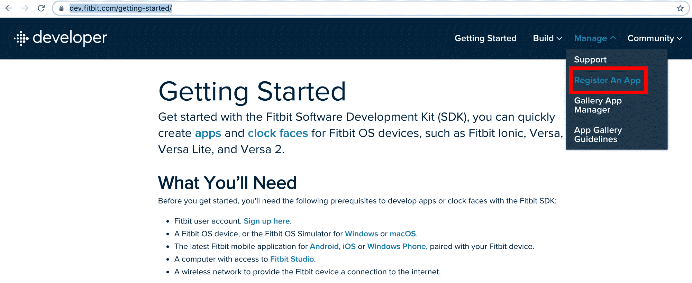
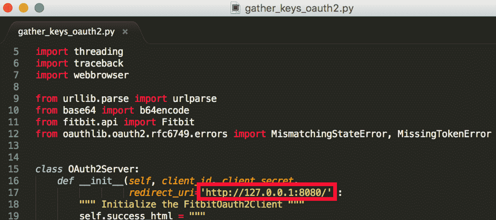
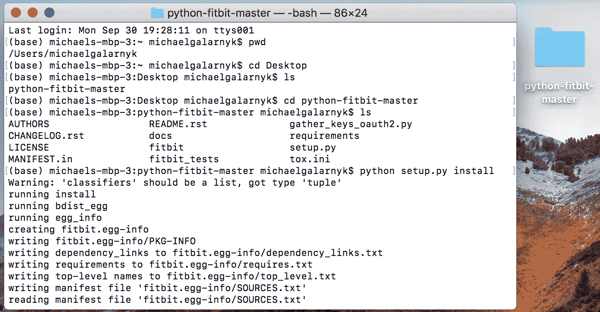
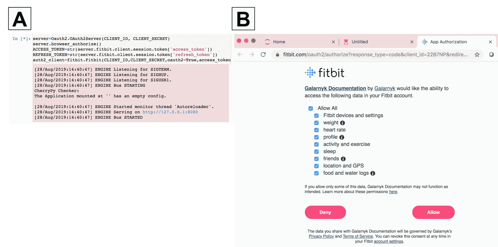
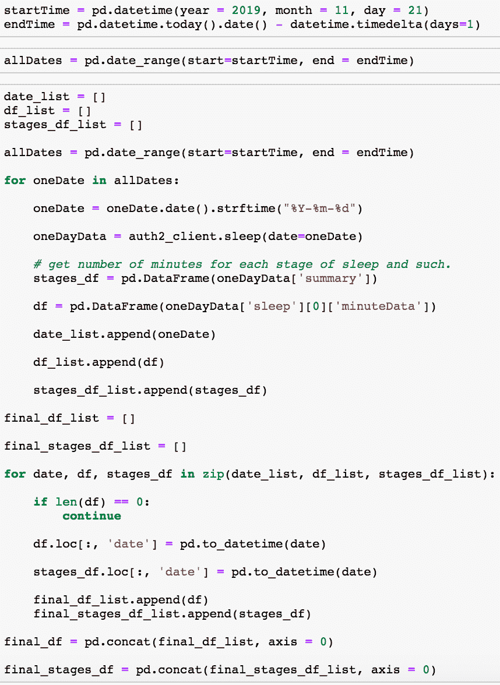
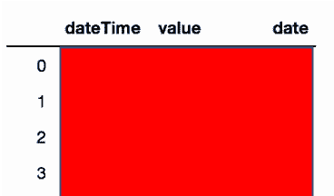
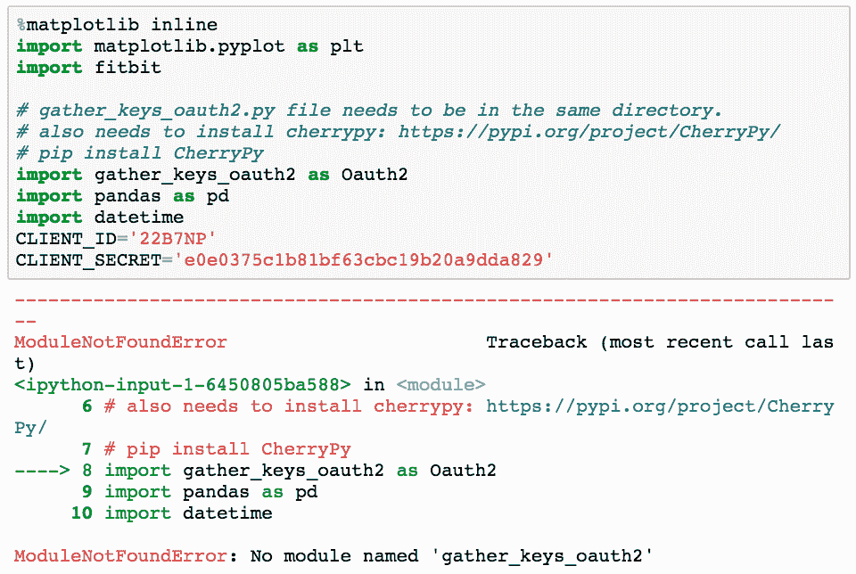
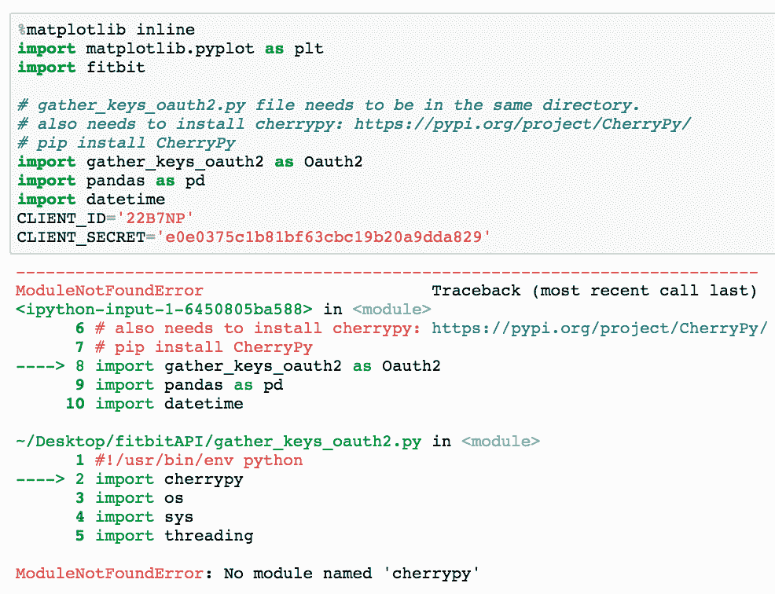
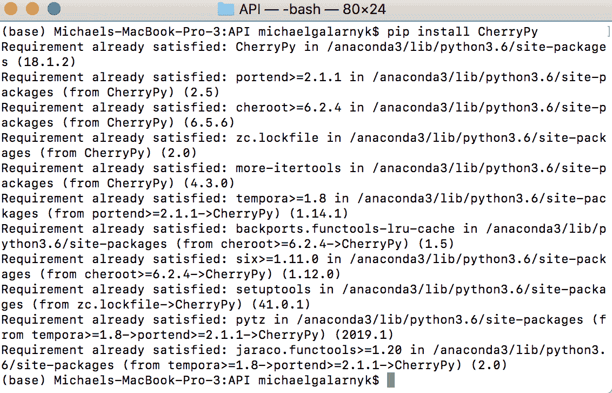
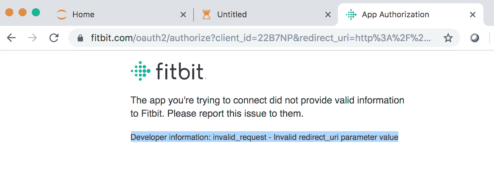

# 使用 Python 和 Fitbit Web API

> 原文：[`www.kdnuggets.com/2020/02/using-fitbit-web-api-python.html`](https://www.kdnuggets.com/2020/02/using-fitbit-web-api-python.html)

评论

**作者：[Michael Galarnyk](https://www.linkedin.com/in/michaelgalarnyk/)，数据科学家**


上面的图表是从 Fitbit 数据制作的，只是没有通过 API。我只是想分享我同事的工作。[`journals.plos.org/plosone/article?id=10.1371/journal.pone.0227709`](https://journals.plos.org/plosone/article?id=10.1371/journal.pone.0227709)

Fitbit 提供了一个 Web API 来访问 Fitbit 活动追踪器、Aria 和 Aria 2 称重器的数据以及手动输入的日志。因此，如果你使用了 Fitbit，你可以使用 [Fitbit API](https://dev.fitbit.com/build/reference/web-api/basics/) ([`dev.fitbit.com/build/reference/web-api/basics/`](https://dev.fitbit.com/build/reference/web-api/basics/)) 来获取自己的数据。除了使用 API 获取数据的便利外，你还可以获得在线应用程序中无法获得的日内（逐分钟）数据。虽然这个教程最初类似于 [Stephen Hsu](https://towardsdatascience.com/@shsu14) 的精彩 [教程](https://towardsdatascience.com/collect-your-own-fitbit-data-with-python-ff145fa10873)，但我决定稍微更新一下流程，解决一些可能出现的错误，并展示如何绘制数据。与往常一样，本教程中使用的代码可以在我的 [GitHub](https://github.com/mGalarnyk/Python_Tutorials/blob/master/Apis/Fitbit/Fitbit_API.ipynb) 上找到。那么，我们开始吧！

### 1.) 创建一个 Fitbit 账户

你可以通过点击 [这里](https://www.fitbit.com/signup) 创建一个 Fitbit 账户。这将带你到一个类似于下面的页面。


你不需要像我一样勾选“保持更新”框。此外，fakeuser@gmail 不是我为我的账户使用的电子邮件。

### 2.) 设置你的账户并创建应用

访问 [dev.fitbit.com](https://dev.fitbit.com/getting-started/)。将鼠标悬停在“管理”上，然后点击“注册应用”。



应该会出现一个类似于下面的页面。


(**A**) 你需要将个人设置为更容易请求下载日内数据（如果你没有设置或遇到错误，你可以在 [这里](https://dev.fitbit.com/build/reference/web-api/intraday-requests/) 进行请求）。(**B**) 回调 URL 是 http://127.0.0.1:8080，因为我们将使用的 Python API 将其作为默认重定向 URL。

对于图像中的每个字段，以下是一些你可以在注册页面填写的建议。

**应用名称：** 可以是任何内容。

**描述：** 可以是任何内容。

**应用网站：** 可以是任何内容。

**组织：** 可以是任何内容。

**组织网站：** 由于我将其用于个人用途（查看个人 Fitbit 数据），这可能不适用。

**服务条款网址：** 我放入了 Fitbit 的服务条款：[`dev.fitbit.com/legal/platform-terms-of-service/`](https://dev.fitbit.com/legal/platform-terms-of-service/)

**隐私政策网址：** 我放入了 Fitbit 的隐私政策：[`www.fitbit.com/legal/privacy-policy`](https://www.fitbit.com/legal/privacy-policy)

**OAuth 2.0 应用程序类型：** 如果你想下载你的 intraday 数据，OAuth 2.0 应用程序类型应为“个人”。顺便提一下，如果你不知道 OAuth 是什么，[这里有一个解释](https://www.varonis.com/blog/what-is-oauth/)。

**回调网址：** 确保回调网址为 http://127.0.0.1:8080/ 以确保我们的 Fitbit API 能正确连接。这是因为我们将使用的库需要这样做，如下所示。



最后，点击同意框，然后点击注册。应该会出现一个类似下面的页面。


记住你的 OAuth 2.0 客户端 ID 和客户端密钥。

我们将从此页面中需要的部分是 OAuth 2.0 客户端 ID 和客户端密钥。你需要记下客户端 ID 和客户端密钥，以备后用。

```py
# OAuth 2.0 Client ID 
# You will have to use your own as the one below is fake
12A1BC# Client Secret
# You will have to use your own as the one below is fake
12345678901234567890123456789012
```

### 3.) 安装 Python 库

下一步是使用 [Fitbit 非官方 API](https://github.com/orcasgit/python-fitbit)。点击链接后，点击绿色按钮。接下来，点击下载 Zip 并解压文件。


下载压缩文件。

然后，打开终端/命令行，切换到解压后的文件夹，并运行下面的命令。

```py
#reasoning for it here: 
#[`stackoverflow.com/questions/1471994/what-is-setup-py`](https://stackoverflow.com/questions/1471994/what-is-setup-py)
# If you want to install it a different way, feel free to do so. python setup.py install
```



进入文件夹目录，并在终端/命令行中输入 **python setup.py install**。

### 4.) API 授权

在开始这一部分之前，我需要说明两点。首先，本教程中使用的代码可以在我的 [GitHub](https://github.com/mGalarnyk/Python_Tutorials/blob/master/Apis/Fitbit/Fitbit_API.ipynb) 上找到。**其次，如果你遇到错误，我在博客文章后面有一个潜在错误部分。**

以下代码导入了各种库，并将步骤 2 中的 CLIENT_ID 和 CLIENT_SECRET 分配给变量。

```py
# This is a python file you need to have in the same directory as your code so you can import it
import gather_keys_oauth2 as Oauth2import fitbit
import pandas as pd 
import datetime# You will need to put in your own CLIENT_ID and CLIENT_SECRET as the ones below are fake
CLIENT_ID='12A1BC'
CLIENT_SECRET='12345678901234567890123456789012'
```

以下代码启用授权过程。

```py
server=Oauth2.OAuth2Server(CLIENT_ID, CLIENT_SECRET)
server.browser_authorize()
ACCESS_TOKEN=str(server.fitbit.client.session.token['access_token'])
REFRESH_TOKEN=str(server.fitbit.client.session.token['refresh_token'])
auth2_client=fitbit.Fitbit(CLIENT_ID,CLIENT_SECRET,oauth2=True,access_token=ACCESS_TOKEN,refresh_token=REFRESH_TOKEN)
```



当你运行上面的代码（如 A 所示）时，单元格会显示仍在运行，直到你登录到你的 Fitbit 账户（B）并点击允许访问 Fitbit 账户中的各种数据。

授权和登录后页面的样子。


这个窗口应该是你看到的内容。

### 5a.) 获取一天的数据


你将使用 `intraday_time_series` 方法来获取数据。

我将首先获取一天的数据，以便下一个部分更容易理解。

```py
# This is the date of data that I want. 
# You will need to modify for the date you want
oneDate = pd.datetime(year = 2019, month = 10, day = 21)oneDayData = auth2_client.intraday_time_series('activities/heart', oneDate, detail_level='1sec')
```


如果你愿意，可以将这些数据放入 pandas DataFrame 中。


当然，你始终可以将数据导出为 CSV 或 Excel 文件。

```py
# The first part gets a date in a string format of YYYY-MM-DD
filename = oneDayData['activities-heart'][0]['dateTime'] +'_intradata'# Export file to csv
df.to_csv(filename + '.csv', index = False)
df.to_excel(filename + '.xlsx', index = False)
```

### 5b.) 获取多天的数据

下面的代码获取从 `startTime` 变量（在下面的代码中称为 `oneDate`）开始的所有天的数据。


当然，你可以将 `final_df` 导出为 CSV 文件（我建议不要尝试导出为 Excel，因为行数可能过多，不容易导出到 Excel）。

```py
filename = 'all_intradata'
final_df.to_csv(filename + '.csv', index = False)
```

### 6.) 尝试绘制日内数据图表

我强烈建议你查看[GitHub](https://github.com/mGalarnyk/Python_Tutorials/blob/master/Apis/Fitbit/Fitbit_API.ipynb)上的代码，以便处理自己的数据。

本节的最终目标是将特定时间的特定日期图表化（日期也包括一天中的时间）。我应该指出，我的代码不够高效部分是由于懒惰。如果你不理解发生了什么，不用担心。你可以向下滚动查看最终结果。

```py
# I want to get the hour of the day and time. The end goal of this section is to get a particular time on a particular day. 
hoursDelta = pd.to_datetime(final_df.loc[:, 'time']).dt.hour.apply(lambda x: datetime.timedelta(hours = x))minutesDelta = pd.to_datetime(final_df.loc[:, 'time']).dt.minutes.apply(lambda x: datetime.timedelta(minutes = x))secondsDelta = pd.to_datetime(final_df.loc[:, 'time']).dt.seconds.apply(lambda x: datetime.timedelta(seconds = x))# Getting the date to also have the time of the day
final_df['date'] = final_df['date'] + hoursDelta + minutesDelta + secondsDelta
```

我接下来的步骤是查看 3 天的数据，而不是多天的数据。

```py
startDate = pd.datetime(year = 2019, month = 12, day = 24)
lastDate = pd.datetime(year = 2019, month = 12, day = 27)coupledays_df = final_df.loc[final_df.loc[:, 'date'].between(startDate, lastDate), :]
```

请记住，你还可以尝试通过按日期和小时（甚至秒）分组绘制图表，并取心率的平均值。代码也尝试使图表看起来更好一些。

```py
fig, ax = plt.subplots(figsize=(10, 7))# Taken from: [`stackoverflow.com/questions/16266019/python-pandas-group-datetime-column-into-hour-and-minute-aggregations`](https://stackoverflow.com/questions/16266019/python-pandas-group-datetime-column-into-hour-and-minute-aggregations)
times = pd.to_datetime(coupledays_df['date'])
coupledays_df.groupby([times.dt.date,times.dt.hour]).value.mean().plot(ax = ax)ax.grid(True,
    axis = 'both',
    zorder = 0,
    linestyle = ':',
    color = 'k')
ax.tick_params(axis = 'both', rotation = 45, labelsize = 20)
ax.set_xlabel('Date, Hour', fontsize = 24)
fig.tight_layout()
fig.savefig('coupledaysavergedByMin.png', format = 'png', dpi = 300)
```

做了这么多工作，也许这不是我应该继续的方向，因为当前数据并没有足够的背景来判断是在休息还是在移动。

### 7.) 静息心率

有研究讨论了[静息心率](https://www.health.harvard.edu/blog/resting-heart-rate-can-reflect-current-future-health-201606179806)如何反映你的当前和未来健康。实际上，有一篇[研究论文展示了 92,447 名佩戴 Fitbit 的成年人在静息心率的个体间和个体内变异性及其与年龄、性别、睡眠、BMI 和季节的关联](https://journals.plos.org/plosone/article?id=10.1371/journal.pone.0227709)。以下是论文中的一张图片（添加了文本以便于理解）。


[`journals.plos.org/plosone/article?id=10.1371/journal.pone.0227709`](https://journals.plos.org/plosone/article?id=10.1371/journal.pone.0227709)

我们一直使用的 API 调用也返回静息心率，因此下面的代码与之前的步骤并没有太大区别。

```py
# startTime is first date of data that I want. 
# You will need to modify for the date you want your data to start
startTime = pd.datetime(year = 2019, month = 11, day = 21)
endTime = pd.datetime.today().date() - datetime.timedelta(days=1)date_list = []
resting_list = []allDates = pd.date_range(start=startTime, end = endTime)for oneDate in allDates:

    oneDate = oneDate.date().strftime("%Y-%m-%d")

    oneDayData = auth2_client.intraday_time_series('activities/heart', base_date=oneDate, detail_level='1sec')

    date_list.append(oneDate)

    resting_list.append(oneDayData['activities-heart'][0]['value']['restingHeartRate'])# there is more matplotlib code on GitHub
fig, ax = plt.subplots(figsize=(10, 7))ax.plot(date_list, resting_list)
```

尝试绘制你的数据图表。

### 8.) 获取睡眠数据

不深入细节，下面的代码获取每分钟的睡眠数据（`final_df`）以及有关 Fitbit 用户在深度、浅度、快速眼动和清醒阶段的总时间（`final_stages_df`）的睡眠总结信息。



`final_stages_df` 是一个 pandas DataFrame，显示了 Fitbit 用户在给定日期晚上每个阶段的睡眠时长（清醒、深度、浅睡、快速眼动）以及总的卧床时间。


`final_df` 是一个 pandas DataFrame，提供了一个日期时间、日期和一个值。值列中的 1 表示“睡着了”，**2** 表示清醒，**3** 表示真正清醒。



### 潜在错误

### 没有名为 gather_keys_oauth2 的模块

这是针对你遇到类似以下错误的情况。



为了解决这个问题，你可以将 `gather_keys_oauth2.py` 文件放入与你的 Python 文件或 jupyter notebook 相同的目录。你可以看到我的项目目录安排如下。


注意 `gather_keys_oauth2.py` 文件位于我的 jupyter notebook 同一目录下。这是我们在第三步中下载的 python-fitbit-master 中包含的一个文件。

### CherryPy 未被识别，没有名为 cherrypy 的模块

如果你遇到类似下面的错误，首先关闭你的 jupyter notebook 或 Python 文件。



你可以通过以下命令解决问题。

```py
pip install CherryPy
```



### Https 与 Http 错误

以下错误发生在我尝试将回调 URL 更改为 https 而不是 http 的第二步中。



### HTTPTooManyRequests: 请求过多


[fitbit 论坛](https://community.fitbit.com/t5/Web-API-Development/Too-many-request/td-p/1644362) 对这个问题有答案。使用 API，你可以每小时对每个用户/fitbit 进行最多 150 次请求。这意味着如果你有超过 150 天的数据，并且使用了本教程第五步 b 的代码，你可能需要稍等片刻才能获取其余的数据。

### 结论

本文介绍了如何从单个 Fitbit 获取数据。虽然我涵盖了相当多的内容，但仍有一些内容没有涉及，比如 [Fitbit API 如何获取你的步数](https://python-fitbit.readthedocs.io/en/latest/)。Fitbit API 是我仍在学习的内容，因此如果你有任何贡献，请告诉我。如果你对教程有任何问题或想法，请随时在下方评论或通过 [Twitter](https://twitter.com/GalarnykMichael) 联系我。

**简历：[Michael Galarnyk](https://www.linkedin.com/in/michaelgalarnyk/)** 是一名数据科学家和企业培训师。他目前在 Scripps Translational Research Institute 工作。你可以在 Twitter (https://twitter.com/GalarnykMichael)、Medium (https://medium.com/@GalarnykMichael) 和 GitHub (https://github.com/mGalarnyk) 上找到他。

[原文](https://towardsdatascience.com/using-the-fitbit-web-api-with-python-f29f119621ea)。已获许可转载。

**相关：**

+   理解 Python 中的决策树分类

+   Python 列表及列表操作

+   Python 元组及其方法

* * *

## 我们的三大课程推荐

 1\. [谷歌网络安全证书](https://www.kdnuggets.com/google-cybersecurity) - 快速进入网络安全职业生涯

 2\. [谷歌数据分析专业证书](https://www.kdnuggets.com/google-data-analytics) - 提升你的数据分析技能

 3\. [谷歌 IT 支持专业证书](https://www.kdnuggets.com/google-itsupport) - 支持你的组织的 IT 需求

* * *

### 更多相关话题

+   [Python 网页抓取初学者指南](https://www.kdnuggets.com/2022/10/beginner-guide-web-scraping-python.html)

+   [HuggingChat Python API: 你的无成本替代方案](https://www.kdnuggets.com/2023/05/huggingchat-python-api-alternative.html)

+   [使用 Python 探索 OpenAI API](https://www.kdnuggets.com/exploring-the-openai-api-with-python)

+   [创建一个 Web 应用程序以使用 Python 从音频中提取主题](https://www.kdnuggets.com/2023/01/creating-web-application-extract-topics-audio-python.html)

+   [在 5 分钟内用 Python 构建网页抓取器](https://www.kdnuggets.com/2022/02/build-web-scraper-python-5-minutes.html)

+   [使用 Python 和 Beautiful Soup 的网页抓取逐步指南](https://www.kdnuggets.com/2023/04/stepbystep-guide-web-scraping-python-beautiful-soup.html)
