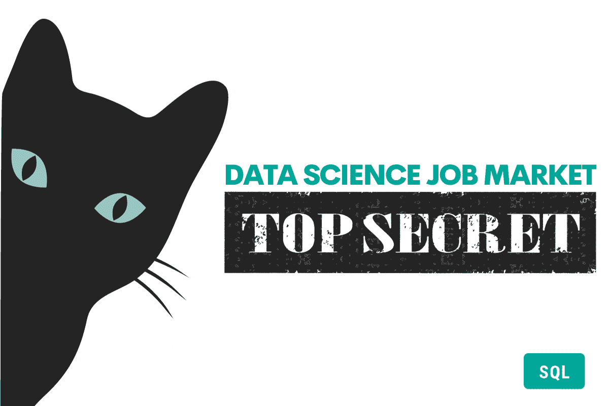
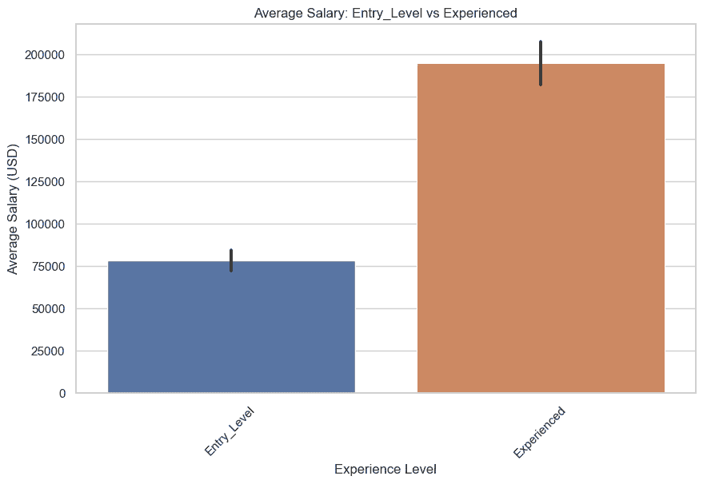
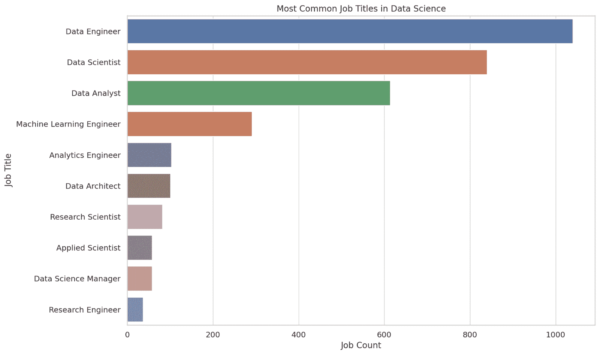
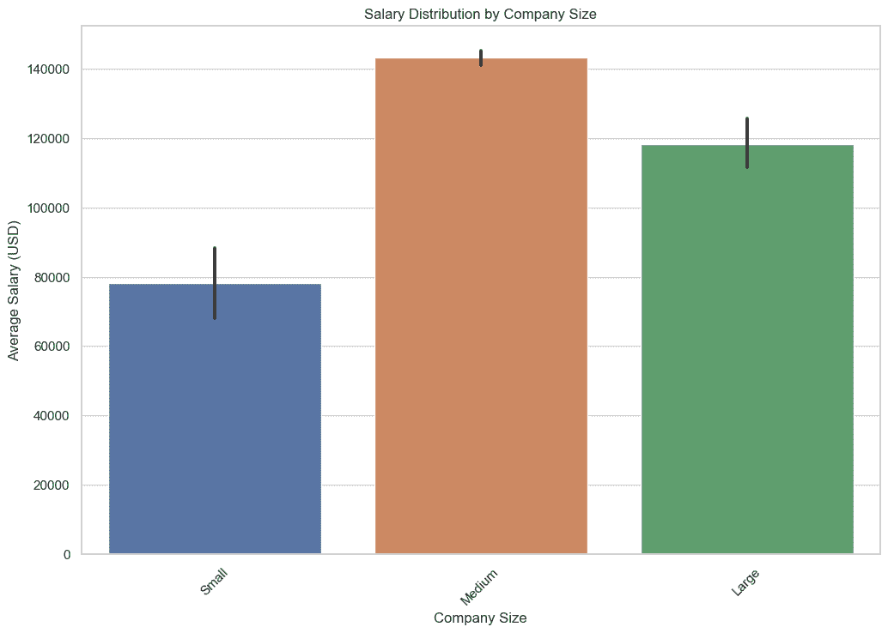

# 使用 SQL 理解数据科学职业趋势

> 原文：[`www.kdnuggets.com/using-sql-to-understand-data-science-career-trends`](https://www.kdnuggets.com/using-sql-to-understand-data-science-career-trends)



图片由作者提供

在数据成为新石油的世界中，理解数据科学职业的细微差别比以往任何时候都更重要。无论你是寻找机会的数据爱好者还是探索机会的老手，使用 SQL 都能提供数据科学就业市场的见解。

我希望你急于了解哪些[数据科学职位](https://www.stratascratch.com/blog/14-different-data-science-job-titles/?utm_source=blog&utm_medium=click&utm_campaign=kdn+ds+career+trends)最具吸引力，或者哪些职位提供最丰厚的薪资。或者，也许你在想经验水平如何与[数据科学平均薪资](https://www.stratascratch.com/blog/how-much-do-data-scientists-make/?utm_source=blog&utm_medium=click&utm_campaign=kdn+ds+career+trends)关联？

在本文中，我们将深入数据科学就业市场，解答所有这些问题（及更多）。让我们开始吧！

# 数据集薪资趋势

我们将在本文中使用的数据集旨在揭示 2021 到 2023 年的数据科学领域薪资模式。通过重点关注工作经历、职位和公司位置等元素，它提供了该行业薪资分布的重要见解。

本文将回答以下问题：

1.  不同经验水平的平均薪资情况如何？

1.  数据科学中最常见的职位名称是什么？

1.  薪资分布如何随着公司规模变化？

1.  数据科学职位主要地理位置在哪里？

1.  哪些职位在数据科学中提供最高薪资？

你可以从[Kaggle](https://www.kaggle.com/code/zabihullah18/data-science-salary-trend)下载这些数据。

## 1\. 不同经验水平的平均薪资情况如何？

在这个 SQL 查询中，我们正在寻找不同经验水平的平均薪资。GROUP BY 子句按经验水平对数据进行分组，AVG 函数计算每个组的平均薪资。

这有助于了解领域经验如何影响收入潜力，这对你规划你的[数据科学职业路径](https://www.stratascratch.com/blog/a-complete-guide-to-data-scientist-career-path/?utm_source=blog&utm_medium=click&utm_campaign=kdn+ds+career+trends)至关重要。我们来看一下代码。

```py
SELECT experience_level, AVG(salary_in_usd) AS avg_salary
FROM salary_data
GROUP BY experience_level;
```

现在让我们用 Python 可视化这个输出。

这里是代码。

```py
# Import required libraries for plotting
import matplotlib.pyplot as plt
import seaborn as sns
# Set up the style for the graphs
sns.set(style="whitegrid")

# Initialize the list for storing graphs
graphs = []

plt.figure(figsize=(10, 6))
sns.barplot(x='experience_level', y='salary_in_usd', data=df, estimator=lambda x: sum(x) / len(x))
plt.title('Average Salary by Experience Level')
plt.xlabel('Experience Level')
plt.ylabel('Average Salary (USD)')
plt.xticks(rotation=45)
graphs.append(plt.gcf())
plt.show()
```

现在让我们比较入门级和有经验的薪资以及中级和高级薪资。

从入门级和有经验的开始。这里是代码。

```py
# Filter the data for Entry_Level and Experienced levels
entry_experienced = df[df['experience_level'].isin(['Entry_Level', 'Experienced'])]

# Filter the data for Mid-Level and Senior levels
mid_senior = df[df['experience_level'].isin(['Mid-Level', 'Senior'])]

# Plotting the Entry_Level vs Experienced graph
plt.figure(figsize=(10, 6))
sns.barplot(x='experience_level', y='salary_in_usd', data=entry_experienced, estimator=lambda x: sum(x) / len(x) if len(x) != 0 else 0)
plt.title('Average Salary: Entry_Level vs Experienced')
plt.xlabel('Experience Level')
plt.ylabel('Average Salary (USD)')
plt.xticks(rotation=45)
graphs.append(plt.gcf())
plt.show() 
```

这里是图表。



现在让我们绘制中级和高级职位的图表。以下是代码。

```py
# Plotting the Mid-Level vs Senior graph
plt.figure(figsize=(10, 6))
sns.barplot(x='experience_level', y='salary_in_usd', data=mid_senior, estimator=lambda x: sum(x) / len(x) if len(x) != 0 else 0)
plt.title('Average Salary: Mid-Level vs Senior')
plt.xlabel('Experience Level')
plt.ylabel('Average Salary (USD)')
plt.xticks(rotation=45)
graphs.append(plt.gcf())
plt.show() 
```


## 2\. 数据科学领域最常见的职位名称是什么？

在这里，我们提取了数据科学领域前 10 个最常见的职位名称。COUNT 函数计算每个职位名称的出现次数，结果按降序排列，以便将最常见的职位排在前面。

这些信息让你对职位市场的需求有一个了解，帮助你识别你可以目标的潜在职位。让我们看看代码。

```py
SELECT job_title, COUNT(*) AS job_count
FROM salary_data
GROUP BY job_title
ORDER BY job_count DESC
LIMIT 10;
```

好了，现在是时候用 Python 可视化这个查询了。

这是代码。

```py
plt.figure(figsize=(12, 8))
sns.countplot(y='job_title', data=df, order=df['job_title'].value_counts().index[:10])
plt.title('Most Common Job Titles in Data Science')
plt.xlabel('Job Count')
plt.ylabel('Job Title')
graphs.append(plt.gcf())
plt.show()
```

让我们看看图表。



## 3\. 薪资分布如何随着公司规模的变化而变化？

在这个查询中，我们提取了每个公司规模分组的平均工资、最低工资和最高工资。使用如 AVG、MIN 和 MAX 等聚合函数有助于提供关于公司规模的薪资全景视图。

这些数据非常重要，因为它帮助你了解根据你打算加入的公司的规模，你可以期望的潜在收入，让我们看看代码。

```py
SELECT company_size, AVG(salary_in_usd) AS avg_salary, MIN(salary_in_usd) AS min_salary, MAX(salary_in_usd) AS max_salary
FROM salary_data
GROUP BY company_size;
```

现在让我们用 Python 可视化这个查询。

这是代码。

```py
plt.figure(figsize=(12, 8))
sns.barplot(x='company_size', y='salary_in_usd', data=df, estimator=lambda x: sum(x) / len(x) if len(x) != 0 else 0, order=['Small', 'Medium', 'Large'])
plt.title('Salary Distribution by Company Size')
plt.xlabel('Company Size')
plt.ylabel('Average Salary (USD)')
plt.xticks(rotation=45)
graphs.append(plt.gcf())
plt.show()
```

这是输出结果。



## 4\. 数据科学职位主要地理分布在哪里？

在这里，我们确定了提供最多数据科学职位机会的前 10 个地点。我们使用 COUNT 函数来确定每个地点的职位发布数量，并按降序排列，以突出机会最多的地区。

拥有这些信息可以使读者了解数据科学职位的地理中心，有助于潜在的搬迁决策。让我们看看代码。

```py
SELECT company_location, COUNT(*) AS job_count
FROM salary_data
GROUP BY company_location
ORDER BY job_count DESC
LIMIT 10;
```

现在让我们用 Python 创建上述代码的图表。

```py
plt.figure(figsize=(12, 8))
sns.countplot(y='company_location', data=df, order=df['company_location'].value_counts().index[:10])
plt.title('Geographical Distribution of Data Science Jobs')
plt.xlabel('Job Count')
plt.ylabel('Company Location')
graphs.append(plt.gcf())
plt.show()
```

让我们看看下面的图表。


## 5\. 哪些职位在数据科学领域提供最高薪资？

在这里，我们识别数据科学领域薪资最高的前 10 个职位名称。通过使用 AVG，我们计算每个职位名称的平均薪资，并按平均薪资降序排序，以突出最有利可图的职位。

你可以通过查看这些数据来设定你的职业目标。让我们继续了解读者如何为这些数据创建 Python 可视化。

```py
SELECT job_title, AVG(salary_in_usd) AS avg_salary
FROM salary_data
GROUP BY job_title
ORDER BY avg_salary DESC
LIMIT 10;
```

这是输出结果。

***(这里我们不能使用照片，因为我们上面已经添加了 4 张照片，剩下的一张用作缩略图。我们是否可以使用类似下面的表格来展示输出结果？)***

| **排名** | **职位名称** | **平均薪资 (美元)** |
| --- | --- | --- |
| 1 | 数据科学技术主管 | 375,000.00 |
| 2 | 云数据架构师 | 250,000.00 |
| 3 | 数据负责人 | 212,500.00 |
| 4 | 数据分析主管 | 211,254.50 |
| 5 | 首席数据科学家 | 198,171.13 |
| 6 | 数据科学总监 | 195,140.73 |
| 7 | 首席数据工程师 | 192,500.00 |
| 8 | 机器学习软件工程师 | 192,420.00 |
| 9 | 数据科学经理 | 191,278.78 |
| 10 | 应用科学家 | 190,264.48 |

这次，让我们尝试自己创建一个图表。

**提示**：你可以在 ChatGPT 中使用以下提示来生成这个图表的 Python 代码：

```py
<SQL Query here>

Create a Python graph to visualize the top 10 highest-paying job titles in Data Science, similar to the insights gathered from the given SQL query above.
```

# 最后思考

当我们结束对数据科学职业世界各种领域的探索时，希望 SQL 能成为一个值得信赖的向导，帮助你发掘支持职业决策的宝贵见解。

我希望你现在感到更加自信，不仅在规划你的职业道路方面，还在使用 SQL 将原始数据转化为强大叙事方面。祝愿你踏入充满机遇的未来，以数据为指南针，以 SQL 为引导力量！

感谢阅读！

**[内特·罗西迪](https://www.stratascratch.com)** 是一名数据科学家和产品策略专家。他还是一位兼职教授，教授分析课程，并且是[StrataScratch](https://www.stratascratch.com/)，一个帮助数据科学家准备面试的在线平台的创始人，提供来自顶级公司的真实面试问题。可以通过[Twitter: StrataScratch](https://twitter.com/StrataScratch)或[LinkedIn](https://www.linkedin.com/in/nathanrosidi/)与他联系。

* * *

## 我们的前三个课程推荐

 1\. [谷歌网络安全证书](https://www.kdnuggets.com/google-cybersecurity) - 快速进入网络安全职业轨道

 2\. [谷歌数据分析专业证书](https://www.kdnuggets.com/google-data-analytics) - 提升你的数据分析技能

 3\. [谷歌 IT 支持专业证书](https://www.kdnuggets.com/google-itsupport) - 支持你的组织 IT

* * *

### 更多相关话题

+   [5 个关键数据科学趋势与分析趋势](https://www.kdnuggets.com/2022/08/5-key-data-science-trends-analytics-trends.html)

+   [图表：理解数据的自然方式](https://www.kdnuggets.com/2022/10/manning-graphs-natural-way-understand-data.html)

+   [24 本最佳（且免费的）书籍以理解机器学习](https://www.kdnuggets.com/2020/03/24-best-free-books-understand-machine-learning.html)

+   [选择示例以理解机器学习模型](https://www.kdnuggets.com/2022/11/picking-examples-understand-machine-learning-model.html)

+   [导航数据革命：探索数据科学和机器学习中的蓬勃趋势](https://www.kdnuggets.com/navigating-the-data-revolution-exploring-the-booming-trends-in-data-science-and-machine-learning)

+   [人工智能、分析、机器学习、数据科学、深度学习…](https://www.kdnuggets.com/2021/12/developments-predictions-ai-machine-learning-data-science-research.html)
