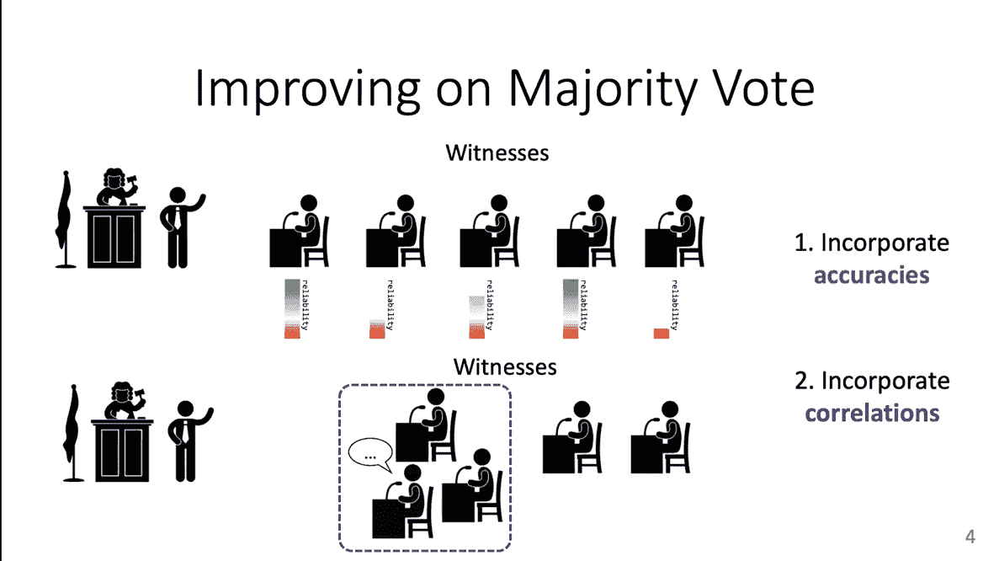
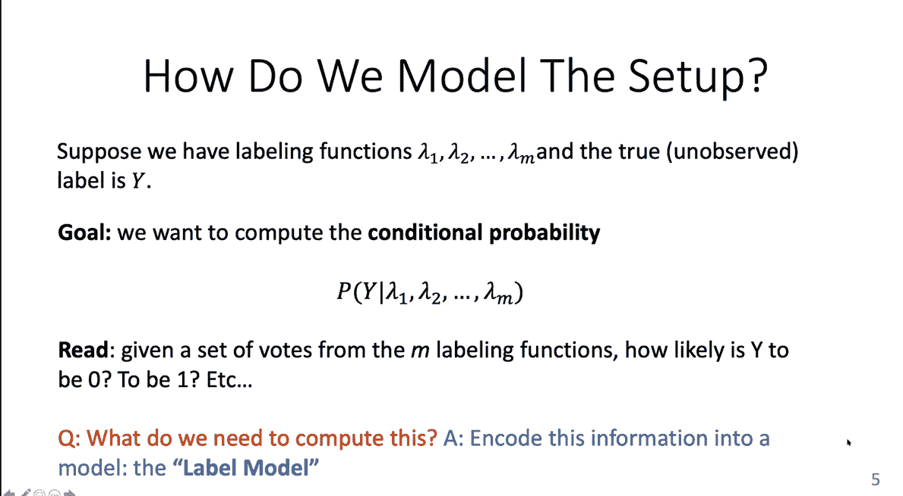
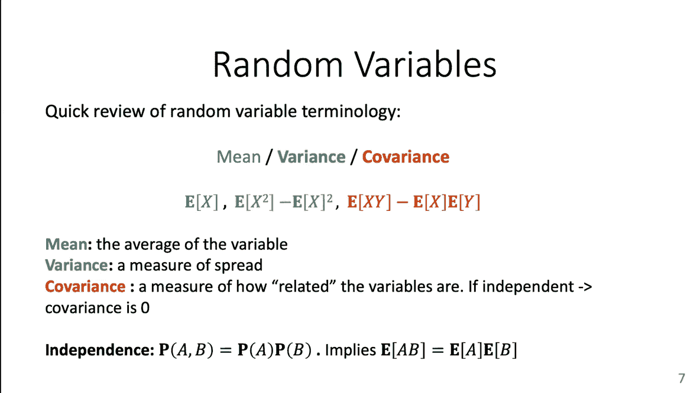
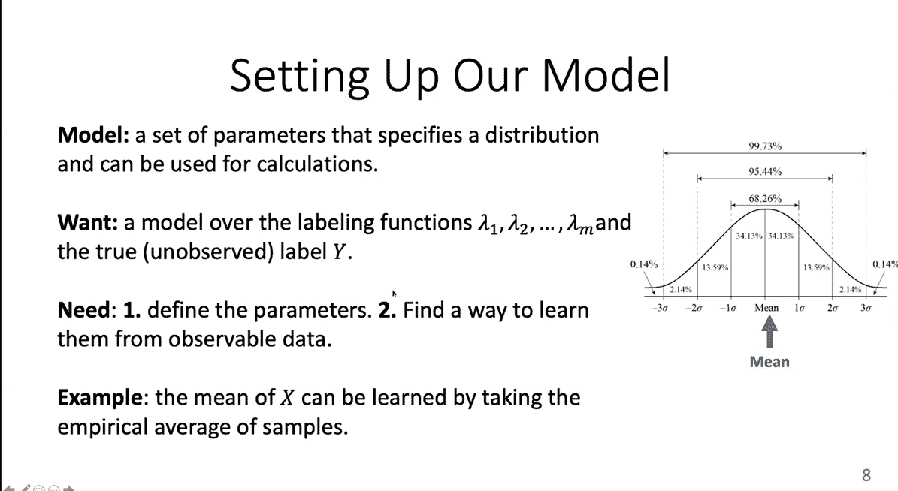
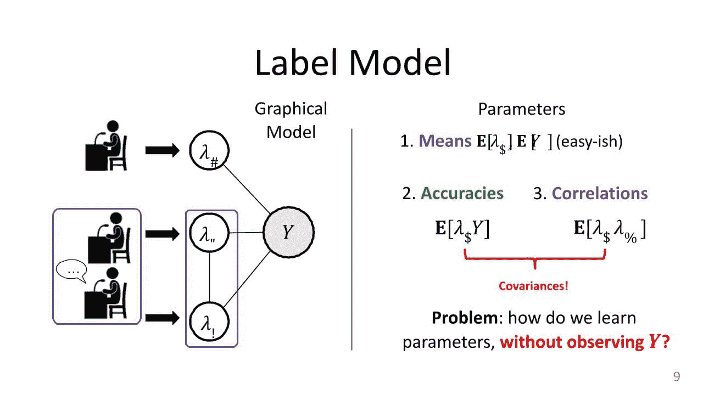
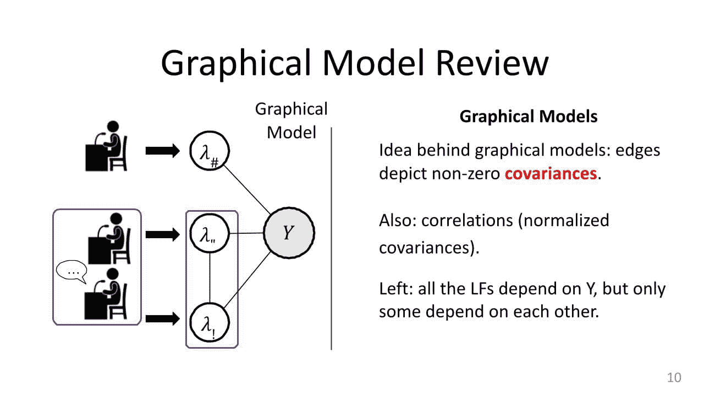
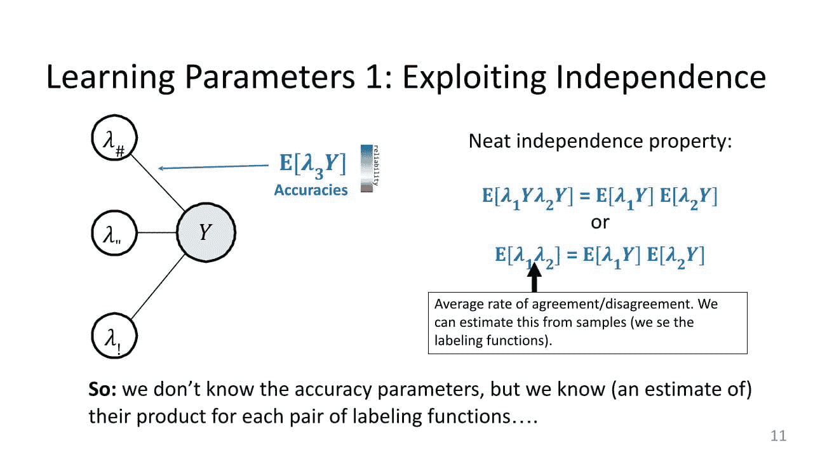
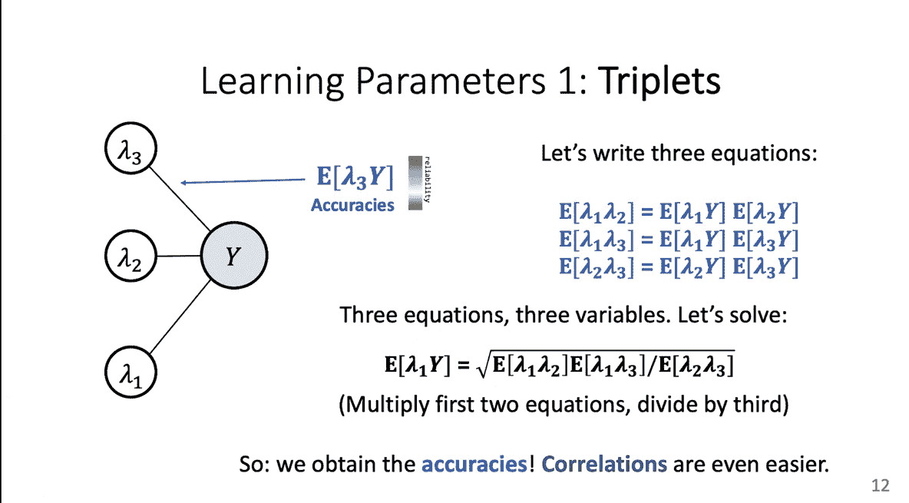
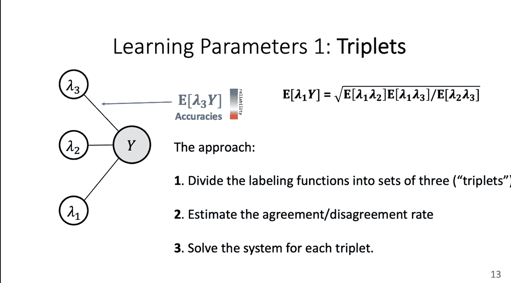

# 弱监督建模，解释

> 原文：[`www.kdnuggets.com/2022/05/weak-supervision-modeling-explained.html`](https://www.kdnuggets.com/2022/05/weak-supervision-modeling-explained.html)

# 什么是弱监督？

[弱监督](https://snorkel.ai/weak-supervision/)是一种通过编写标记函数以程序化的方式为机器学习模型训练数据点获取标签的方法。这些函数比手动标记更快、更高效地标记数据，但它们也会创建“嘈杂”的标签，然后你需要对这些标签进行建模和合并，以生成稍后用于训练下游模型的标签。换句话说，几乎没有实际的人工标记，而是通过程序化的方式进行标记，然后通过标签模型进行“去噪”。

* * *

## 我们的三大课程推荐

 1\. [Google 网络安全证书](https://www.kdnuggets.com/google-cybersecurity) - 快速进入网络安全职业。

 2\. [Google 数据分析专业证书](https://www.kdnuggets.com/google-data-analytics) - 提升你的数据分析技能

 3\. [Google IT 支持专业证书](https://www.kdnuggets.com/google-itsupport) - 支持你的组织的 IT 需求

* * *

在这篇文章中，我们将主要关注这个流程的中间部分：标签模型本身。这是用来建模和合并嘈杂标签的对象。

# 在弱监督中创建标签模型

思考去噪的一种方法是合并嘈杂的标签——但所有的标记函数不一定都同样可靠！当你生成一个标签模型时，你在问：你如何知道由[程序化标记](https://snorkel.ai/programmatic-labeling/)函数生成的嘈杂标签中哪些是可靠的？本质上，你需要弄清楚哪些标签应该丢弃，哪些应该保留，然后如何使用它们。通过这样做，你可以确定“最佳猜测”实际标签是什么，这为你提供了一个自动构建的数据集。然后，你使用这些标签训练你的最终模型。

标签模型背后的直觉是什么？用一个简单的类比来说明，想象一个充满证人的法庭。我们通常将数据点的“真实”标签视为一个潜在的、未观察到的变量，这正是法庭上的情况。你不知道被告是否真正犯了罪。因此，你必须使用一些替代方法来了解真相。在这个非常简单的类比中，每个证人会说，“我认为被告犯了罪，”或者，“我不认为被告犯了罪。”

证人很像我们的标签函数。被告是否犯了罪这个变量有点像我们的“+1; -1”标签。一位证人是+1，一位证人是+1，一位证人是-1，等等。从这里开始，最简单的方法是依照多数证人的意见，这也是标签模型中多数投票方面的作用。它的意思是，“多数标签函数说是+1，所以这个数据点是+1。”这样做可以获得很多信息。但也有一些缺点。

# 准确性与相关性

对于我们的目的来说，多数投票有两个主要缺点。一个是并非所有证人都是同等可靠的。你不希望仅仅抛弃那些不太可靠的证人，但你确实想给他们分配不同的权重。困难之处在于你不能确定哪些证人是可靠的还是不可靠的。你需要自己搞清楚。我们称这个过程为寻找“准确性”。我们希望我们的标签模型能结合标签函数的准确性。

第二个缺点是所谓的相关性或“圈子”。想象一下，如果三位证人在审判开始之前合作并讨论过。你不会像对待三位独立证人那样信任他们，因为一旦他们协调一致，他们可能会改变想法并达成统一观点。理想情况下，你会想要减少这些“圈子”证人的权重。

多数投票无法解决这些问题。它仅仅对每个人赋予相等的权重，无论可靠与否，即使他们形成了一个圈子也如此。但你希望在标签模型中包括准确性和相关性，这意味着我们需要学习这些内容。

从现在开始，我们将使用这种符号表示数学：“*lambda 1*”，“*lambda 2*”，一直到“*lambda n*”。这些是你的标签函数。它们是随机变量，取值如-1 或+1。然后，是“*Y*”这个真实但未观察到的标签。你看不到它，但它确实存在。

非常具体地说，你的目标是计算在给定? *1 ? 2*到? *n*的条件概率 *P(Y)*。这是已知我们从标签函数中获得了这些信息的情况下，标签的概率。换句话说：考虑到你拥有的所有噪声标签，*Y*的值是 0、1、2，等等的概率。

这已经比多数投票有了很大的改进，因为您不需要仅仅说，“我认为它是+1。”相反，您可以说，“我认为它是+1 的概率是 0.6，-1 的概率是 0.3，”等等。这对于训练您的最终模型来说已经有了更多的用处。但您仍然不知道足够的信息来计算条件概率。为了做到这一点，您需要将所有信息编码成我们所说的标签模型。

标签模型实际上就是这样：它包含了计算这些条件概率所需的所有信息，这些条件概率告诉您，给定标记函数的输出，真实标签的每一个可能值的概率是*Y*。

# 什么是概率模型？

为了计算条件概率，您需要一个概率模型。概率模型是一组参数，可以完全指定您用于计算的某种分布。

一个非常简单的例子是高斯随机变量。如果您知道均值和方差，您可以把它看作一个独立的模型。因此，如果我告诉您均值和方差，您可以说，例如，“*X*等于 3.7 的概率是 ___；*X*在-2 和 16 之间的概率是 ___”，等等。

对于您的标签模型，您需要定义类似的内容。您需要找出：在给定标记函数的值的情况下，哪些参数足以计算真实标签的条件概率。

# 随机变量

让我们在这里暂停一下，回顾一下随机变量的简要介绍。

在上面的经典钟形曲线图中，均值位于中间。这就是*X*的期望。方差是衡量分布扩散程度的指标——即您平均离均值有多远。

两个变量之间的协方差是衡量两个变量相关性的指标。当变量是独立的，意味着它们没有关于彼此的信息时，它们的协方差为 0。您可以将其视为定义准确度。我们想知道一个标记函数和真实标签*Y*之间的协方差。如果一个给定的标记函数在猜测*Y*时表现非常糟糕，这两个变量之间的协方差将是 0。

最后，还有独立性属性：*A*和*B*是独立的，当且仅当，*P(AB)*等于 *P(A)* 乘以 *P(B)*。这意味着这两个东西的期望值可以写成期望值的乘积。

# 设置您的模型

现在，让我们设置您的实际标签模型。

在一个 [数据中心化 AI](https://snorkel.ai/data-centric-ai/) 方法中，标签模型涉及所有这些变量，包括真实标签中的标记函数 *Y*，然后你当然需要从数据中学习这些参数，因为你不知道它们 *a priori*。以这个高斯示例为例，你可以通过简单地取很多样本、加总它们并归一化来计算均值，即将其除以你看到的样本数量。你也可以用抛硬币的方式来理解。如果正面朝上的概率是 *P*，你可以通过抛硬币 10,000 次来估计 *P*，查看有多少次正面朝上，并将其除以 10,000。这就是 *P* 的经验估计。就我们的目的而言，你必须做一个非常类似的程序。

简要回顾：你想通过整合标记函数的准确性以及它们的相关性或“团体”来改进简单的多数投票。为此，你必须在真实标签中的标记函数上引入一些概率模型。你需要了解编码所有这些信息的适当参数是什么。你需要有一种学习这些参数的方法。然后，你需要找到什么计算能给我们提供那个条件概率。

换句话说：给定我们从波长函数中看到的内容，真实标签 *Y* 的概率是多少？你永远不会看到 *Y*。这就是弱监督的整个思想。你只能看到来自标记函数的样本，那就是你可以使用的信息。

现在，让我们来具体说明这些参数到底是什么。

显然，你想要像均值这样的东西，所以这些标记函数的期望 ? i 也是 *Y* 的期望。这些东西不难估计。要找到 ? i 的期望，查看标记函数的所有输出，然后看看它投票 +1 的频率、投票 -1 的频率，除以总数，这样你就可以得到均值。

*Y* 的期望更难，因为你无法看到真实的标签，但如果你有一个开发集，例如，你也可以得到这个期望。你可以从开发集中获得类别平衡的估计，还有其他方法可以做到这一点。

这些是均值，如果你从上面的高斯示例中回忆一下，均值和方差给你提供了所有你需要的信息。这儿也是一样。方差（或协方差）将是这些准确性和这些相关性。*itimes Y* 的期望，然后是这个乘积的期望 ? i comes ? *J*。

假设我们讨论的是二元变量。那么它们要么是 +1，要么是 -1。 当然，这只是为了说明——如果我们有多类标签值，我们可以做稍微复杂一点的事情。如果你的 ? i——你的标记函数——真的很准确，那么它总是会与*Y*一致。因此，当*Y*为 1 时，它也会是 1。当*Y*为-1 时，它也会是-1。这个乘积总是为 1，因为 1 乘 1 等于 1，-1 乘-1 也等于 1。这个期望值会一直接近 1。如果你的标记函数真的不准确，你将会一直接近 0。这种参数将告诉我们实际标记函数的准确性，这就是我们可以解释这种准确性术语的原因。

相关性是一样的。标记函数之间的相符程度如何，或它们之间的不一致程度如何？然后，在存在这些相关性的情况下，你也会得到一个相关性。这为你提供了模型的所有参数。就像高斯示例一样，你有这些均值，并且你有协方差而不是方差。如果你知道这些，你就有足够的信息来计算这些条件概率。这就是标签模型的全部目标，其余的都从这里开始。

相比于硬币抛掷示例，这一切要困难得多。通常，如果你在计算均值，你会查看大量样本并找出它们的平均值。但在这种情况下，你不知道*Y*是什么，所以你不能仅仅采样 ?itimes *Y*。这就是弱监督的难点。你不知道真实标签，所以你无法轻易计算这些经验期望。这就是你在标签模型中需要使用的唯一真正技巧：一种在实际不知道*Y*是什么的情况下获取这些信息的方法。

在这个图形模型中，每个随机变量都有一个节点。边缘告诉你关于相关性或协方差的信息。确切的技术解释是存在的，但大致上，如果两个事物之间有一条边，你可以认为它们是相关的。如果两个节点之间没有边，你可以认为它们之间有某种独立性。有时，你必须对变量做一些处理才能发现这种独立性，但这是基本的思想。在这个设置中，标记函数总是与真实标签连接。如果它们没有连接，那么标记函数值和标签之间将没有关系。你将会有一个“随机猜测”的标记函数，这将没有用。你总是有这些边连接实际标签值和所有标记函数。

有时标记函数对之间有边缘，有时没有。当我们有那对边缘时，是在相关性的情况下。那就像上面的法庭比喻，你有两个证人互相交谈并编造一个故事。这也是我们想建模的，因为我们确实想降低这些值的权重。实际上，当你计算这个条件“*P(Y)* given ___”概率时，你会在计算时考虑到这一点。

如何学习这些参数呢？主要有两种方法。

第一种方法可能最简单。我们真正关心的唯一参数是准确性。要学习它，你需要专门利用独立性，这就是为什么在这个图形模型中，左侧标记函数之间没有边缘，只有标记函数与真实标签之间有边缘。

再次记住准确性参数是什么。这些是标记函数乘积的期望值，它们越大，你可以认为给定的标记函数越可靠。如果它们是完全可靠的，你会直接使用这些信息来确定 *Y*。如果它们非常不可靠，你就需要降低它们的权重。

让我们来深入探讨这个独立性的非常有趣的特性。标记函数本身并不相互独立，这很好，因为它们都在尝试预测相同的事物。如果它们是独立的，那将非常糟糕。但事实证明，标记函数和*Y*的乘积往往是独立的。实际上，尽管变量本身不独立，但准确性是独立的。

那这意味着什么？如果你在左边写这个乘积——这个 ? *1Y*，? *2Y*——你可以因独立性将这个乘积因式分解为两个期望值的乘积（在一些我们不会详细讨论的小假设下）。这是：乘积的期望值*是*期望值的乘积。

第二种学习参数的方法涉及使用三元组。这个 *Y* 可以是 +1 或 -1。这是两种可能的值。当你乘以 ? *1Y* ? *2Y* 时，你会得到 ? *1 ? 2Y* 的平方。但 *Y* 的平方为 1，无论 *Y* 是 +1 还是 -1。因此，这一项就会消失，你最终只看到 ? *1 ? 2* 的期望值。

所以，我们在计算*1Y*次*2Y*的期望，这两个是准确度参数。它们的乘积是这个相关性参数，实际上可以估计。这只是对一对标记函数在平均上的一致性或不一致性。如果你查看它们标记的所有内容，你可以说：“它们有 75%的时间具有相同的标签，25%的时间不同，这告诉我*1 ? 2*的期望。”换句话说，这是可观察的。我并不知道这两个标记函数的准确度参数是什么，但我知道它们的乘积是这种类型的相关性参数，这是可知的。我们不知道准确度参数，但我们知道准确度参数的一个函数，即它们的乘积。

这实际上是我们必须拥有的关键内容。一旦我们有了这个，我们可以做一个小的方程组，称为三元组。我们可以为三个标记函数逐一写下这个确切的内容。对于上面的三个方程，我们刚刚对*1 ? 2*做了这个确切的操作，然后是*1 ? 3*，再到*2 ? 3*。我们在这些对之间有独立性属性。共有三对不同的对，你有三个方程和三个变量。那三个变量是什么？它们就是这些准确度参数。你知道所有这些情况下的左侧值，所以你可以把它看作*A*乘以*B*有一个值，*A*乘以*C*有一个值，*B*乘以*C*有一个值。你知道这三个值，需要从中计算*A, B*和*C*。你可以解决这个问题。

所以，即使你从未看到过*Y*，也即使你不能直接做样本平均来获得这个期望，你仍然将其写成可观察的形式。你可以进入我们的标签矩阵，计算这三个术语，解这个方程，并得到我们对这个乘积的估计。然后你可以对每一个可能的标记函数进行这操作，得到所有的准确度。至于相关性，你可以直接估计它。你只需像掷硬币一样进行平均。现在我们可以访问所有的准确度，我们就完成了。

学习参数

+   利用独立性

+   三元组

+   协方差矩阵

与 Fred 联系的方式：[Twitter](https://twitter.com/fredsala) | [Website](https://pages.cs.wisc.edu/~fredsala/)。

与 Snorkel AI 保持联系，关注我们的[Twitter](https://twitter.com/snorkelai)，[LinkedIn](https://www.linkedin.com/company/snorkel-ai)，[Facebook](https://www.facebook.com/snorkelai)，[Youtube](https://www.youtube.com/channel/UC6MQ2p8gZFYdTLEV8cysE6Q)或[Instagram](https://www.instagram.com/snorkel_ai/)，如果你有兴趣加入 Snorkel 团队，我们正在招聘！请在我们的[招聘页面](https://snorkel.ai/careers)申请。

**[弗雷德里克·萨拉](https://pages.cs.wisc.edu/~fredsala/)** 是威斯康星大学麦迪逊分校计算机科学系的助理教授。弗雷德的研究专注于数据驱动系统的基础，特别是机器学习系统。此前，他曾在斯坦福大学计算机科学系担任博士后研究员，参与斯坦福信息实验室和斯坦福 DAWN 项目。他于 2016 年 12 月获得加州大学洛杉矶分校电气工程博士学位。他获得了 NSF 研究生奖学金、加州大学洛杉矶分校电气工程系杰出博士论文奖，以及加州大学洛杉矶分校亨利·萨缪尔工程与应用科学学院的爱德华·K·赖斯杰出硕士生奖。他在密歇根大学安娜堡分校获得了电气工程学士学位。

### 更多相关话题

+   [自然语言处理中的 N-gram 语言建模](https://www.kdnuggets.com/2022/06/ngram-language-modeling-natural-language-processing.html)

+   [一个为客户数据建模开发 Hugging Face 的社区](https://www.kdnuggets.com/2022/08/objectiv-community-developing-hugging-face-customer-data-modeling.html)

+   [主题建模方法：Top2Vec 与 BERTopic](https://www.kdnuggets.com/2023/01/topic-modeling-approaches-top2vec-bertopic.html)

+   [2023 年最佳数据建模工具的 7 个推荐](https://www.kdnuggets.com/2023/03/list-7-best-data-modeling-tools-2023.html)

+   [数据库关键术语解析](https://www.kdnuggets.com/2016/07/database-key-terms-explained.html)

+   [描述性统计学关键术语解析](https://www.kdnuggets.com/2017/05/descriptive-statistics-key-terms-explained.html)
