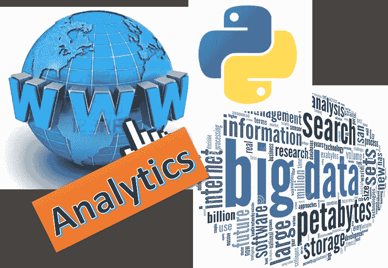
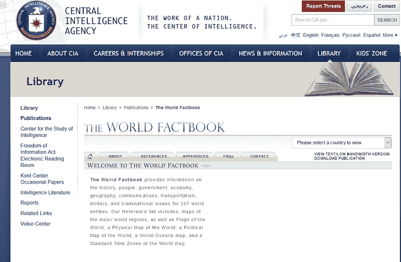
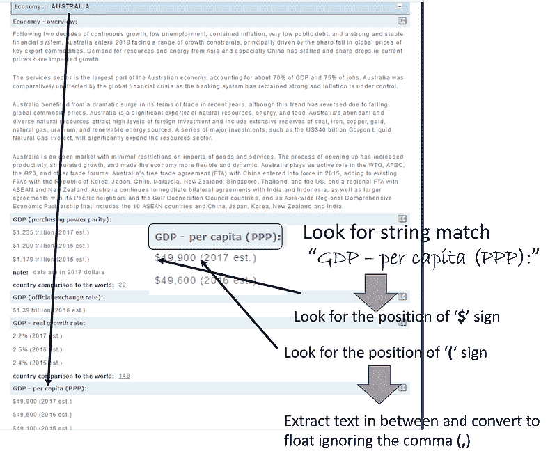

# 使用 Python 进行网络爬取：以 CIA 世界概况为例

> 原文：[`www.kdnuggets.com/2018/03/web-scraping-python-cia-world-factbook.html`](https://www.kdnuggets.com/2018/03/web-scraping-python-cia-world-factbook.html)

 评论



在数据科学项目中，几乎总是最耗时且最麻烦的部分是数据收集和清洗。每个人都喜欢构建一个炫酷的深度神经网络（或 XGboost）模型，并展示自己用炫酷的 3D 交互式图表的技能。但这些模型需要原始数据作为起点，而这些数据并不容易获得且不干净。

> **毕竟，生活不是 Kaggle，那里一个装满数据的 zip 文件等着你去解压和建模 :-)**

**那么，为什么要收集数据或建立模型呢**？根本的动机是为了回答一个商业、科学或社会问题。*是否有趋势*？*这个东西与那个东西有关吗*？*测量这个实体是否能预测那个现象的结果*？这是因为回答这个问题将验证你作为科学家/从业者的假设。你只是使用数据（与化学家用试管或物理学家用磁铁不同）来测试你的假设并从科学上证明或证伪它。**这就是数据科学中的‘科学’部分。没有更多，也没有更少……**

相信我，提出一个需要稍微应用数据科学技术来回答的高质量问题并不那么难。每一个这样的问提都会成为你的小项目，你可以将其编写成代码并在像 Github 这样的开源平台上展示给朋友。即使你不是职业数据科学家，没有人可以阻止你编写炫酷的程序来回答一个好的数据问题。这展示了你作为一个对数据熟悉并能够讲述数据故事的人的形象。

今天让我们处理这样一个问题……

> **一个国家的 GDP（按购买力平价计算）与其互联网用户百分比之间是否存在关系？这种趋势在低收入/中等收入/高收入国家中是否相似？**

现在，你可以想到任何数量的来源来收集数据以回答这个问题。我发现来自 CIA 的一个网站（是的，就是那个‘机构’），提供有关全球所有国家的基本事实信息，是抓取数据的好地方。

因此，我们将使用以下 Python 模块来构建我们的数据库和可视化，

+   **Pandas**，**Numpy, matplotlib/seaborn**

+   Python **urllib**（用于发送 HTTP 请求）

+   **BeautifulSoup**（用于 HTML 解析）

+   **正则表达式模块**（用于查找精确匹配的文本）

让我们讨论一下程序结构，以回答这个数据科学问题。我的 [Github 仓库](https://github.com/tirthajyoti/Web-Database-Analytics-Python) 中提供了 [完整的代码模板](https://github.com/tirthajyoti/Web-Database-Analytics-Python/blob/master/CIA-Factbook-Analytics2.ipynb)。如果你喜欢，可以随意 fork 和 star。

**读取前 HTML 页面并传递给 BeautifulSoup**

这是 [CIA 世界概况书前页](https://www.cia.gov/library/publications/the-world-factbook/) 的样子，



图：CIA 世界概况书前页

我们使用带有 SSL 错误忽略上下文的简单 urllib 请求来检索该页面，然后将其传递给神奇的 BeautifulSoup，它为我们解析 HTML 并生成漂亮的文本转储。对于那些不熟悉 BeautifulSoup 库的人，他们可以观看以下视频或阅读这篇 [很棒的 Medium 文章](https://medium.freecodecamp.org/how-to-scrape-websites-with-python-and-beautifulsoup-5946935d93fe)。

这里是读取前页 HTML 的代码片段，

```py
ctx = ssl.create_default_context()
ctx.check_hostname = False
ctx.verify_mode = ssl.CERT_NONE

# Read the HTML from the URL and pass on to BeautifulSoup
url = 'https://www.cia.gov/library/publications/the-world-factbook/'
print("Opening the file connection...")
uh= urllib.request.urlopen(url, context=ctx)
print("HTTP status",uh.getcode())
html =uh.read().decode()
print(f"Reading done. Total {len(html)} characters read.")
```

这里是我们如何将数据传递给 BeautifulSoup，并使用 `find_all` 方法查找 HTML 中嵌入的所有国家名称和代码。基本思想是 **查找名为‘option’的 HTML 标签**。该标签中的文本是国家名称，而标签值的第 5 和第 6 个字符代表 2 字符的国家代码。

现在，你可能会问，如何知道只需要提取第 5 和第 6 个字符？简单的答案是 **你必须检查 soup 文本，即解析后的 HTML 文本，并确定这些索引**。没有通用的方法来确定这一点。每个 HTML 页面及其底层结构都是独一无二的。

```py
soup = BeautifulSoup(html, 'html.parser')
country_codes=[]
country_names=[]

for tag in soup.find_all('option'):
    country_codes.append(tag.get('value')[5:7])
    country_names.append(tag.text)

temp=country_codes.pop(0) # *To remove the first entry 'World'*
temp=country_names.pop(0) # *To remove the first entry 'World'*
```

**抓取：通过单独抓取每一页，将所有国家的文本数据下载到字典中**

这个步骤是所谓的基本抓取或爬取。要做到这一点，**关键是要确定每个国家信息页面的 URL 是如何结构化的**。一般情况下，这可能很难获取。在这个特定的案例中，快速检查显示了一个非常简单且规律的结构可以遵循。以下是澳大利亚的截图，


这意味着有一个固定的 URL，你需要将 2 字符的国家代码附加到这个 URL 上，就能到达该国家页面的 URL。因此，我们可以遍历国家代码列表，使用 BeautifulSoup 提取所有文本并存储在本地字典中。以下是代码片段，

```py
# Base URL
urlbase = 'https://www.cia.gov/library/publications/the-world-factbook/geos/'
# Empty data dictionary
text_data=dict()

# Iterate over every country
for i in range(1,len(country_names)-1):
    country_html=country_codes[i]+'.html'
    url_to_get=urlbase+country_html
    # Read the HTML from the URL and pass on to BeautifulSoup
    html = urllib.request.urlopen(url_to_get, context=ctx).read()
    soup = BeautifulSoup(html, 'html.parser')
    txt=soup.get_text()
    text_data[country_names[i]]=txt
    print(f"Finished loading data for {country_names[i]}")

print ("\n**Finished downloading all text data!**")
```

**如果你喜欢，可以存储在 Pickle 转储中**

为了更好地处理，我喜欢将这些数据序列化并 **存储在一个 [Python pickle 对象](https://pythontips.com/2013/08/02/what-is-pickle-in-python/) 中**。这样，下次打开 Jupyter notebook 时，我可以直接读取数据，而无需重复网络爬取步骤。

```py
import pickle
pickle.dump(text_data,open("text_data_CIA_Factobook.p", "wb"))

# Unpickle and read the data from local storage next time
text_data = pickle.load(open("text_data_CIA_Factobook.p", "rb"))
```

**使用正则表达式从文本转储中提取 GDP/人数据**

这是程序的核心文本分析部分，我们借助 [***正则表达式*** 模块](https://docs.python.org/3/howto/regex.html) 来查找在庞大的文本字符串中寻找我们需要的信息，并提取相关的数字数据。正则表达式是 Python（或几乎所有高级编程语言）中的丰富资源。它允许在大文本语料库中搜索/匹配特定模式的字符串。在这里，我们使用非常简单的正则表达式方法来匹配如“*GDP — per capita (PPP):*”这样的确切词汇，然后读取其后的几个字符，提取某些符号如$和括号的位置，最终提取 GDP/人均的数值。这里用一个图示例说明了这个想法。



图：文本分析的示意图

在这个笔记本中使用了其他正则表达式技巧，例如提取总 GDP，无论数字是以十亿还是万亿表示。

```py
# 'b' to catch 'billions', 't' to catch 'trillions'
start = re.search('\$',string)
end = re.search('[b,t]',string)
if (start!=None and end!=None):
    start=start.start()
    end=end.start()
    a=string[start+1:start+end-1]
    a = convert_float(a)
    if (string[end]=='t'):
    # If the GDP was in trillions, multiply it by 1000
        a=1000*a
```

这是示例代码片段。**注意代码中放置的多个错误处理检查**。这是必要的，因为 HTML 页面的不可预测性极高。不是所有国家都有 GDP 数据，页面上的数据表述可能不完全相同，数字的形式也可能不同，字符串中的$和()也可能放置得不同。可能会发生各种错误。

> 准备和编写所有场景的代码几乎是不可能的，但至少你需要有代码来处理异常，以防出现异常，这样你的程序不会中断，并可以优雅地继续处理下一个页面。

```py
# Initialize dictionary for holding the data
GDP_PPP = {}
# Iterate over every country
for i in range(1,len(country_names)-1):
    country= country_names[i]
    txt=text_data[country]       
    pos = txt.find('GDP - per capita (PPP):')
    if pos!=-1: #If the wording/phrase is not present
        pos= pos+len('GDP - per capita (PPP):')
        string = txt[pos+1:pos+11]
        start = re.search('\$',string)
        end = re.search('\S',string)
        if (start!=None and end!=None): #If search fails somehow
            start=start.start()
            end=end.start()
            a=string[start+1:start+end-1]
            #print(a)
            a = convert_float(a)
            if (a!=-1.0): #If the float conversion fails somehow
                print(f"GDP/capita (PPP) of {country}: {a} dollars")
                # Insert the data in the dictionary
                GDP_PPP[country]=a
            else:
                print("**Could not find GDP/capita data!**")
        else:
            print("**Could not find GDP/capita data!**")
    else:
        print("**Could not find GDP/capita data!**")

print ("\nFinished finding all GDP/capita data")
```

**不要忘记使用 pandas 的内连接/左连接方法**

需要记住的一点是，这些文本分析将生成具有略微不同国家集的数据框，因为不同类型的数据可能在不同国家不可用。可以使用 [**Pandas 左连接**](https://pandas.pydata.org/pandas-docs/stable/merging.html) 来创建一个包含所有公共国家交集的数据框，这些国家的数据是可用的或可以提取的。

```py
df_combined = df_demo.join(df_GDP, how='left')
df_combined.dropna(inplace=True)
```

**现在进入有趣的部分，建模……但等等！先做过滤吧！**

在完成 HTML 解析、页面抓取和文本挖掘的所有艰苦工作后，现在你已经准备好获得成果——迫不及待地运行回归算法和酷炫的可视化脚本！但等等，通常你需要在生成这些图表之前对数据进行更多的清理（特别是对于这类社会经济问题）。基本上，你想要过滤掉离群值，例如非常小的国家（如岛国），这些国家的参数值可能极度偏斜，但不符合你想要调查的主要动态。几行代码足以完成这些过滤。虽然可能有更*Pythonic*的实现方式，但我尽量保持简单易懂。以下代码例如创建了过滤器，以排除总 GDP 小于 500 亿以及收入边界低于 5000 美元和高于 25000 美元的国家（人均 GDP）。

```py
# Create a filtered data frame and x and y arrays
filter_gdp = df_combined['Total GDP (PPP)'] > 50
filter_low_income=df_combined['GDP (PPP)']>5000
filter_high_income=df_combined['GDP (PPP)']<25000

df_filtered = df_combined[filter_gdp][filter_low_income][filter_high_income]
```

**最后，数据可视化**

我们使用了[**seaborn regplot** 函数](https://seaborn.pydata.org/generated/seaborn.regplot.html)来创建散点图（互联网用户比例 vs. 人均 GDP），并显示线性回归拟合和 95%的置信区间带。它们看起来如下。可以将结果解释为

> 国家互联网用户比例与人均 GDP 之间存在强正相关关系。此外，低收入/低 GDP 国家的相关性强度显著高于高 GDP 发达国家。**这可能意味着互联网访问帮助低收入国家更快地发展，并且在改善公民平均状况方面比发达国家更有效**。


**总结**

本文介绍了一个演示 Python 笔记本，说明如何通过使用 BeautifulSoup 进行 HTML 解析来抓取网页以下载原始信息。随后，它还说明了使用正则表达式模块来搜索和提取用户所需的重要信息。

> 总而言之，这展示了在挖掘混乱的 HTML 解析文本时，为什么没有简单、普遍的规则或程序结构。必须检查文本结构，并设置适当的错误处理检查，以优雅地处理所有情况，确保程序流程顺畅（不会崩溃），即使不能提取所有场景的数据。

希望读者能从提供的 Notebook 文件中受益，并根据自己的需求和想象进行扩展。有关更多网络数据分析的笔记本，[**请查看我的代码库。**](https://github.com/tirthajyoti/Web-Database-Analytics-Python)

如果你有任何问题或想法，请通过 [**tirthajyoti[AT]gmail.com**](mailto:tirthajyoti@gmail.com) 联系作者。你也可以查看作者的 [**GitHub 仓库**](https://github.com/tirthajyoti?tab=repositories) 以获取其他有趣的 Python、R 或 MATLAB 代码片段和机器学习资源。如果你像我一样，对机器学习/数据科学充满热情，请随时 [在 LinkedIn 上添加我](https://www.linkedin.com/in/tirthajyoti-sarkar-2127aa7/) 或 [在 Twitter 上关注我](https://twitter.com/tirthajyotiS)。

**简介： [Tirthajyoti Sarkar](https://www.linkedin.com/in/tirthajyoti-sarkar-2127aa7/)** 是一位半导体技术专家，机器学习/数据科学爱好者，电气工程博士，博客作者和作家。

[原文](https://towardsdatascience.com/data-analytics-with-python-by-web-scraping-illustration-with-cia-world-factbook-abbdaa687a84)。经允许转载。

**相关：**

+   使用 Python 的网页抓取教程：技巧与窍门

+   为什么你应该忘记数据科学代码中的‘for-loop’，而接受矢量化

+   IT 工程师需要学习多少数学才能进入数据科学领域

* * *

## 我们的前三大课程推荐

 1\. [Google 网络安全证书](https://www.kdnuggets.com/google-cybersecurity) - 快速进入网络安全职业生涯

 2\. [Google 数据分析专业证书](https://www.kdnuggets.com/google-data-analytics) - 提升你的数据分析能力

 3\. [Google IT 支持专业证书](https://www.kdnuggets.com/google-itsupport) - 支持你的组织的 IT

* * *

### 更多相关内容

+   [初学者 Python 网页抓取指南](https://www.kdnuggets.com/2022/10/beginner-guide-web-scraping-python.html)

+   [逐步指南：使用 Python 和 Beautiful Soup 进行网页抓取](https://www.kdnuggets.com/2023/04/stepbystep-guide-web-scraping-python-beautiful-soup.html)

+   [掌握使用 BeautifulSoup 进行网页抓取](https://www.kdnuggets.com/mastering-web-scraping-with-beautifulsoup)

+   [Octoparse 8.5：赋能本地抓取及更多功能](https://www.kdnuggets.com/2022/02/octoparse-85-empowering-local-scraping.html)

+   [使用 Python 创建一个从音频中提取主题的 Web 应用程序](https://www.kdnuggets.com/2023/01/creating-web-application-extract-topics-audio-python.html)

+   [在 5 分钟内使用 Python 构建一个网页抓取器](https://www.kdnuggets.com/2022/02/build-web-scraper-python-5-minutes.html)
