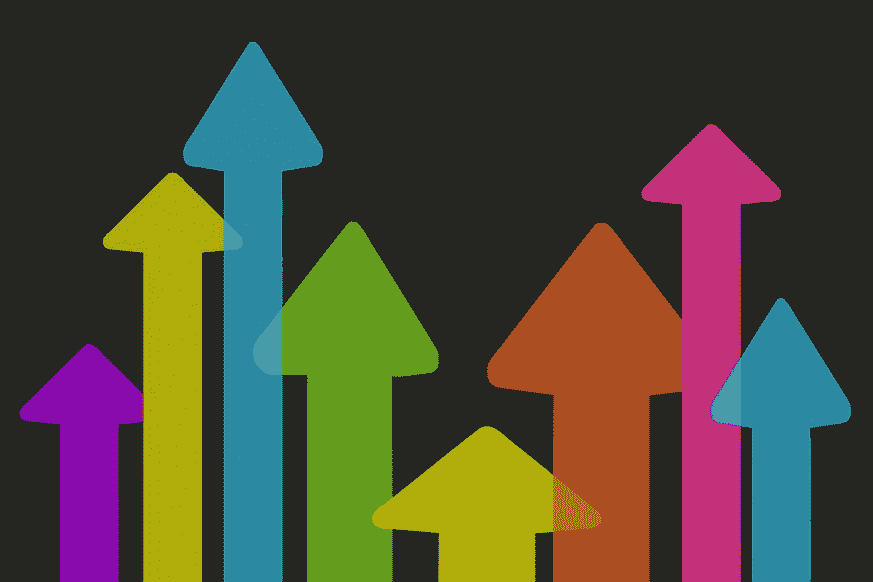
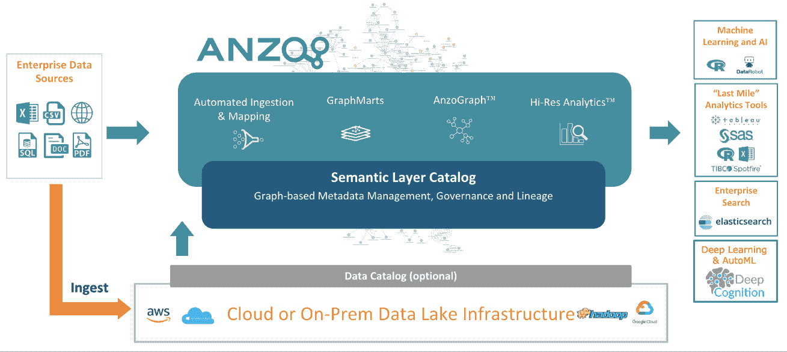

# 今年数据世界将会发生什么

> 原文：[`www.kdnuggets.com/2019/05/whats-going-happen-this-year-data-world.html`](https://www.kdnuggets.com/2019/05/whats-going-happen-this-year-data-world.html)

 评论

### 引言

如果你沉浸在数据世界中，你很可能见过许多关于未来几年将会发生什么的文章、博客帖子和新闻，关于趋势和期望的内容。

* * *

## 我们的三大课程推荐

 1\. [谷歌网络安全证书](https://www.kdnuggets.com/google-cybersecurity) - 快速进入网络安全职业的快车道。

 2\. [谷歌数据分析专业证书](https://www.kdnuggets.com/google-data-analytics) - 提升你的数据分析能力

 3\. [谷歌 IT 支持专业证书](https://www.kdnuggets.com/google-itsupport) - 支持你的组织的 IT 需求

* * *

我读了很多这样的文章，如果你想查看完整内容，可以到文章的末尾找到。但是在这里，我想快速概述一下目前的情况，并分析人们谈论的不同趋势，以了解哪些可能性更大。

### 最常见的趋势

如果你搜索“数据科学”这个术语，你会发现大约有 5400 万条结果，这非常多。对这个领域的兴趣多年来一直在增长。

但数据科学现在非常重要，对于不同的人来说意义各异。如果你查看文章和新闻，最大的趋势有：

还有更多，但这些是最大的几个。同时每一个都有很多可以讨论的内容，但我现在想专注于两个（2）方面。**自动化和图形。**

### 自动化和图形（数据结构）

[`towardsdatascience.com/the-data-fabric-for-machine-learning-part-1-2c558b7035d7`](https://towardsdatascience.com/the-data-fabric-for-machine-learning-part-1-2c558b7035d7)

如果你一直在关注我的研究，目前我最感兴趣的之一是数据结构。请记住，我对数据结构的定义是：

> *数据结构是支持公司所有数据的平台。它如何被管理、描述、组合和普遍访问。这个平台由企业知识图谱构成，以创建一个统一和统一的数据环境。*

我想在这里强调两个重要点，数据架构由企业知识图谱构成，应该尽可能实现自动化。

其中一篇非常清楚地提到这一点的文章是来自 Gartner 的：

[**Gartner 识别 2019 年数据和分析技术的前 10 大趋势**](https://www.gartner.com/en/newsroom/press-releases/2019-02-18-gartner-identifies-top-10-data-and-analytics-technolo)

*增强分析、持续智能和可解释的人工智能（AI）是...* [www.gartner.com](https://www.gartner.com/en/newsroom/press-releases/2019-02-18-gartner-identifies-top-10-data-and-analytics-technolo)

他们说：

> 图处理和图数据库管理系统（DBMS）的应用将每年增长 100%，以持续加速数据准备并支持更复杂和适应性的 数据科学。

还有：

> 到 2022 年，定制的数据架构设计将主要以静态基础设施形式部署，这迫使组织进入一个新的成本浪潮，完全重新设计以适应更动态的数据网格方法。

很明显，图形概念和数据架构每年在数据公司中会变得更加普遍。但自动化呢？

在机器学习、深度学习和部署方面有许多进展。但正如我之前所说，数据是现在公司最重要的资产（也许是最重要的资产）。因此，在你可以应用机器学习或深度学习之前，你需要拥有数据，知道你拥有什么，理解它，治理它，清理它，分析它，标准化它（可能更多），然后你才能考虑如何使用它。

我们需要自动化来处理数据存储、数据清洗、数据探索、数据清理以及我们实际花费大量时间做的所有事情。你可以说像 [DataRobot](https://www.datarobot.com/) 这样的工具可以提供这些功能，但根据我的经验，这个领域还有很多工作要做。

这就是为什么我认为语义技术是解决此问题的途径。通过它们（如 [Anzo](https://www.cambridgesemantics.com/product/)），你可以实现自动查询生成（是的，这是一个功能），并使用它们处理复杂的图形，使提取特征变得简单，并最终实现完全自动化。

在我关于这个主题的最初几篇文章中，我提出了这样的架构：

 [`towardsdatascience.com/deep-learning-for-the-masses-and-the-semantic-layer-f1db5e3ab94b`](https://towardsdatascience.com/deep-learning-for-the-masses-and-the-semantic-layer-f1db5e3ab94b)

在你能随处见到自动化的地方。并且可以轻松地实时添加更多功能，比如**可解释的 AI**、**持续智能**等。在同一篇文章中，Gartner 提到：

> 持续智能是一种设计模式，其中实时分析被集成到业务操作中，处理当前和历史数据以建议应对事件的行动。它提供决策自动化或决策支持。

这个词并不新鲜，如果我们考虑流式分析，但我喜欢这个名字。实际上，发生的事情可以分为两部分：**语义技术和自动化。**

这里是过去 5 年语义技术的兴趣情况：

如我们所见，数据织物的高度并不高，但我认为这很快会改变。

### 结论

如果你想保持最新状态，最好开始考虑如何将你的数据湖升级为智能数据湖，同时自动化你的过程，从数据摄取到模型部署和监控，并利用图形技术。

再次重申，如果：

+   你有高度相关的数据。

+   你需要一个灵活的模式。

+   你需要一个结构化的方案，并构建更符合人们思维方式的查询。

如果你有高度结构化的数据，想要进行大量分组计算且表之间的关系不多，那么使用关系数据库可能更合适。

剑桥语义学的团队创建了这张很棒的信息图，让你更了解数据织物的宇宙：

感谢阅读，希望这篇文章能给你在个人业务和生活中作为数据科学家的工作提供一些建议。

### 参考文献：

[**Gartner 识别出 2019 年十大数据和分析技术趋势**](https://www.example.com)

*增强分析、持续智能和可解释的人工智能（AI）是…*www.gartner.com](https://www.gartner.com/en/newsroom/press-releases/2019-02-18-gartner-identifies-top-10-data-and-analytics-technolo)

[**2019 年数据科学趋势**](https://www.example.com)

*今年可以被视为人工智能（AI）的繁荣之年。看看初创公司数量…*towardsdatascience.com](https://towardsdatascience.com/data-science-trends-for-2019-11b2397bd16b)

[**2019 年数据科学趋势 - DATAVERSITY**](https://www.example.com)

*谈到 2019 年值得关注的主要数据科学趋势，去年的主要趋势从 2017 年延续下来，增长…*www.dataversity.net](https://www.dataversity.net/data-science-trends-in-2019/#)

[**2018 年人工智能、数据科学、分析的主要发展和 2019 年的关键趋势**](https://www.example.com)

*与以往一样，我们带来了一些专家的预测和分析总结。我们询问了主要…*www.kdnuggets.com](/2018/12/predictions-data-science-analytics-2019.html)

[**2019 年值得关注的 10 大大数据趋势**](https://www.example.com)

*我们寻求更多数据是有充分理由的：数据是推动数字创新的商品。然而，要将这些巨大的…*www.datanami.com](https://www.datanami.com/2019/01/21/10-big-data-trends-to-watch-in-2019/)

[**2019 年 5 大数据与 AI 趋势 - 信息周刊**](https://www.informationweek.com/5-data-and-ai-trends-for-2019)

*新的一年，新的日历页。如果 2019 年与 2018 年类似，你可以确定数据、分析、机器学习……*www.informationweek.com](https://www.informationweek.com/strategic-cio/5-data-and-ai-trends-for-2019/d/d-id/1333581)

[**图形数据库。有什么大不了的？**

*继续对语义和数据科学的分析，是时候谈谈图形数据库及其有什么…*towardsdatascience.com](https://towardsdatascience.com/graph-databases-whats-the-big-deal-ec310b1bc0ed)

[**Anzo®**

*迄今为止，没有任何技术能够在企业规模上提供语义层——具有安全性、治理和……*www.cambridgesemantics.com](https://www.cambridgesemantics.com/product/)

**简介: [Favio Vazquez](https://www.linkedin.com/in/faviovazquez/)** 是一名物理学家和计算机工程师，从事数据科学和计算宇宙学工作。他热爱科学、哲学、编程和音乐。他是西班牙语数据科学出版物 Ciencia y Datos 的创始人。他喜欢接受新挑战，与优秀团队合作，并解决有趣的问题。他参与了 Apache Spark 的协作，帮助 MLlib、Core 和文档的工作。他热衷于将自己的科学、数据分析、可视化和自动学习知识应用于使世界变得更美好。

[原文](https://towardsdatascience.com/whats-going-to-happen-this-year-in-the-data-world-9fc065ac3870). 经许可转载。

**相关:**

+   解释性 AI 简介及其必要性

+   克服对生产性分析的信任障碍

+   哪个深度学习框架增长最快？

### 相关话题

+   [AI 发生在哪里？](https://www.kdnuggets.com/2023/07/kdd-where-does-ai-happen.html)

+   [如何跟上 AI 世界的最新动态](https://www.kdnuggets.com/2022/03/stay-top-going-ai-world.html)

+   [Python 中的情感分析：超越词袋模型](https://www.kdnuggets.com/sentiment-analysis-in-python-going-beyond-bag-of-words)

+   [最佳数据科学资源、训练营和课程，以便学习…](https://www.kdnuggets.com/2023/12/springboard-best-data-science-resources-bootcamp-courses-learn-data-science-new-year)

+   [5 个适合数据科学专业最后一年学生的作品集项目](https://www.kdnuggets.com/5-portfolio-projects-for-final-year-data-science-students)

+   [一年内掌握数据科学：终极实惠、自学指南](https://www.kdnuggets.com/master-data-science-in-a-year-the-ultimate-guide-to-affordable-self-paced-learning)
