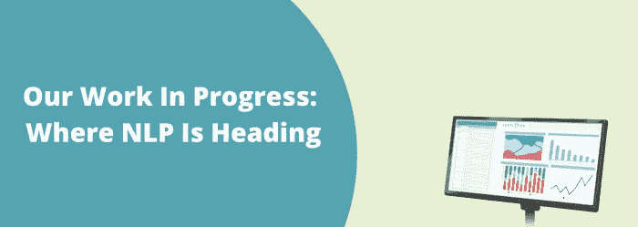

# NLP 的未来发展方向

> 原文：[`www.kdnuggets.com/2021/11/where-nlp-is-heading.html`](https://www.kdnuggets.com/2021/11/where-nlp-is-heading.html)

评论

**由[Paul Barba](https://www.linkedin.com/in/paul-barba/)，Lexalytics 首席科学家，inMoment 公司**。

* * *

## 我们的前三名课程推荐

 1\. [谷歌网络安全证书](https://www.kdnuggets.com/google-cybersecurity) - 快速开启网络安全职业生涯。

 2\. [谷歌数据分析专业证书](https://www.kdnuggets.com/google-data-analytics) - 提升您的数据分析技能

 3\. [谷歌 IT 支持专业证书](https://www.kdnuggets.com/google-itsupport) - 支持您的组织在 IT 领域

* * *

随着我们能够获取的书面和口头语言语料库的普及，自然语言处理（NLP）已成为研究人员、组织甚至爱好者的宝贵工具。它使我们能够总结文档、分析情感、分类内容、翻译语言——有一天甚至可能达到人类水平的对话。

像任何人工智能和机器学习学科一样，自然语言处理（NLP）也是一个快速发展的领域，正在经历着快速变化，因为从业者和研究人员都在深入探索它所带来的前景。尽管 NLP 领域变化迅速，但我看到的一些趋势和机会如下。

### 提示：用几个选择词来激发 NLP

“[提示](https://thegradient.pub/prompting/)”是一种技术，涉及在您的输入示例中添加一段文本，以鼓励语言模型执行您感兴趣的任务。比如您的输入文本是：“我们有一个很棒的服务员，但食物煮得不够熟。”也许您对比较不同餐馆的食物质量感兴趣。将评论附加“食物是”并观察“糟糕”或“很棒”哪个更可能成为续写的词，这样突然就为您提供了一个主题情感模型。鉴于“未熟”相关的负面情感，我们的缺失词几乎肯定是“糟糕”。

从零开始训练这样的模型需要大量的注释，但通过少量的示例或甚至没有示例，可以找到可行的解决方案，使得提示成为小规模项目和预算的可行选择。由于提示语言可以轻松更改，您可以在数据集上探索许多可能的分类法和功能，而无需为您的注释者确定最终的指南集。

### 站在巨人的肩膀上：跨模态的汇聚

随着领域的逐渐成熟，我们开始看到不同人工智能和机器学习学科之间的交叉传播。现在进入这一领域所需的背景知识减少了，取而代之的是我们开始看到扎实的通才。这促使了各种模式的融合，我们现在看到传统的基于文本的方法被带入数值领域，而传统上以 NLP 为导向的事物，如变换器网络，也被应用于视频甚至物理模拟。

对于创意思维者来说，机会和应用是广泛的：例如，三星正在将 NLP 与视频图像结合起来，帮助自动驾驶汽车解读外国的街道标志。NLP 和计算机视觉[天作之合](https://medium.com/sciforce/nlp-and-computer-vision-integrated-843558143e01)，我也期待看到它们被用来帮助将视频翻译为文本以提高可及性，改善医学图像的描述，甚至将口头设计请求转化为书面或视觉描述。

### 分享即关怀：开源模型推动知识进步

一个[开源人工智能文化](https://www.forbes.com/sites/insights-intelai/2019/05/22/the-power-of-open-source-ai/?sh=666ba6ed6300)有利于创新，提供宝贵的反馈回路、改进和发展技术的机会，并为技术人员提供成长空间。像 DeepMind 这样的巨头通过 AlphaGo 和 AlphaZero 留下的研究论文和库开辟了道路，而现在像[HuggingFace](https://techcrunch.com/2021/03/11/hugging-face-raises-40-million-for-its-natural-language-processing-library/)这样的较小竞争者也在与语言研究人员共同开发的商业/开源混合技术中做同样的事情。这些合作伙伴关系，如我们与 UMass 的合作，使得 NLP 社区对[数据集](https://github.com/huggingface)、分词器和变换器有了更多的访问权限，深入了解技术细节，并为社区提供了迭代、推进和拓宽技术访问的机会——同时增强了我们的集体技能和知识。

### 公平竞争，算法：算法和人共同合作

算法和人类各有其优势，通过合作，它们可以产生卓越的结果。一个引起关注的领域是生成语言，但问题在于，尽管算法可以生成听起来像人类的输出，但它们不关心真实性。然而，有一个人类来监控准确性、相关性和格赖斯准则的其余部分，可以改善结果。这种合作关系在总结中同样有效，这是我感兴趣的领域。快速将一篇长文章浓缩成最重要的要点对人类来说出乎意料地困难，而机器在一定的约束条件下表现出合理的能力。另一方面，当我们要求机器将这些要点转换成连贯的总结时，它们往往会将意义改变为非事实的东西。但是，让机器突出文档中的关键思想，然后由人类将其转化为简短的摘录，效果优于单独工作。我认为，随着人工智能和自然语言处理在日常工作流程中变得更加嵌入，我们将看到越来越多这样的情况。

### 转换变换器：资源消耗更少的解决方案

BERT 和其他类似的知名技术是使用[变换器](https://towardsdatascience.com/transformers-89034557de14)构建的，这是一种模型，可以识别长块文本中目标词的相关依赖关系（句子中的词与目标词之间的关系）。变换器非常有效，但也极其资源密集，因为它们需要大量的预训练和数据。尽管变换器技术已经风靡一时，但我们开始看到替代方案的出现，因为小公司和团队正在寻求更适合小规模（和预算）问题的解决方案。HuggingFace 的变换器变体，[SRU++及相关工作](https://www.kdnuggets.com/2021/03/reducing-high-cost-training-nlp-models-sru.html)、Reformer（高效的变换器模型）以及类似 ETC/BigBird 的模型是潜在的替代方案，我预计这些将会受到更多关注，因为基于变换器的项目的计算成本变得难以承担。

### 技术陈词滥调：剩下的还在继续

人工智能和自然语言处理总是在不断发展和改进中，我们可以看到资源丰富的行业在赶上下一个大事时的起伏，而研究则需要一些时间来跟上并扩展我们的知识。这个周期，现在受到自然语言处理的开源性质、技术交叉传播和新行业应用的影响，将继续带来新的机会和进展供我们探索和利用。

**相关内容：**

+   [自然语言处理中的不同词嵌入技术终极指南](https://www.kdnuggets.com/2021/11/guide-word-embedding-techniques-nlp.html)

+   [7 个顶级开源数据集，用于训练自然语言处理（NLP）和文本模型](https://www.kdnuggets.com/2021/11/top-open-source-datasets-nlp.html)

+   [使用 Hugging Face 理解 BERT](https://www.kdnuggets.com/2021/07/understanding-bert-hugging-face.html)

### 更多相关话题

+   [停止学习数据科学以寻找目标，并找到目标去…](https://www.kdnuggets.com/2021/12/stop-learning-data-science-find-purpose.html)

+   [一个 90 亿美元的人工智能失败，经过审查](https://www.kdnuggets.com/2021/12/9b-ai-failure-examined.html)

+   [学习数据科学统计学的顶级资源](https://www.kdnuggets.com/2021/12/springboard-top-resources-learn-data-science-statistics.html)

+   [成功数据科学家的 5 个特征](https://www.kdnuggets.com/2021/12/5-characteristics-successful-data-scientist.html)

+   [为什么 Python 是初创公司的理想编程语言](https://www.kdnuggets.com/2021/12/makes-python-ideal-programming-language-startups.html)

+   [每位数据科学家都应该知道的三个 R 库（即使你使用 Python）](https://www.kdnuggets.com/2021/12/three-r-libraries-every-data-scientist-know-even-python.html)
