# 手中掌握整个数据科学世界

> 原文：[`www.kdnuggets.com/2019/06/whole-data-science-world.html`](https://www.kdnuggets.com/2019/06/whole-data-science-world.html)

 评论 图片由 [Héizel Vázquez](https://www.instagram.com/heizelvazquez/) 提供

我多年来一直在寻找一个可以运行数据科学项目的平台，而不必为安装和填满电脑上各种工具和环境而烦恼。

* * *

## 我们的前三名课程推荐

 1\. [Google 网络安全证书](https://www.kdnuggets.com/google-cybersecurity) - 快速进入网络安全职业生涯

 2\. [Google 数据分析专业证书](https://www.kdnuggets.com/google-data-analytics) - 提升你的数据分析水平

 3\. [Google IT 支持专业证书](https://www.kdnuggets.com/google-itsupport) - 支持你的组织 IT

* * *

幸运的是，我发现 [MatrixDS](https://matrixds.com/) 提供了所有这些功能，并且是免费的！在这篇文章中，我将测试几乎所有他们提供的工具，这样你就不必这样做了。

项目在平台上是公开的，你可以在这里查看：

[**MatrixDS | 数据项目工作台**](https://matrixds.com/)

*MatrixDS 是一个用于构建、分享和管理各种规模的数据项目的平台。* [community.platform.matrixds.com](https://community.platform.matrixds.com/community/project/5cb72e2478de19f638a914b9)


如果你想试用，只需将其叉车加载即可。

还有一个 GitHub 仓库：

[**FavioVazquez/matrix_languages_tools**](https://github.com/FavioVazquez/matrix_languages_tools)

*测试 MatrixDS 的不同工具和语言。贡献于 FavioVazquez/matrix_languages_tools 开发…* [github.com](https://github.com/FavioVazquez/matrix_languages_tools)

### 测试 Python 相关内容

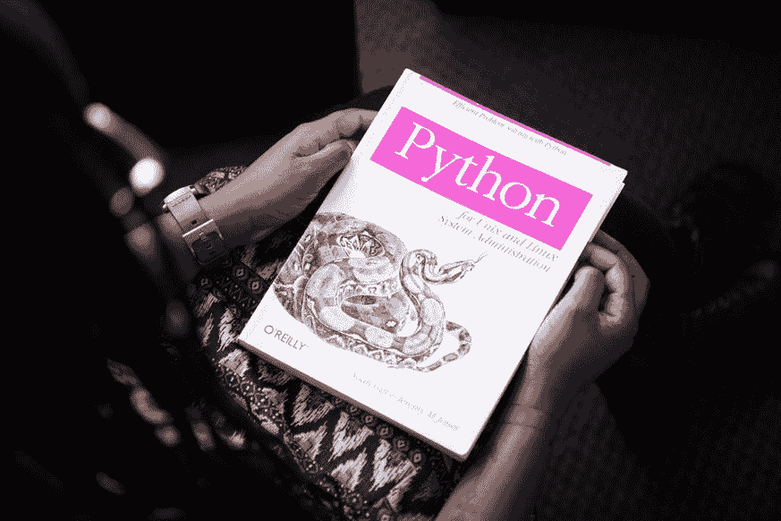

**Jupyter Notebook**

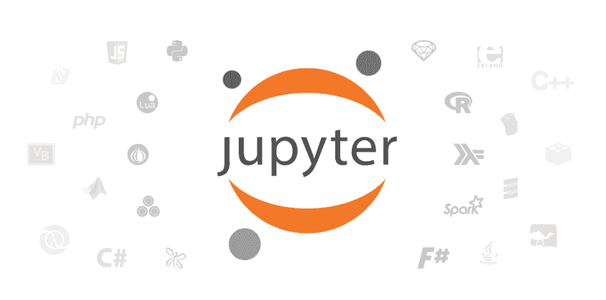

我目前最喜欢的编程语言是 Python。使用这种语言有很多很棒的工具和功能。其中一个最受欢迎的工具是 Jupyter Notebook。要在 MatrixDS 中启动笔记本，请执行以下操作：

1.  转到平台中的工具标签。

1.  点击右侧的 (+) 按钮：

1.  选择 Python 3（或 2）与 Jupyter Notebook：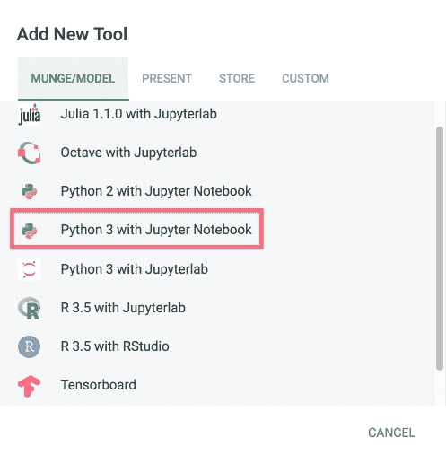

1.  为工具选择一个名称，并设置核心数和内存：

1.  当笔记本创建并启动后，只需打开它：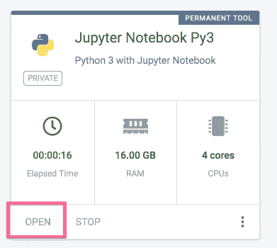

1.  编程愉快 ;)

    在笔记本内部，你可以随意做任何事情。我创建了一个简单的 Python 笔记本来测试 [PySnooper](https://github.com/cool-RR/PySnooper)，你可以尝试一下。

这是该笔记本的要点，你可以在 MatrixDS 项目中找到：

[pysnooper](https://render.githubusercontent.com/view/ipynb?commit=aaf90880150dcb1fe7f36424f13c84071d837c5a&enc_url=68747470733a2f2f7261772e67697468756275736572636f6e74656e742e636f6d2f676973742f466176696f56617a7175657a2f64626562393465323238646633393838666436383366333362323333653132652f7261772f616166393038383031353064636231666537663336343234663133633834303731643833376335612f546573745f5079536e6f6f7065722e6970796e62&nwo=FavioVazquez%2Fdbeb94e228df3988fd683f33b233e12e&path=Test_PySnooper.ipynb&repository_id=96014280&repository_type=Gist#e12c743d-5dec-4d8c-b289-3e35597fdbf2)

**Jupyter Lab**


JupyterLab 是 Project Jupyter 的下一代基于网页的用户界面。它就像是升级版的 Jupyter Notebooks。

在 MatrixDS 中启动一个笔记本，请执行以下操作：

1.  转到平台上的工具标签。

1.  点击右侧的 (+) 按钮：

1.  选择 Python 3 和 JupyterLab：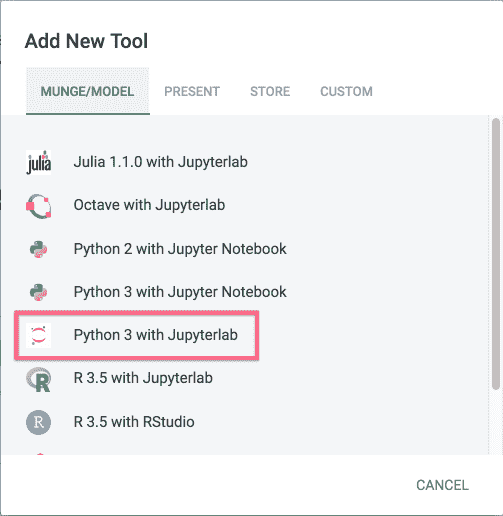

1.  选择工具的名称并设置核心数和内存：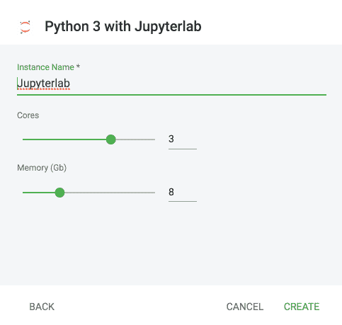

1.  当工具创建并启动后，只需打开它：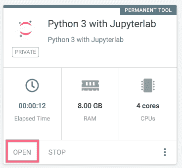

1.  更加有趣 :)

    我在 JupyterLab 实例中创建了一个简单的 Python 笔记本进行测试，你可以尝试一下。

    如果你到现在为止一直关注我，这就是你应该看到的：

    

哦，顺便说一句，如果你想知道如何在 MatrixDS 中使用 git，请查看这篇文章：

[**用 Optimus 进行数据科学。第二部分：设置你的 DataOps 环境。**

*用 Python、Spark 和 Optimus 分解数据科学。今天：数据科学的数据操作。 ..::第一部分在这里…*towardsdatascience.com](https://towardsdatascience.com/data-science-with-optimus-part-2-setting-your-dataops-environment-248b0bd3bce3)

我创建的测试笔记本测试了新的库 [fklearn](https://github.com/nubank/fklearn)，用于功能性机器学习。这里是该笔记本的要点，你可以在 MatrixDS 项目中找到：

[fklearn](https://render.githubusercontent.com/view/ipynb?commit=c892a161542fb31e877feccbf60f7389344df660&enc_url=68747470733a2f2f7261772e67697468756275736572636f6e74656e742e636f6d2f676973742f466176696f56617a7175657a2f31393030363935303337623562393439306637366231333062623466356362392f7261772f633839326131363135343266623331653837376665636362663630663733383933343464663636302f546573745f666b6c6561726e2e6970796e62&nwo=FavioVazquez%2F1900695037b5b9490f76b130bb4f5cb9&path=Test_fklearn.ipynb&repository_id=96014640&repository_type=Gist#985e0f12-137f-4db3-bbba-c662433ad36f)

### 测试 R 相关内容

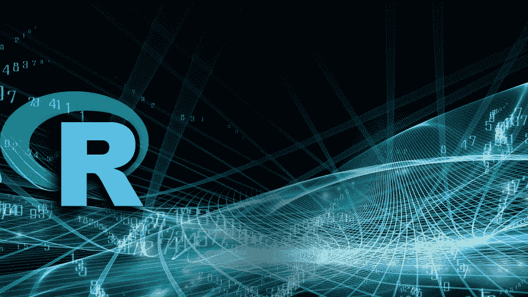[`www.computerworld.com/video/series/8563/do-more-with-r`](https://www.computerworld.com/video/series/8563/do-more-with-r)

我开始我的数据科学职业生涯时使用了 R。它是进行数据分析、数据清理、绘图等的绝佳工具。我认为现在机器学习部分用 Python 更好，但要成为成功的数据科学家，你需要同时掌握这两者。

要在 MatrixDS 中启动 RStudio，请执行以下操作：

1.  转到平台上的工具选项卡。

1.  点击右侧的 (+) 按钮：

1.  选择 R 3.5 和 RStudio: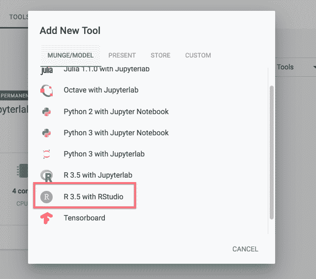

1.  为工具选择一个名称，并设置核心数量和内存：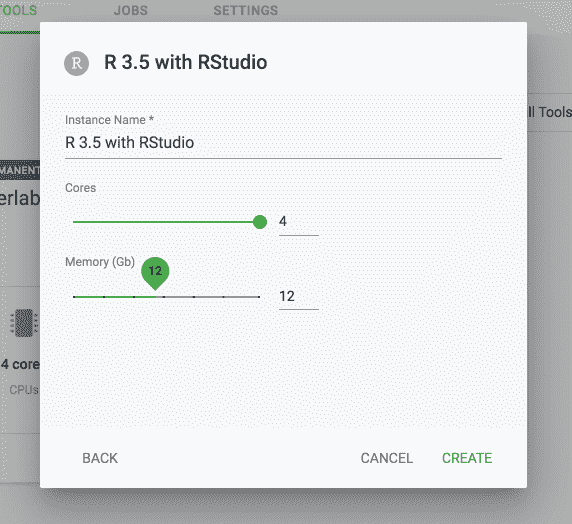

1.  当工具创建并启动后，只需打开它：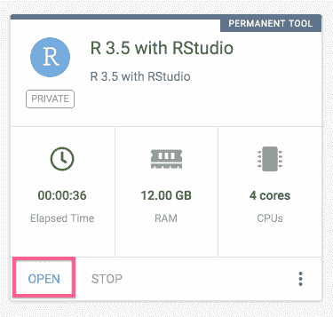

1.  玩 R 很有趣 :)

    我创建的测试 R 环境正在测试一个名为 g2r 的新库，该库使用 g2 创建互动可视化图形。

顺便说一下！我在运行 g2r 之前必须这样做：

```py

sudo su 
apt-get install libv8-dev

```

所以，通常你需要这样做以获得 ggplot2 图：

```py

library(ggplot2)

ggplot(iris, aes(Petal.Length, Petal.Width, color = Species)) +
  geom_point() +
  facet_wrap(.~Species)

```

然后你将会得到：

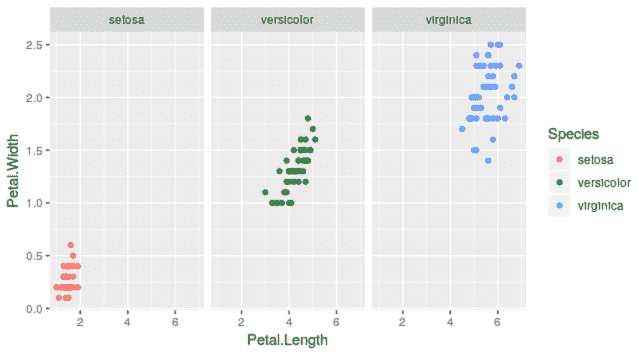

不算太糟，但如何为其添加互动性呢？使用 g2r 很简单。这是实现该功能的代码：

```py

library(g2r)

g2(iris, asp(Petal.Length, Petal.Width, color = Species)) %>%
  fig_point() %>%
  plane_wrap(planes(Species))

```

然后你将会得到：

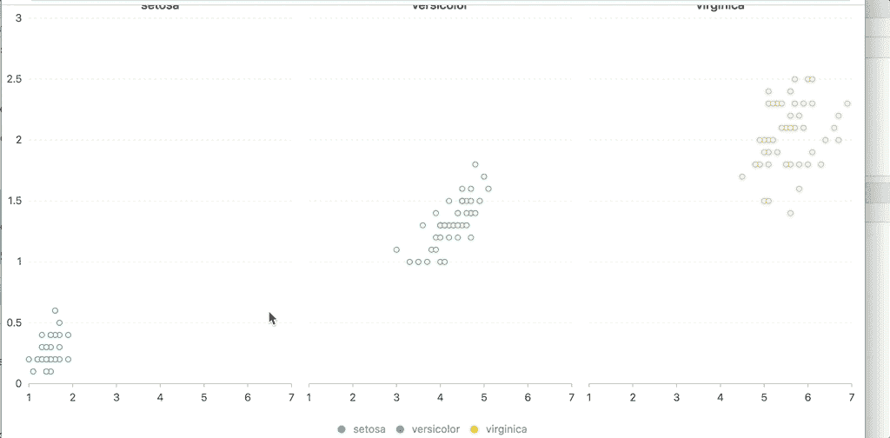

在代码中你需要更改：

```py

aes -> asp
geom_point() -> fig_point()
facet_wrap(.~Species) -> plane_wrap(planes(Species))

```

我仍在想为什么他们没有使用相同的 API，不过这是一个非常酷的项目。你可以在这里查看更多示例：

[**文章**](https://g2r.dev/articles/)

*开始使用 g2r，发现它与 ggplot2 的相似之处，并查看一些示例来指导你…* [g2r.dev](https://g2r.dev/articles/)

这是所有代码：

```py

install.packages("remotes")
remotes::install_github("JohnCoene/g2r")

# So normally this is what you do for getting a plot with ggplot2

library(ggplot2)

ggplot(iris, aes(Petal.Length, Petal.Width, color = Species)) +
  geom_point() +
  facet_wrap(.~Species)

# Now with g2r

library(g2r)

g2(iris, asp(Petal.Length, Petal.Width, color = Species)) %>% 
  fig_point() %>%
plane_wrap(planes(Species))

```

### 测试 Julia 相关内容


当我在两年前攻读物理硕士学位时，我真的认为 Julia 会彻底改变科学编程世界。不要误会我，它确实做得很棒，但我认为 Python 的新进展已经让这个项目在很多方面处于第二位。

为测试 MatrixDS 的 Julia 能力，我想了解一下该语言的数据库。你可以在下面看到。

要在 MatrixDS 中启动 Julia Notebook，请执行以下操作：

1.  转到平台上的工具选项卡。

1.  点击右侧的 (+) 按钮：

1.  选择 Julia 1.1.0 和 JupyterLab：

1.  为工具选择一个名称，并设置核心数量和内存：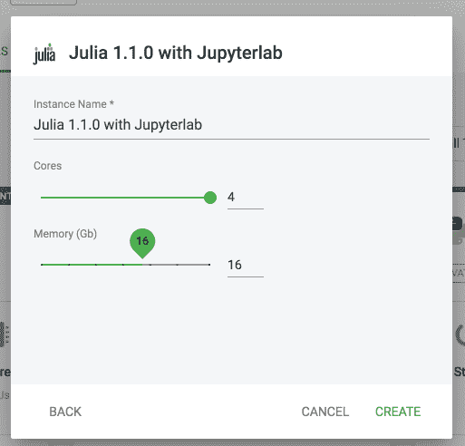

1.  当工具创建并启动后，只需打开它：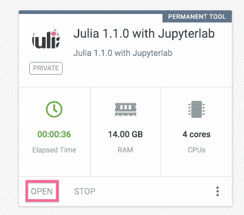

1.  让我们用 Julia :) （听起来有点奇怪）

    启动时，你可以打开或创建任何 Python 或 Julia 笔记本：

这是我为测试 Julia 在数据科学中的能力而创建的笔记本：

[Julia 在 MatrixDS 中](https://render.githubusercontent.com/view/ipynb?commit=77813bc6f1c654b8aa8cd411c8028be9150a70b3&enc_url=68747470733a2f2f7261772e67697468756275736572636f6e74656e742e636f6d2f676973742f466176696f56617a7175657a2f32366165346535333034623364393162313264636638353065656565333933312f7261772f373738313362633666316336353462386161386364343131633830323862653931353061373062332f546573745f4a756c69615f44532e6970796e62&nwo=FavioVazquez%2F26ae4e5304b3d91b12dcf850eeee3931&path=Test_Julia_DS.ipynb&repository_id=96429511&repository_type=Gist#867cd745-e22c-484e-9e1b-10e8ec6082ed)

在这里我测试了一些库，如 DataFrames、Gadfly、Queryverse、Vega 用于绘图等 :)

如你所见，对我来说，这是在云端进行数据科学的最完整平台。你只需最低配置，甚至可以通过 docker 安装自己的工具。

还有很多内容需要涵盖和在平台上做的事情，我将在其他文章中进行。如果你想和我保持联系，请在这里关注我：

[**Favio Vázquez (@FavioVaz) | 推特**](https://twitter.com/faviovaz)

*Favio Vázquez (@FavioVaz) 的最新推文。数据科学家。物理学家和计算工程师。我有一…*twitter.com](https://twitter.com/faviovaz)

**简介：[Favio Vazquez](https://www.linkedin.com/in/faviovazquez/)** 是一位物理学家和计算机工程师，专注于数据科学和计算宇宙学。他对科学、哲学、编程和音乐充满热情。他是 Ciencia y Datos 的创始人，这是一个西班牙语的数据科学出版物。他喜欢新挑战，喜欢与优秀团队合作，并解决有趣的问题。他参与了 Apache Spark 的协作，帮助进行 MLlib、Core 和文档工作。他喜欢应用自己的知识和专业技能于科学、数据分析、可视化和自动学习，致力于让世界变得更美好。

[原文](https://towardsdatascience.com/the-whole-data-science-world-in-your-hands-2f418165075e)。经许可转载。

**相关：**

+   Julia 的顶级机器学习项目

+   数据科学笔记本使用最佳实践

+   在 Jupyter 中运行 R 和 Python

### 更多相关话题

+   [实践强化学习课程第三部分：SARSA](https://www.kdnuggets.com/2022/01/handson-reinforcement-learning-course-part-3-sarsa.html)

+   [实践强化学习课程，第一部分](https://www.kdnuggets.com/2021/12/hands-on-reinforcement-learning-course-part-1.html)

+   [实践强化学习课程，第二部分](https://www.kdnuggets.com/2021/12/hands-on-reinforcement-learning-part-2.html)

+   [生成式 AI 与大型语言模型：实践培训](https://www.kdnuggets.com/2023/07/generative-ai-large-language-models-handson-training.html)

+   [动手实践有监督学习：线性回归](https://www.kdnuggets.com/handson-with-supervised-learning-linear-regression)

+   [动手实践无监督学习：K 均值聚类](https://www.kdnuggets.com/handson-with-unsupervised-learning-kmeans-clustering)
