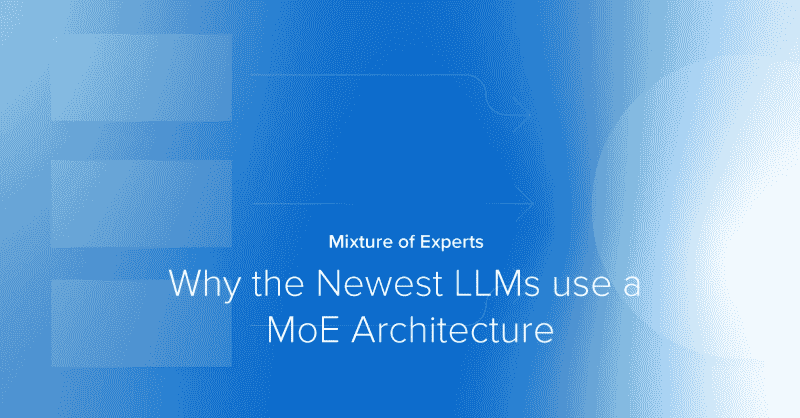
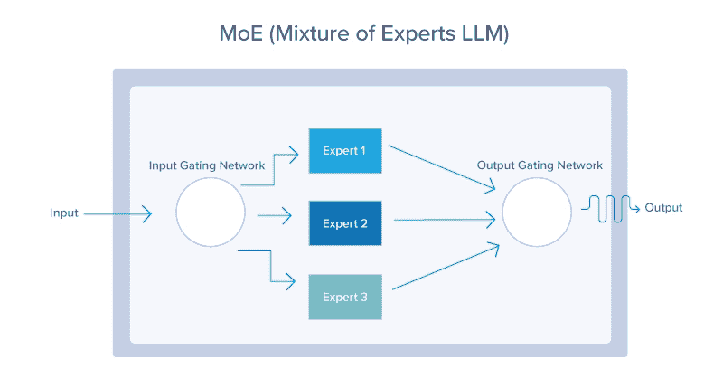
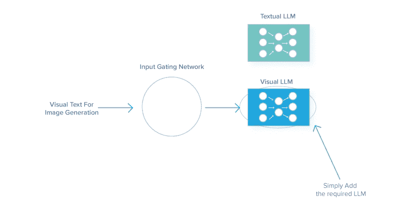

# 为什么最新的 LLM 使用 MoE（专家混合）架构

> 原文：[`www.kdnuggets.com/why-the-newest-llms-use-a-moe-mixture-of-experts-architecture`](https://www.kdnuggets.com/why-the-newest-llms-use-a-moe-mixture-of-experts-architecture)

## 专业化的必要性

医院里挤满了各类专家和医生，他们各自拥有不同的专业领域，解决各种独特的问题。外科医生、心脏科医生、儿科医生——各类专家携手合作，提供护理，常常需要合作以满足患者的需求。我们可以在 AI 中实现类似的做法。

* * *

## 我们的前三名课程推荐

 1\. [谷歌网络安全证书](https://www.kdnuggets.com/google-cybersecurity) - 快速进入网络安全领域。

 2\. [谷歌数据分析专业证书](https://www.kdnuggets.com/google-data-analytics) - 提升你的数据分析技能

 3\. [谷歌 IT 支持专业证书](https://www.kdnuggets.com/google-itsupport) - 支持你的组织在 IT 方面

* * *

在人工智能中，专家混合（MoE）架构定义为不同“专家”模型的组合，这些模型共同处理或响应复杂的数据输入。对于 AI 而言，每个 MoE 模型中的专家专注于更大的问题——就像每位医生专注于其医学领域一样。这提高了效率，增加了系统的效能和准确性。

Mistral AI 提供了与 OpenAI 相媲美的开源基础 LLM。他们正式讨论了在其 Mixtral 8x7B 模型中使用 MoE 架构，这是一种突破性的前沿大型语言模型（LLM）。我们将深入探讨为什么 Mistral AI 的 Mixtral 在其他基础 LLM 中脱颖而出，以及为什么当前 LLM 采用 MoE 架构，突出其速度、规模和准确性。

## 升级大型语言模型（LLM）的常见方式

为了更好地理解 MoE 架构如何提升我们的 LLM，让我们讨论一下提高 LLM 效率的常见方法。AI 从业者和开发者通过增加参数、调整架构或微调来提升模型性能。

+   **增加参数：** 通过输入更多信息并进行解读，模型学习和表示复杂模式的能力提高。然而，这可能导致过拟合和幻觉现象，需要进行大量的来自人类反馈的强化学习（RLHF）。

+   **调整架构：** 引入新的层或模块以适应增加的参数数量，并提高特定任务的性能。然而，对底层架构的更改实施起来具有挑战性。

+   **微调：** 预训练模型可以在特定数据上或通过迁移学习进行微调，使现有的 LLM 能够处理新任务或领域，而无需从头开始。这是最简单的方法，并且不需要对模型进行重大更改。

## MoE 架构是什么？

专家混合（MoE）架构是一种神经网络设计，通过动态激活每个输入的专业网络子集（称为专家）来提高效率和性能。门控网络决定激活哪些专家，从而实现稀疏激活和降低计算成本。MoE 架构包括两个关键组件：门控网络和专家。让我们深入了解一下：

本质上，MoE 架构像一个高效的交通系统，根据实时条件和目标目的地，将每辆车——在这种情况下，是数据——引导到最佳路线。每个任务都被路由到最适合处理该任务的专家或子模型。这种动态路由确保为每个任务分配最具能力的资源，提高了模型的整体效率和效果。MoE 架构利用了提高模型保真度的所有 3 种方法。

+   通过实现多个专家，MoE 自然地提高了模型的

+   通过增加每个专家的参数数量来增大参数规模。

+   MoE 改变了经典的神经网络架构，包含一个门控网络，以确定为指定任务使用哪些专家。

+   每个 AI 模型都有一定程度的微调，因此 MoE 中的每个专家都会经过微调，以便为传统模型无法利用的额外调优层执行预期的功能。

### MoE 门控网络

门控网络在 MoE 模型中充当决策者或控制器的角色。它评估传入的任务，并确定哪个专家适合处理这些任务。这个决策通常基于学习到的权重，这些权重随着训练时间的推移而调整，从而进一步提高其将任务与专家匹配的能力。门控网络可以采用各种策略，从使用概率方法将任务分配给多个专家的软分配，到将每个任务路由到单一专家的确定性方法。

### MoE 专家

MoE 模型中的每个专家代表一个较小的神经网络、机器学习模型或针对问题领域特定子集优化的 LLM。例如，在 Mistral 中，不同的专家可能专注于理解某些语言、方言或特定类型的查询。这种专业化确保每个专家在其小众领域中精通，当与其他专家的贡献相结合时，将在各种任务中表现出更高的性能。

### MoE 损失函数

虽然不被视为 MoE 架构的主要组成部分，但损失函数在模型未来的性能中扮演着关键角色，因为它旨在优化个别专家和门控网络。

它通常结合了为每个专家计算的损失，并根据门控网络分配给它们的概率或重要性进行加权。这有助于为专家的特定任务进行微调，同时调整门控网络以提高路由准确性。

## MoE 过程从开始到结束

现在让我们总结一下整个过程，添加更多细节。

下面是路由过程从开始到结束的总结说明：

+   输入处理：对输入数据进行初步处理。在 LLMs 的情况下，主要是我们的提示。

+   特征提取：将原始输入转换为可分析的数据。

+   门控网络评估：通过概率或权重评估专家的适用性。

+   加权路由：根据计算的权重分配输入。在这里，选择最合适的 LLM 的过程完成。在某些情况下，会选择多个 LLM 来回答单一输入。

+   任务执行：处理每个专家分配的输入。

+   专家输出的整合：将各个专家的结果合并为最终输出。

+   反馈与调整：利用性能反馈来改进模型。

+   迭代优化：对路由和模型参数进行持续的改进。

## 利用 MoE 架构的流行模型

+   **OpenAI 的 GPT-4 和 GPT-4o：** GPT-4 和 GPT-4o 为 ChatGPT 的高级版本提供支持。这些多模态模型利用 MoE 能够处理不同来源的媒介，如图像、文本和语音。有传闻且略微证实 GPT-4 拥有 8 个专家，每个专家拥有 2200 亿参数，总模型超过 1.7 万亿参数。

+   **Mistral AI 的 Mixtral 8x7b：** Mistral AI 提供了非常强大的开源 AI 模型，并表示他们的 Mixtral 模型是一种 sMoE 模型或稀疏专家混合模型，体积小巧。Mixtral 8x7b 总共有 467 亿参数，但每个 token 只使用 129 亿参数，因此以此成本处理输入和输出。他们的 MoE 模型在性能上 consistently 超越了 Llama2（70B）和 GPT-3.5（175B），而运行成本更低。

## MoE 的好处以及为何它是首选架构

最终，MoE 架构的主要目标是提出一种新的范式，来应对复杂的机器学习任务。它提供了独特的好处，并在多个方面展示了其优于传统模型的优势。

+   **增强的模型可扩展性**

    +   每个专家负责任务的一部分，因此通过增加专家来扩展不会导致计算需求的同比增加。

    +   这种模块化方法可以处理更大、更复杂的数据集，并促进并行处理，加快操作。例如，将图像识别模型添加到基于文本的模型中，可以集成一个额外的 LLM 专家来解释图片，同时仍能输出文本。或者

    +   多功能性使模型能够扩展其处理不同类型数据输入的能力。

+   **提高效率和灵活性**

    +   MoE 模型非常高效，仅在特定输入下选择性地调用必要的专家，不像传统架构那样无论如何都使用所有参数。

    +   该架构减少了每次推断的计算负担，使模型能够适应不同的数据类型和专门任务。

+   **专门化与准确性：**

    +   MoE 系统中的每个专家可以针对整体问题的特定方面进行精细调节，从而在这些领域实现更高的专业性和准确性。

    +   这种专门化在医学影像或金融预测等领域中非常有用，这些领域中精确性是关键。

    +   MoE 可以从狭窄领域中生成更好的结果，因为它对细微差别的理解、详细知识以及在专门任务上超越通用模型的能力。

## MoE 架构的缺点

尽管 MoE 架构提供了显著的优势，但它也带来了可能影响其采用和有效性的挑战。

+   **模型复杂性：** 管理多个神经网络专家和一个用于引导流量的门控网络，使 MoE 的开发和运营成本具有挑战性。

+   **训练稳定性：** 门控网络与专家之间的交互引入了不可预测的动态，阻碍了实现均匀学习率，并需要大量的超参数调整。

+   **不平衡：** 让专家闲置对 MoE 模型来说是糟糕的优化，浪费资源在不使用的专家上或过度依赖某些专家。平衡工作负载分配和调节有效的门控对高性能 MoE AI 至关重要。

需要注意的是，上述缺点通常会随着 MoE 架构的改进而逐渐减少。

## 由专门化塑造的未来

反思 MoE 方法及其与人类并行的情况，我们可以看到，就像专门化团队比通才团队取得更好的成果一样，专门化模型在人工智能模型中也优于单一模型。优先考虑多样性和专业知识将大规模问题的复杂性转化为专家可以有效解决的可管理的部分。

展望未来，考虑到专门化系统在推动其他技术方面的广泛影响。MoE 的原则可能会影响医疗保健、金融和自主系统等领域的发展，促进更高效和更准确的解决方案。

MoE 的旅程才刚刚开始，其持续演变有望推动 AI 及其他领域的进一步创新。随着高性能硬件的不断进步，这种专家 AI 的混合可以驻留在我们的智能手机中，提供更加智能的体验。但首先，需要有人来训练这些模型。

**[Kevin Vu](https://blog.exxactcorp.com/)** 管理着 [Exxact Corp 博客](https://blog.exxactcorp.com/)，并与许多撰写有关深度学习不同方面的才华横溢的作者合作。

### 更多相关主题

+   [数据网格及其分布式数据架构](https://www.kdnuggets.com/2022/02/data-mesh-distributed-data-architecture.html)

+   [KDnuggets™ 新闻 22:n07, 2 月 16: 如何学习机器学习中的数学…](https://www.kdnuggets.com/2022/n07.html)

+   [数据网格架构：重新定义数据管理](https://www.kdnuggets.com/2022/05/data-mesh-architecture-reimagining-data-management.html)

+   [KDnuggets 新闻，5 月 18: 5 个免费的机器学习托管平台…](https://www.kdnuggets.com/2022/n20.html)

+   [如何使用 Apache Kafka 构建可扩展的数据架构](https://www.kdnuggets.com/2023/04/build-scalable-data-architecture-apache-kafka.html)

+   [你文本分类任务的最佳架构：基准测试…](https://www.kdnuggets.com/2023/04/best-architecture-text-classification-task-benchmarking-options.html)
