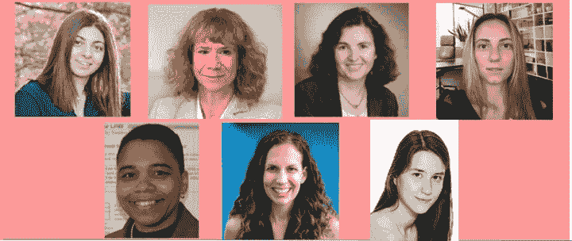

# 19 位在人工智能、大数据、数据科学、机器学习领域的激励女性

> 原文：[`www.kdnuggets.com/2019/03/women-ai-big-data-science-machine-learning.html`](https://www.kdnuggets.com/2019/03/women-ai-big-data-science-machine-learning.html)

 评论为了纪念 3 月 8 日的国际妇女节，我们为您呈现 19 位在人工智能、大数据、数据科学和机器学习领域的激励人心的女性资料。尽管该领域的女性数量相对较少，但我相信，人工智能和机器学习领域的多样性和女性参与度的提高将带来益处。

我希望下面这些令人惊叹的女性的例子能继续激励更多女性加入这一领域。

也请查看我们 2018 年的文章 18 Inspiring Women In AI, Big Data, Data Science, Machine Learning。那篇文章相当受欢迎，但我们收到了许多关于其他激励女性的评论，她们没有被包含在那份名单中。

所以，这里是 2019 年全新的更多令人惊叹的女性名单。

[**Libby Duane Adams**](https://www.linkedin.com/in/libbyduaneadams/)，Alteryx 的首席客户官和创始合伙人，Alteryx 提供了一个端到端的分析平台，正在为分析师和数据科学家彻底改变企业分析。

[**Anima Anandkumar**](https://www.linkedin.com/in/anima-anandkumar-35171b1/), [@AnimaAnandkumar](https://twitter.com/AnimaAnandkumar), NVIDIA 的研究总监和加州理工学院的布伦教授。直到最近，她曾是亚马逊网络服务的首席科学家，她在该领域推动了云基础设施上的机器学习。她是张量代数方法、非凸优化、概率模型和深度学习的领先研究者。

[**Anna Anisin**](https://www.linkedin.com/in/annaanisin/), [**@annaontheweb**](https://twitter.com/annaontheweb), 是 Formulated.by 的创始人；社区企业家；《福布斯》撰稿人；数据科学沙龙系列会议的组织者，并被 CNN 评为科技行业内幕人士。

[**Moojan Asghari**](https://www.linkedin.com/in/moojanasghari/), [**@moojanasghari**](https://twitter.com/moojanasghari), 科技企业家，《The Hacking House》经理，[**@Women_in_AI**](https://twitter.com/Women_in_AI) 的发起人，丝绸之路初创公司的创始人，Startup Sesame 的联合创始人。

[**Cynthia Breazeal**](http://cynthiabreazeal.media.mit.edu/), Jibo 的创始人及首席科学家；麻省理工学院媒体实验室媒体艺术与科学副教授；她是社会机器人学和人机互动的先驱。她撰写了《设计社交机器人》一书，并发表了 100 多篇关于人工智能、机器人、人与机器人互动及相关主题的同行评审文章。

[**Joy Buolamwini**](https://www.media.mit.edu/people/joyab/overview/)，[**@jovialjoy**](https://twitter.com/jovialjoy)，是一位用艺术和研究揭示 AI 社会影响的代码诗人。她创立了算法公正联盟，以对抗 AI 中的有害偏见。在 MIT 媒体实验室，她开创了现在正在全球范围内提高面部分析技术透明度的技术。她曾入选《福布斯》30 岁以下 30 人榜单和前 50 位科技女性。

[**Kate Crawford**](https://www.katecrawford.net/)，[**@katecrawford**](https://twitter.com/katecrawford)，是一位领先的研究人员、教授和作者，过去十年致力于研究数据系统、机器学习和 AI 的社会影响。她共同创立了 NYU 的 AI Now Institute，并且是 MSR-NYC 的首席研究员和 NYU 的杰出研究教授。

[**Sanja Fidler**](https://www.cs.utoronto.ca/~fidler/) 是多伦多大学的助理教授，以及 NVIDIA 的 AI 总监。她的研究兴趣包括 2D 和 3D 对象检测，特别是可扩展的多类别检测、对象分割和图像标注，以及 (3D) 场景理解。她于 2018 年获得了加拿大 CIFAR AI Chair 奖项。

[**Fosca Giannotti**](https://kdd.isti.cnr.it/people/giannotti-fosca) 是信息科学与技术研究所计算机科学研究主任，并领导比萨 KDD 实验室——知识发现与数据挖掘实验室，该实验室成立于 1994 年，是最早的以数据挖掘为中心的研究实验室之一。Fosca 是移动数据挖掘、社交网络分析和隐私保护数据挖掘的开创性科学家。她协调了数十个欧洲项目和工业合作，目前是 SoBigData 的协调员，这是一个关于大数据分析和社会挖掘的欧洲研究基础设施。

[**Katherine Gorman**](http://www.katherinelgorman.com/)，[**@kgorman**](https://twitter.com/kgorman)，是机器智能播客 Talking Machines 的创始执行制片人和联合主持人 [**@TlkngMchns**](https://twitter.com/TlkngMchns)。在 2016 和 2017 年，她担任 TedXBoston 的策展人和主持人，专注于机器学习和 AI 的研究；在 2017 年，Katherine 帮助 NeurIPS 会议开发和实施媒体策略，并担任 NeurIPS 和 ICML 的新闻联席主席。

[**Isabelle Guyon**](https://www.clopinet.com/isabelle/) 是一位独立顾问，专注于机器学习和统计数据分析。她曾在贝尔实验室工作，并在 1990 年代与 Vladimir Vapnik 共同发现了支持向量机。她的研究项目包括最优间隔分类器和支持向量机、指纹验证、基因选择、手写识别和笔计算。她还在 NIPS（现为 NeurIPS）及其他会议上组织了许多研讨会和挑战赛。

[**达芙妮·科勒**](https://en.wikipedia.org/wiki/Daphne_Koller) 目前是 insitro 的创始人兼首席执行官，该公司将前沿的机器学习技术与生命科学领域的突破性创新相结合。她曾担任斯坦福大学计算机科学与病理学教授，并获得了麦克阿瑟（“天才”）奖学金、ACM/Infosys 奖以及许多其他荣誉。她于 2012 年与安德鲁·吴共同创办了 Coursera。她的研究领域是人工智能及其在生物医学科学中的应用。

[**拉娜·艾尔·卡柳比**](https://en.wikipedia.org/wiki/Rana_el_Kaliouby)，[**@kaliouby**](https://twitter.com/kaliouby) 是 Affectiva 的首席执行官和共同创始人。她曾是世界经济论坛的年轻全球领袖，入选《财富》40 岁以下精英榜单。她的领域是表情识别研究和技术开发，用于识别面部表达的情感。

[**卡塔里娜·莫里克**](https://www-ai.cs.uni-dortmund.de/PERSONAL/morik.html) 是德国多特蒙德工业大学计算机科学系的全职教授。她是机器学习、归纳逻辑编程、统计学习和大规模数据集分析领域的领先研究者。她是国家科学与工程学院以及北莱茵-威斯特法伦科学与艺术学院的成员。她已在主要会议和期刊上发表了 200 多篇论文。她最新的研究成果包括时空随机场和整数马尔可夫随机场，这些成果在资源约束下支持复杂的图模型。

[**丹妮拉·鲁斯**](https://www.csail.mit.edu/person/daniela-rus) 是麻省理工学院电气工程与计算机科学系的 Andrew 和 Erna Viterbi 教授，并且是计算机科学与人工智能实验室（CSAIL）的主任。她的研究兴趣包括机器人技术、移动计算和数据科学。她是麦克阿瑟学者，ACM、AAAI 和 IEEE 的会员，并且是国家工程院和美国艺术与科学学院的成员。

[**凯特·斯特拉赫尼**](https://www.linkedin.com/in/kate-strachnyi-data)，[**@storybydata**](https://twitter.com/storybydata?lang=en) 是 *《颠覆者：数据科学领袖》* 和 *《成为数据科学家之旅》* 的作者，目前正在撰写几本新书。她是 Datacated Weekly 的主持人，该项目致力于帮助他人了解数据领域的各种主题。她曾在 2018 年 LinkedIn 数据科学与分析领域顶级声音榜单中排名第二。

[**拉塔尼亚·斯威尼**](https://www.iq.harvard.edu/people/latanya-sweeney) 是哈佛大学政府与技术教授。拉塔尼亚创建并使用技术来评估和解决社会、政治和治理问题，并教导他人如何做到这一点。她关注的数据隐私问题，她是哈佛 IQSS 数据隐私实验室的主任。斯威尼教授是美国医学信息学学院的当选成员，拥有近 100 篇学术出版物、3 项专利、2 项政府法规中的明确引用和 3 个公司孵化项目。

[**瑞秋·托马斯**](https://www.linkedin.com/in/rachel-thomas-942a7923/)、[**@math_rachel**](https://twitter.com/math_rachel) 曾被《福布斯》评选为“20 位令人惊叹的 AI 女性”之一，是 Uber 的早期工程师，并在杜克大学获得数学博士学位。她是 fast.ai 的联合创始人，该公司创建了“实用深度学习课程”，已有超过 20 万名学生参加。瑞秋还是一位受欢迎的作家和主题演讲者。

[**桑德拉·瓦赫特**](https://www.oii.ox.ac.uk/people/sandra-wachter/)、[**@SandraWachter5**](https://twitter.com/SandraWachter5) 是牛津互联网研究所的数据伦理、人工智能、机器人技术和互联网监管/网络安全领域的律师及研究员。

**相关：**

+   [18 位在 AI、大数据、数据科学和机器学习领域激励人心的女性](https://www.kdnuggets.com/2018/03/inspiring-women-ai-big-data-science.html)

+   [**数据科学中的多样性：概述与策略**](https://www.kdnuggets.com/2018/09/diversity-data-science.html)

+   [**数据科学和机器学习领域的女性资源**](https://www.kdnuggets.com/2018/06/resources-women-data-science-machine-learning.html)

### 更多相关话题

+   [停止学习数据科学，找到目的，再去找…](https://www.kdnuggets.com/2021/12/stop-learning-data-science-find-purpose.html)

+   [学习数据科学统计学的顶级资源](https://www.kdnuggets.com/2021/12/springboard-top-resources-learn-data-science-statistics.html)

+   [成功数据科学家的 5 个特征](https://www.kdnuggets.com/2021/12/5-characteristics-successful-data-scientist.html)

+   [每个数据科学家都应了解的三大 R 语言库（即使你使用 Python）](https://www.kdnuggets.com/2021/12/three-r-libraries-every-data-scientist-know-even-python.html)

+   [分析一桩 90 亿美元的 AI 失败案例](https://www.kdnuggets.com/2021/12/9b-ai-failure-examined.html)

+   [是什么让 Python 成为初创企业的理想编程语言](https://www.kdnuggets.com/2021/12/makes-python-ideal-programming-language-startups.html)
