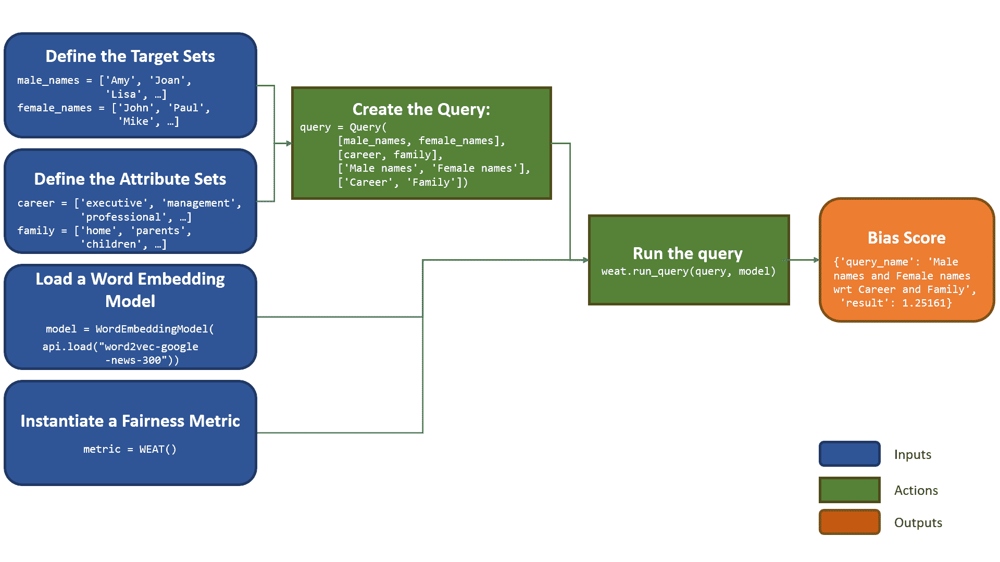
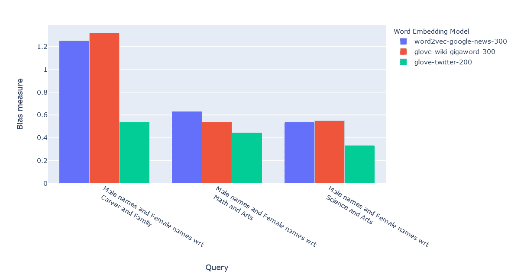

# 词嵌入公平性评估

> 原文：[`www.kdnuggets.com/2020/08/word-embedding-fairness-evaluation.html`](https://www.kdnuggets.com/2020/08/word-embedding-fairness-evaluation.html)

评论

**由 [Pablo Badilla](https://github.com/pabloBad) 和 [Felipe Bravo-Marquez](https://felipebravom.com/).**

### 关于 WEFE

* * *

## 我们的前三名课程推荐

 1\. [谷歌网络安全证书](https://www.kdnuggets.com/google-cybersecurity) - 快速进入网络安全职业生涯

 2\. [谷歌数据分析专业证书](https://www.kdnuggets.com/google-data-analytics) - 提升你的数据分析技能

 3\. [谷歌 IT 支持专业证书](https://www.kdnuggets.com/google-itsupport) - 支持你的组织的 IT

* * *

[词嵌入](https://www.kdnuggets.com/2019/02/word-embeddings-nlp-applications.html) 是从文档语料库中训练出的词的稠密向量表示。由于其能够有效捕捉词之间的语义和句法关系，它们已成为自然语言处理（NLP）下游系统的核心组件。词嵌入的一个广泛报告的缺点是它们容易继承训练语料库中表现出的刻板社会偏见。

如何量化提到的偏见目前是一个活跃的研究领域，近年来文献中提出了几种不同的*公平性指标*。

尽管所有指标有类似的目标，但它们之间的关系却不清楚。阻碍清晰比较的两个问题是，它们处理的输入不同（词对、词集、多个词集等），而且它们的输出彼此不兼容（实数、正数、范围等）。这导致它们之间缺乏一致性，从而在尝试比较和验证结果时造成了若干问题。

我们提出了[**词嵌入公平性评估** (WEFE)](https://felipebravom.com/publications/ijcai2020.pdf)作为一个用于衡量词嵌入公平性的框架，并且我们将其实现发布为[开源库](https://wefe.readthedocs.io)。

### 框架

我们提出了一个*公平性指标*的抽象视图，作为一个函数，该函数接受*查询*作为输入，每个查询由*目标*和*属性*词组成。*目标词*描述了公平性旨在测量的社会群体（例如，女性、白人、穆斯林），而*属性词*描述了可能对某一社会群体表现出的偏见的特征或态度（例如，愉快与不愉快的术语）。有关框架的更多细节，您可以阅读我们最近被接受的论文，刊登在*IJCAI-PRICAI* [1]。

WEFE 实现了以下指标：

+   [词嵌入关联测试 (WEAT)](https://science.sciencemag.org/content/356/6334/183)

+   [相对规范距离 (RND)](https://www.pnas.org/content/115/16/E3635)

+   [相对负面情感偏差 (RNSB)](https://www.aclweb.org/anthology/P19-1162/)

+   [平均余弦 (MAC)](https://arxiv.org/abs/1904.04047)

### WEFE 的标准使用模式

使用 WEFE 测量偏差的标准过程如下面的图示所示：



### 安装

有两种不同的方法来安装 WEFE：

```py
pip install wefe

```

或

```py
conda install -c pbadilla wefe

```

### 运行查询

在下面的代码中，我们使用以下方法测量 *性别偏差* 的 *word2vec*：

+   一个查询研究了男性名字和职业相关词，女性名字和家庭相关词之间的关系，我们称之为 *"男性名字与女性名字的职业和家庭相关性"*。查询中使用的词在代码中详细列出。

+   词嵌入关联测试 (WEAT) 度量。由 [Caliskan et al. 2017](https://science.sciencemag.org/content/356/6334/183) 提出，WEAT 接受两个目标词集  和 ，以及两个属性词集  和 。因此，它总是期望查询的形式为 。其目标是通过置换测试量化两个词集对的关联强度。

给定一个词嵌入 ，WEAT 首先定义度量 ，其中  是词嵌入向量的余弦相似度。

然后对于查询  ，WEAT 度量定义在查询词集的嵌入上如下：


其思路是，如果给出的值越积极，目标与属性的关系就越紧密，目标与属性的关系也会更紧密。另一方面，如果值越负，目标与属性的关系会更紧密，而目标与属性的关系也会更紧密。通常这些值在和之间。理想得分为。

1\. 首先，我们使用 [gensim](https://radimrehurek.com/gensim/) API 加载一个词嵌入模型。

```py
from wefe import WordEmbeddingModel, Query, WEAT
import gensim.downloader as api

word2vec_model = WordEmbeddingModel(api.load('word2vec-google-news-300'),
                                    'word2vec-google-news-300')

```

2\. 然后，我们使用目标词（*男性名字*和*女性名字*）以及两个属性词集（*职业*和*家庭*术语）创建查询对象。

```py
# target sets (sets of popular names in the US)
male_names = ['John', 'Paul', 'Mike', 'Kevin', 'Steve', 'Greg', 'Jeff', 'Bill']
female_names = ['Amy', 'Joan', 'Lisa', 'Sarah', 'Diana', 'Kate', 'Ann', 'Donna']

#attribute sets
career = ['executive', 'management', 'professional', 'corporation',
         'salary', 'office', 'business', 'career']
family = ['home', 'parents', 'children', 'family', 'cousins', 'marriage',
         'wedding', 'relatives']

gender_occupation_query = Query([male_names, female_names],
                                [career, family],
                                ['Male names', 'Female names'],
                                ['Career', 'Family'])

```

3\. 最后，我们使用 WEAT 作为度量来运行查询。

```py
weat = WEAT()
results = weat.run_query(gender_occupation_query, word2vec_model)

print(results

```

```py
{'query_name': 'Male names and Female names wrt Career and Family',
 'result': 1.251}

```

正如我们所见，执行结果返回一个*字典*，其中包含执行的查询名称及其得分。得分为正且高于 1 表明*word2vec* 展现了男性名字与职业以及女性名字与家庭之间的适度强关系。

**运行多个查询**

在 WEFE 中，我们可以在一次调用中轻松测试多个查询：

1\. 创建查询：

```py
from wefe.utils import run_queries
from wefe.datasets import load_weat

# Load the sets used in the weat case study
weat_wordsets = load_weat()

gender_math_arts_query = Query(
    [male_names, female_names],
    [weat_wordsets['math'], weat_wordsets['arts']],
    ['Male names', 'Female names'],
    ['Math', 'Arts'])

gender_science_arts_query = Query(
    [male_names, female_names],
    [weat_wordsets['science'], weat_wordsets['arts_2']],
    ['Male names', 'Female names'],
    ['Science', 'Arts'])

```

2\. 将查询添加到数组中：

```py
queries = [
    gender_occupation_query,
    gender_math_arts_query,
    gender_science_arts_query,
]

```

3\. 使用 WEAT 运行查询：

```py
weat_results = run_queries(WEAT, queries, [word2vec_model])
weat_results

```

请注意，这些结果以 DataFrame 对象形式返回。

| **model_name** | **男性名字与女性名字相对于职业和家庭** | **男性名字与女性名字相对于数学和艺术** | **男性名字与女性名字相对于科学和艺术** |
| --- | --- | --- | --- |
| word2vec-google-news-300 | 1.25161 | 0.631749 | 0.535707 |

我们可以看到，在所有情况下，男性名字与职业、科学和数学词汇呈正相关，而女性名字则更多地与家庭和艺术术语相关。

虽然上述结果给我们提供了关于*word2vec* 展现的性别偏见的想法，但我们还希望了解这些偏见在其他词嵌入模型中的表现。

我们在另外两个嵌入模型上运行相同的查询：“glove-wiki”和“glove-twitter”。

1\. 加载 glove 模型并再次执行查询：

```py
# load the models.
glove_wiki = WordEmbeddingModel(api.load('glove-wiki-gigaword-300'),
                                'glove-wiki-gigaword-300')
glove_twitter = WordEmbeddingModel(api.load('glove-twitter-200'),
                                'glove-twitter-200')

# add the models to an array.
models = [word2vec_model, glove_wiki, glove_twitter]

# run the queries.
results = run_queries(WEAT, queries, models)
results

```

| **模型名称** | **男性名字与女性名字相对于职业和家庭** | **男性名字与女性名字相对于数学和艺术** | **男性名字与女性名字相对于科学和艺术** |
| --- | --- | --- | --- |
| word2vec-google-news-300 | 1.25161 | 0.631749 | 0.535707 |
| glove-wiki-gigaword-300 | 1.31949 | 0.536996 | 0.549819 |
| glove-twitter-200 | 0.537437 | 0.445879 | 0.332440 |

2\. 我们还可以绘制结果：

```py
from wefe.utils import plot_queries_results
plot_queries_results(results)

```



### 聚合结果

在之前的步骤中执行`run_queries`给出了各种结果评分。然而，这些评分并没有告诉我们关于嵌入模型的整体公平性。

我们希望有一些机制将这些结果聚合为一个单一的评分。

要做到这一点，当使用`run_queries`时，你可以将`add_results`参数设置为`True`。这将激活通过平均结果的绝对值并将其放入结果表的最后一列来添加结果的选项。

也可以要求`run_queries`函数仅返回聚合结果，通过将`return_only_aggregation`参数设置为`True`来实现。

```py
weat_results = run_queries(WEAT,
                        queries,
                        models,
                        aggregate_results=True,
                        return_only_aggregation=True,
                        queries_set_name='Gender bias')
weat_results

```

| **model_name** | **WEAT：性别偏见绝对值平均评分** |
| --- | --- |
| word2vec-google-news-300 | 0.806355 |
| glove-wiki-gigaword-300 | 0.802102 |
| glove-twitter-200 | 0.438586 |

这种聚合的思想是根据各种查询量化嵌入模型的偏见量。在这种情况下，我们可以看到 glove-twitter 的性别偏见比其他模型少。

### 排名词嵌入

最后，我们希望根据这些嵌入模型包含的偏见总量对它们进行排名。这可以通过使用`create_ranking`函数来完成，该函数根据一个或多个查询结果计算公平性排名。

```py
from wefe.utils import create_ranking

ranking = create_ranking([weat_results])
ranking

```

| **model_name** | **WEAT：性别偏见绝对值平均评分** |
| --- | --- |
| word2vec-google-news-300 | 3 |
| glove-wiki-gigaword-300 | 2 |
| glove-twitter-200 | 1 |

你可以在这个[笔记本](https://github.com/dccuchile/wefe/blob/master/examples/KDNuggetsTutorial.ipynb)中查看此教程代码，以及在以下[链接](https://wefe.readthedocs.io/en/latest/)中查看完整的参考文档，包括用户指南、示例和以前研究的复制。

如果你喜欢这个项目，非常欢迎你在[Github](https://github.com/dccuchile/wefe)上“点赞”它。

[1] P. Badilla, F. Bravo-Marquez 和 J. Pérez [WEFE: 词嵌入公平性评估框架](https://www.ijcai20.org/) 在 *第 29 届国际联合人工智能会议暨第 17 届环太平洋国际人工智能会议（IJCAI-PRICAI 2020）*，横滨，日本。

**相关：**

+   [AI 中的偏见：入门](https://www.kdnuggets.com/2020/06/bias-ai-primer.html)

+   [将伦理应用于 AI 的 5 种方法](https://www.kdnuggets.com/2019/12/5-ways-apply-ethics-ai.html)

+   [NLP 中的词嵌入及其应用](https://www.kdnuggets.com/2019/02/word-embeddings-nlp-applications.html)

### 更多相关话题

+   [终极指南：NLP 中的不同词嵌入技术](https://www.kdnuggets.com/2021/11/guide-word-embedding-techniques-nlp.html)

+   [分类问题的更多性能评估指标你…](https://www.kdnuggets.com/2020/04/performance-evaluation-metrics-classification.html)

+   [机器学习评估指标：理论与概述](https://www.kdnuggets.com/machine-learning-evaluation-metrics-theory-and-overview)

+   [关于可信图神经网络的综合调查：隐私、鲁棒性、公平性与可解释性](https://www.kdnuggets.com/2022/05/comprehensive-survey-trustworthy-graph-neural-networks-privacy-robustness-fairness-explainability.html)

+   [快速有效地审计机器学习公平性的方法](https://www.kdnuggets.com/2023/01/fast-effective-way-audit-ml-fairness.html)

+   [使用 Python 自动化 Microsoft Excel 和 Word](https://www.kdnuggets.com/2021/08/automate-microsoft-excel-word-python.html)
