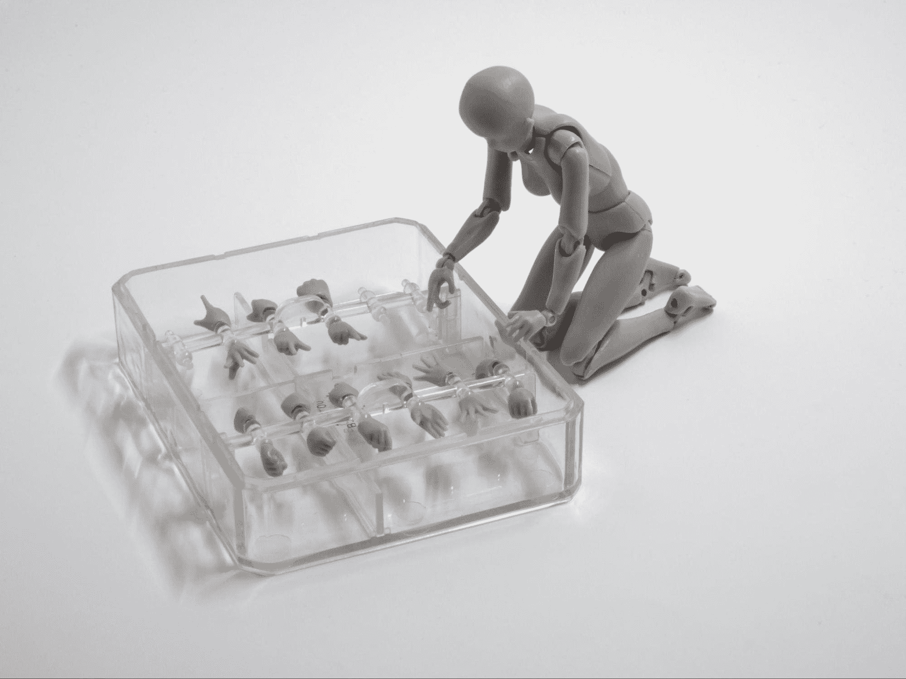

# 集成技术何时是一个好选择？

> 原文：[`www.kdnuggets.com/2022/07/would-ensemble-techniques-good-choice.html`](https://www.kdnuggets.com/2022/07/would-ensemble-techniques-good-choice.html)



[布雷特·乔丹](https://unsplash.com/@brett_jordan) via Unsplash

在任何决策过程中，你需要收集所有不同类型的数据和信息，拆解这些信息，深入了解，寻求专家意见，等等，然后才能做出坚实的决定。

* * *

## 我们的前三个课程推荐

 1\. [谷歌网络安全证书](https://www.kdnuggets.com/google-cybersecurity) - 快速进入网络安全职业轨道

 2\. [谷歌数据分析专业证书](https://www.kdnuggets.com/google-data-analytics) - 提升你的数据分析能力

 3\. [谷歌 IT 支持专业证书](https://www.kdnuggets.com/google-itsupport) - 支持你的组织 IT 部门

* * *

这在机器学习过程中与集成技术类似。集成模型将多种模型组合在一起，以帮助预测（决策）过程。单一模型可能没有能力为特定数据集产生正确的预测 - 这增加了高方差、低准确性以及噪声和偏差的风险。通过结合多个模型，我们有效地提高了准确性的可能性。

最简单的例子是决策树 - 一种类似于概率树的模型，它不断分裂数据，根据先前回答的问题来进行预测。

# 为什么使用集成技术？

为了回答本文的问题，“何时使用集成技术是一个好选择？”当你想提高机器学习模型的性能时 - 就这么简单。

例如，如果你正在进行分类任务并希望提高模型的准确性 - 使用集成技术。如果你想减少回归任务的平均误差 - 使用集成技术。

使用集成学习算法的主要 2 个原因是：

+   提高预测 - 你将获得比仅使用单一模型更好的预测能力。

+   提高稳健性 - 你将获得比仅使用单一模型更稳定的预测结果。

使用集成技术时，你的总体目标应该是减少预测的一般化误差。因此，使用多样化的基础模型将自动降低你的预测误差。

本质上是构建一个更稳定、更可靠、更准确的模型，让你信赖。

有 3 种类型的集成建模技术：

1.  Bagging

1.  Boosting

1.  Stacking

# Bagging

袋装法的简称是 Bootstrap Aggregation，该集成建模技术结合了自助采样和聚合形成一个集成模型。它基于创建多个原始训练数据集，建立类似树的结构概率模型，然后进行聚合以得出最终预测。

每个模型学习前一个模型产生的错误，并使用训练数据集的不同子集。袋装法旨在避免数据过拟合并减少预测的方差，可用于回归和分类模型。

## 随机森林

随机森林是一种袋装法算法，但有一点不同。它使用训练数据的样本子集和特征子集来构建多个决策树。你可以把它看作是多个决策树，以随机方式拟合每个训练集。

分割决策基于特征的随机选择，导致每棵树之间的差异。这会产生更准确的聚合结果和最终预测。

其他示例算法包括：

+   袋装决策树

+   Extra Trees

+   自定义袋装法

# 提升法

提升法是将弱学习者转变为强学习者的过程。弱学习者由于其能力不足，无法做出准确的预测。通过应用基础学习算法生成新的弱预测规则。这是通过获取数据的随机样本并输入到模型中，然后进行顺序训练，旨在训练弱学习者并试图修正其前身。

提升法的一个示例是 AdaBoost 和 XGBoost

## AdaBoost

AdaBoost 是自适应提升的简称，用作提升机器学习算法性能的技术。它利用随机森林的弱学习者概念，在多个弱学习者之上构建模型。

```py
class sklearn.ensemble.AdaBoostClassifier(base_estimator=None, *, n_estimators=50, learning_rate=1.0, algorithm='SAMME.R', random_state=None)
```

## XGBoost

XGBoost 代表极端梯度提升，是最受欢迎的提升算法之一，可用于回归和分类任务。它是一种监督学习算法，旨在通过组合一组较弱的模型来准确预测目标变量。

其他示例算法包括：

+   梯度提升机

+   随机梯度提升

+   LightGBM

# 何时使用袋装法与提升法？

确定何时使用袋装法或提升法的最简单方法是：

+   如果分类器不稳定且有高方差 - 使用袋装法

+   如果分类器稳定但有高偏差 - 使用提升法

# 堆叠法

堆叠法是堆叠泛化的简称，与提升法类似；目的是生成更强健的预测模型。这是通过将弱学习者的预测结果用于创建一个强模型来实现的。它通过找出如何最佳地结合多个模型在同一数据集上的预测来完成。

它基本上是在问你‘如果你有多种在特定问题上表现良好的机器学习模型，你如何选择最值得信赖的模型？’

## 投票法

投票是堆叠的一个示例，但在分类和回归任务中有所不同。

对于回归，预测是基于其他回归模型的平均值。

```py
class sklearn.ensemble.VotingRegressor(estimators, *, weights=None, n_jobs=None, verbose=False)
```

对于分类任务，可以使用硬投票或软投票。硬投票本质上是选择票数最多的预测，而软投票则是结合每个模型中每个预测的概率，然后选择总概率最高的预测。

```py
class sklearn.ensemble.VotingClassifier(estimators, *, voting='hard', weights=None, n_jobs=None, flatten_transform=True, verbose=False)
```

其他示例算法包括：

+   加权平均

+   混合

+   堆叠

+   超级学习器

# 堆叠和装袋/提升有什么区别？

装袋使用决策树，而堆叠使用不同的模型。装袋从训练数据集中抽取样本，而堆叠则在相同的数据集上进行拟合。

提升使用一系列模型，将弱学习者转化为强学习者，以纠正之前模型的预测，而堆叠使用单一模型来学习如何最佳地结合来自贡献模型的预测。

# 聚合所有内容

你总是需要在尝试解决任务之前理解你想要实现的目标。一旦你做到这一点，你将能够确定你的任务是分类还是回归任务，从而选择最适合的集成算法来提高模型的预测能力和稳健性。

**[尼莎·阿里亚](https://www.linkedin.com/in/nisha-arya-ahmed/)** 是一名数据科学家和自由技术作家。她特别关注提供数据科学职业建议或教程以及数据科学理论知识。她还希望探索人工智能如何/能否有助于人类寿命的不同方式。她是一个热衷学习者，寻求拓宽她的技术知识和写作技能，同时帮助指导他人。

### 更多相关内容

+   [集成学习技术：使用 Python 中的随机森林进行详细讲解](https://www.kdnuggets.com/ensemble-learning-techniques-a-walkthrough-with-random-forests-in-python)

+   [如果我必须重新开始学习数据科学，我会怎么做？](https://www.kdnuggets.com/2020/08/start-learning-data-science-again.html)

+   [带有示例的集成学习](https://www.kdnuggets.com/2022/10/ensemble-learning-examples.html)

+   [什么使得可视化效果好？](https://www.kdnuggets.com/2022/10/sphere-makes-visualization-good.html)

+   [你的特征重要吗？这并不意味着它们好](https://www.kdnuggets.com/your-features-are-important-it-doesnt-mean-they-are-good)

+   [数据质量：好、坏与丑](https://www.kdnuggets.com/2022/01/data-quality-good-bad-ugly.html)
