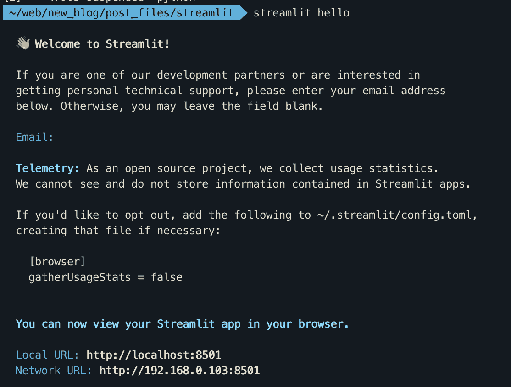
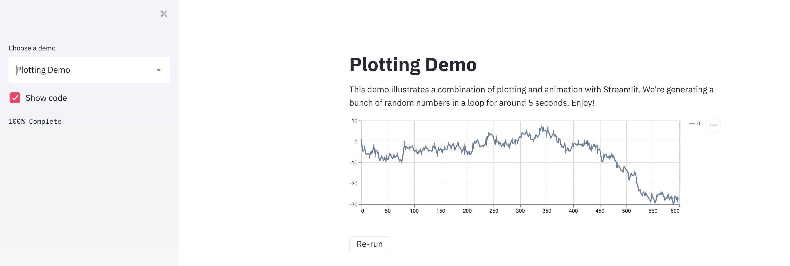
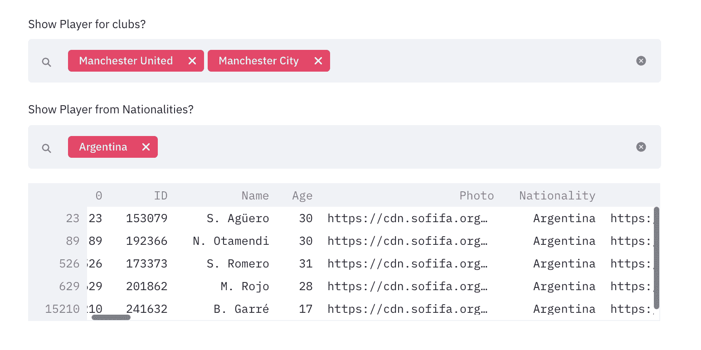
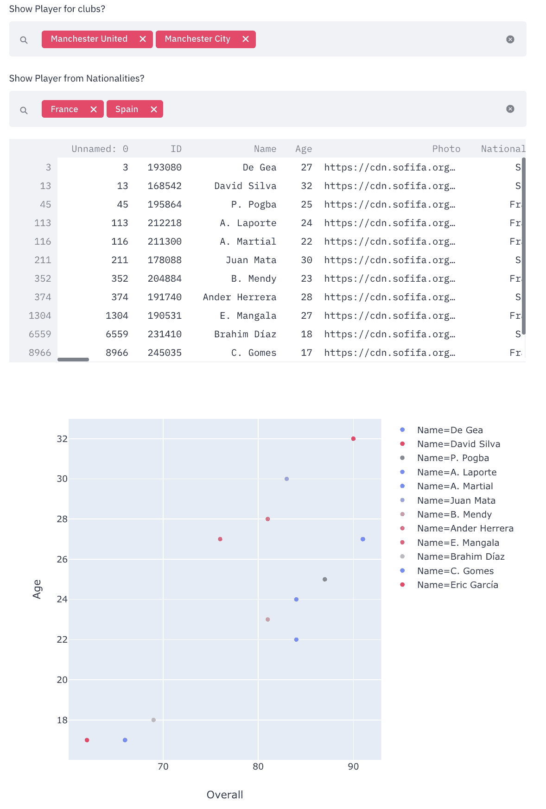
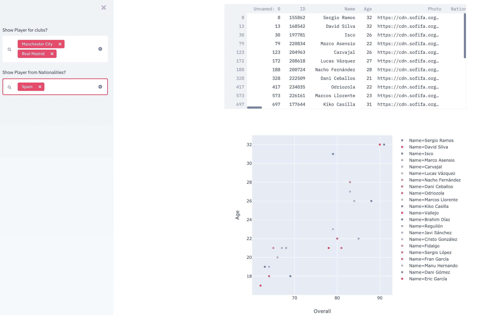
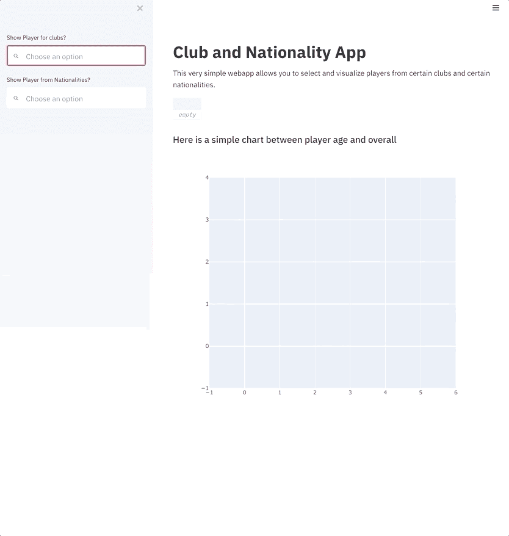

# 如何使用简单的 Python 为数据科学家编写 Web 应用程序

> 原文：[`www.kdnuggets.com/2019/10/write-web-apps-using-simple-python-data-scientists.html`](https://www.kdnuggets.com/2019/10/write-web-apps-using-simple-python-data-scientists.html)

评论

如果没有一个好的展示方式，机器学习项目永远不会真正完成。

过去，一个制作精良的可视化或一小份 PPT 就足以展示数据科学项目，但随着 RShiny 和 Dash 等仪表板工具的出现，一个优秀的数据科学家需要对 Web 框架有一定的了解才能顺利进行。

* * *

## 我们的前三大课程推荐

 1\. [谷歌网络安全证书](https://www.kdnuggets.com/google-cybersecurity) - 快速进入网络安全职业的快车道

 2\. [谷歌数据分析专业证书](https://www.kdnuggets.com/google-data-analytics) - 提升您的数据分析能力

 3\. [谷歌 IT 支持专业证书](https://www.kdnuggets.com/google-itsupport) - 支持您的组织进行 IT 工作

* * *

而 Web 框架学习起来很困难。我仍然会在所有那些 HTML、CSS 和 Javascript 中感到困惑，进行各种尝试，尽管有时看起来很简单。

更不用说还有许多方法可以实现相同的目标，这让我们这些对 Web 开发作为次要技能的数据科学人员感到困惑。

***那么，我们是否注定要学习 Web 框架？还是在半夜为了些许疑问打电话给我们的开发者朋友？***

这就是 Streamlit 发挥作用的地方，它兑现了仅使用 Python 创建 Web 应用程序的承诺。

> Python 的禅意：简单优于复杂，Streamlit 使创建应用程序变得非常简单。

***这篇文章讲述了如何使用 Streamlit 创建支持数据科学项目的应用程序。***

要了解更多有关 Streamlit 的架构和思路，请查看这篇优秀的[文章](https://towardsdatascience.com/coding-ml-tools-like-you-code-ml-models-ddba3357eace)，作者之一是[Adrien Treuille](https://medium.com/u/39dfc90d7a34?source=post_page-----a227a1a01582----------------------)。

### 安装

安装方法就是运行以下命令：

`pip install streamlit`

要查看我们的安装是否成功，只需运行：

`streamlit hello`

这应该会显示一个提示信息：



您可以在浏览器中访问本地 URL: `localhost:8501` 来查看 Streamlit 应用程序的实际效果。开发者提供了一些有趣的演示，您可以尽情体验。在回来之前请充分体验一下工具的强大。



### Streamlit Hello World

Streamlit 旨在通过简单的 Python 使应用程序开发变得容易。

所以，让我们写一个简单的应用来看看它是否能兑现这个承诺。

在这里，我开始一个简单的应用，我们将其称为 Streamlit 的 Hello World。只需将下面给出的代码粘贴到名为`helloworld.py`的文件中

```py
import streamlit as stx = st.slider('x')
st.write(x, 'squared is', x * x)
```

然后，在终端中运行：

```py
streamlit run helloworld.py
```

完成后，你应该能在浏览器中的`localhost:8501`看到一个简单的应用，允许你移动滑块并显示结果。


一个简单的滑块小部件应用

这非常简单。在上述应用中，我们使用了 Streamlit 的两个功能：

+   `st.slider` 小部件可以滑动以更改网页应用的输出。

+   以及多功能的`st.write`命令。我对它可以写入从图表、数据框到简单文本的任何内容感到惊讶。稍后会详细介绍。

***重要提示：记住，每次我们更改小部件的值时，整个应用都会从头到尾重新运行。***

### Streamlit 小部件

小部件为我们提供了一种控制应用的方式。阅读小部件的最佳地方是[API 参考](https://streamlit.io/docs/api.html)文档，但我将描述一些你可能会使用的最重要的小部件。

**1\. 滑块**

```py
streamlit.slider(*label*, *min_value=None*, *max_value=None*, *value=None*, *step=None*, *format=None*)
```

我们已经在上面看到`st.slider`的效果。它可以与 min_value、max_value 和 step 一起使用，以获取范围内的输入。

**2\. 文本输入**

获取用户输入的最简单方式，无论是一些 URL 输入还是文本输入进行情感分析。只需要一个标签来命名文本框。

```py
import streamlit as sturl = st.text_input('Enter URL')
st.write('The Entered URL is', url)
```

这是应用的外观：


一个简单的文本输入小部件应用

**提示：** 你可以直接更改文件`helloworld.py`并刷新浏览器。我工作的方式是打开并更改`sublime text`中的`helloworld.py`，然后在浏览器中并排查看更改。

**3\. 复选框**

复选框的一个用例是隐藏或显示应用中的特定部分。另一个用例可能是在函数的参数中设置布尔值。`[st.checkbox()](https://streamlit.io/docs/api.html#streamlit.checkbox)` 接受一个参数，即小部件标签。在此应用中，复选框用于切换条件语句。

```py
import streamlit as st
import pandas as pd
import numpy as npdf = pd.read_csv("football_data.csv")
if st.checkbox('Show dataframe'):
    st.write(df)
```


一个简单的复选框小部件应用

**4\. 选择框**

我们可以使用`[st.selectbox](https://streamlit.io/docs/api.html#streamlit.selectbox)`从一系列或列表中进行选择。通常的用例是将其用作简单的下拉列表，以从列表中选择值。

```py
import streamlit as st
import pandas as pd
import numpy as npdf = pd.read_csv("football_data.csv")option = st.selectbox(
    'Which Club do you like best?',
     df['Club'].unique())'You selected: ', option
```


一个简单的下拉/选择框小部件应用

**5\. 多选框**

我们也可以从下拉列表中使用多个值。在这里，我们使用`st.multiselect`来获取多个值作为`options`变量中的列表。

```py
import streamlit as st
import pandas as pd
import numpy as npdf = pd.read_csv("football_data.csv")options = st.multiselect(
 'What are your favorite clubs?', df['Club'].unique())st.write('You selected:', options)
```


一个简单的多选小部件应用

### 一步一步创建我们的简单应用

了解了重要的小部件后，我们将创建一个使用多个小部件的简单应用。

为了简单起见，我们将尝试使用 Streamlit 可视化我们的足球数据。借助上述小部件，这相当简单。

```py
import streamlit as st
import pandas as pd
import numpy as npdf = pd.read_csv("football_data.csv")clubs = st.multiselect('Show Player for clubs?', df['Club'].unique())nationalities = st.multiselect('Show Player from Nationalities?', df['Nationality'].unique())# Filter dataframe
new_df = df[(df['Club'].isin(clubs)) & (df['Nationality'].isin(nationalities))]# write dataframe to screen
st.write(new_df)
```

我们的简单应用程序看起来像：



使用多个小部件联合使用

这很简单。但现在看起来相当基础。我们可以添加一些图表吗？

Streamlit 当前支持许多绘图库。***Plotly、Bokeh、Matplotlib、Altair 和 Vega 图表*** 都是其中的一部分。***Plotly Express*** 也可以使用，尽管文档中没有明确说明。它还有一些对 Streamlit 来说是“原生”的内置图表类型，如 `st.line_chart` 和 `st.area_chart`。

我们将使用 `plotly_express`。这是我们简单应用程序的代码。我们仅使用了四个对 Streamlit 的调用，其余部分都是简单的 Python。

```py
import streamlit as st
import pandas as pd
import numpy as np
import plotly_express as pxdf = pd.read_csv("football_data.csv")clubs = st.multiselect('Show Player for clubs?', df['Club'].unique())
nationalities = st.multiselect('Show Player from Nationalities?', df['Nationality'].unique())new_df = df[(df['Club'].isin(clubs)) & (df['Nationality'].isin(nationalities))]
st.write(new_df)# create figure using plotly express
fig = px.scatter(new_df, x ='Overall',y='Age',color='Name')# Plot!
st.plotly_chart(fig)
```



添加图表

### 改进

一开始我们说每次更改任何小部件时，整个应用程序都会从头到尾运行。当我们创建将服务于深度学习模型或复杂机器学习模型的应用程序时，这并不可行。Streamlit 在这方面通过引入 ***缓存*** 来解决了这个问题。

**1\. 缓存**

在我们的简单应用程序中，每当值发生变化时，我们都会一遍又一遍地读取 pandas 数据框。虽然这适用于我们拥有的小数据，但对于大数据或需要大量数据处理的情况，它将不起作用。让我们像下面这样使用 Streamlit 的 `st.cache` 装饰器函数来使用缓存。

```py
import streamlit as st
import pandas as pd
import numpy as np
import plotly_express as pxdf = st.cache(pd.read_csv)("football_data.csv")
```

对于更复杂且耗时的函数，只需运行一次，可以使用：

```py
@st.cache
def complex_func(a,b):
    DO SOMETHING COMPLEX# Won't run again and again.
complex_func(a,b)
```

当我们用 Streamlit 的缓存装饰器标记一个函数时，每当函数被调用时，Streamlit 会检查你调用函数时使用的输入参数。

***如果这是 Streamlit 第一次看到这些参数，它会运行函数并将结果存储在本地缓存中。***

当下次调用函数时，如果那些参数没有改变，Streamlit 知道可以跳过执行函数。它只是使用缓存中的结果。

**2\. 侧边栏**

根据你的偏好，为了更干净的外观，你可能希望将小部件移到侧边栏中，就像 Rshiny 仪表板那样。***这很简单。只需在你的小部件代码中添加 ***`***st.sidebar***`*** 即可。***

```py
import streamlit as st
import pandas as pd
import numpy as np
import plotly_express as pxdf = st.cache(pd.read_csv)("football_data.csv")clubs = st.sidebar.multiselect('Show Player for clubs?', df['Club'].unique())
nationalities = st.sidebar.multiselect('Show Player from Nationalities?', df['Nationality'].unique())new_df = df[(df['Club'].isin(clubs)) & (df['Nationality'].isin(nationalities))]
st.write(new_df)# Create distplot with custom bin_size
fig = px.scatter(new_df, x ='Overall',y='Age',color='Name')# Plot!
st.plotly_chart(fig)
```



将小部件移动到侧边栏

**3\. Markdown？**

我喜欢用 Markdown 编写。我发现它比 HTML 更简洁，更适合数据科学工作。那么，我们可以在 Streamlit 应用程序中使用 Markdown 吗？

是的，我们可以。有几种方法可以做到这一点。在我看来，最好的方法是使用 [Magic commands](https://streamlit.io/docs/api.html#id1)。Magic commands 允许你像编写注释一样轻松地编写 Markdown。你也可以使用 `st.markdown` 命令。

```py
import streamlit as st
import pandas as pd
import numpy as np
import plotly_express as px'''
# Club and Nationality AppThis very simple webapp allows you to select and visualize players from certain clubs and certain nationalities.
'''
df = st.cache(pd.read_csv)("football_data.csv")clubs = st.sidebar.multiselect('Show Player for clubs?', df['Club'].unique())
nationalities = st.sidebar.multiselect('Show Player from Nationalities?', df['Nationality'].unique())new_df = df[(df['Club'].isin(clubs)) & (df['Nationality'].isin(nationalities))]
st.write(new_df)# Create distplot with custom bin_size
fig = px.scatter(new_df, x ='Overall',y='Age',color='Name')'''
### Here is a simple chart between player age and overall
'''st.plotly_chart(fig)
```



我们的最终应用演示

### 结论

Streamlit 已经使创建应用程序的整个过程变得更加普及，我非常推荐它。

在这篇文章中，我们创建了一个简单的网页应用。但可能性是无穷的。举个例子，这里是来自 Streamlit 网站的[面部 GAN](https://research.nvidia.com/publication/2017-10_Progressive-Growing-of)。它通过使用相同的部件和缓存指导思想来工作。


我喜欢开发者使用的默认颜色和样式，比我之前用于演示的 Dash 更加舒适。你还可以在你的 Streamlit 应用中加入[音频](https://streamlit.io/docs/api.html#display-interactive-widgets)和视频。

**此外，Streamlit 是一个免费的开源工具，而不是一个开箱即用的专有网页应用。**

以前，每次在演示或展示中做出任何修改时，我都不得不联系我的开发者朋友；现在，这些修改相对而言非常简单。

> 我计划从现在起在我的工作流程中更多地使用它，考虑到它提供的功能而无需费心劳作，我认为你也应该这样做。

我还不确定它在生产环境中表现如何，但对于小型概念验证项目和演示来说，这简直是一个福音。我计划从现在起在我的工作流程中更多地使用它，考虑到它提供的功能而无需费心劳作，我认为你也应该这样做。

你可以在[这里](https://github.com/MLWhiz/streamlit_football_demo)找到最终应用的完整代码。

如果你想了解创建可视化的最佳策略，我推荐一门来自密歇根大学的优秀课程，[**数据可视化与应用绘图**](https://www.coursera.org/specializations/data-science-python?ranMID=40328&ranEAID=lVarvwc5BD0&ranSiteID=lVarvwc5BD0-SAQTYQNKSERwaOgd07RrHg&siteID=lVarvwc5BD0-SAQTYQNKSERwaOgd07RrHg&utm_content=3&utm_medium=partners&utm_source=linkshare&utm_campaign=lVarvwc5BD0)，这也是一个非常不错的[**Python 数据科学专业课程**](https://www.coursera.org/specializations/data-science-python?ranMID=40328&ranEAID=lVarvwc5BD0&ranSiteID=lVarvwc5BD0-SAQTYQNKSERwaOgd07RrHg&siteID=lVarvwc5BD0-SAQTYQNKSERwaOgd07RrHg&utm_content=3&utm_medium=partners&utm_source=linkshare&utm_campaign=lVarvwc5BD0)的一部分。请务必查看一下。

感谢阅读。我还会在未来写更多适合初学者的文章。可以在[**Medium**](https://medium.com/@rahul_agarwal)关注我，或订阅我的[**博客**](http://eepurl.com/dbQnuX)以获取最新信息。和往常一样，我欢迎反馈和建设性的批评，可以通过 Twitter [@mlwhiz](https://twitter.com/MLWhiz) 联系我。

另外，一个小的免责声明——这篇文章中可能包含一些相关资源的附属链接，因为分享知识从来不是坏主意。

**个人简介：[Rahul Agarwal](https://www.linkedin.com/in/rahulagwl/)** 是 Walmart Labs 的数据科学家。

[原文](https://towardsdatascience.com/how-to-write-web-apps-using-simple-python-for-data-scientists-a227a1a01582)。经许可转载。

**相关：**

+   数据科学家的 6 条建议

+   Kaggle 的优质特征构建技巧和窍门

+   数据科学家应该知道的 5 个图算法

### 更多相关内容

+   [认识 MetaGPT：ChatGPT 驱动的 AI 助手，将文本转换为…](https://www.kdnuggets.com/meet-metagpt-the-chatgptpowered-ai-assistant-that-turns-text-into-web-apps)

+   [使用管道编写干净的 Python 代码](https://www.kdnuggets.com/2021/12/write-clean-python-code-pipes.html)

+   [初学者 Python 网页抓取指南](https://www.kdnuggets.com/2022/10/beginner-guide-web-scraping-python.html)

+   [如何在原生 Python 中编写 SQL](https://www.kdnuggets.com/2022/02/easy-sql-native-python.html)

+   [如何编写高效的 Python 代码：初学者教程](https://www.kdnuggets.com/how-to-write-efficient-python-code-a-tutorial-for-beginners)

+   [8 个内置 Python 装饰器，让代码更优雅](https://www.kdnuggets.com/8-built-in-python-decorators-to-write-elegant-code)
