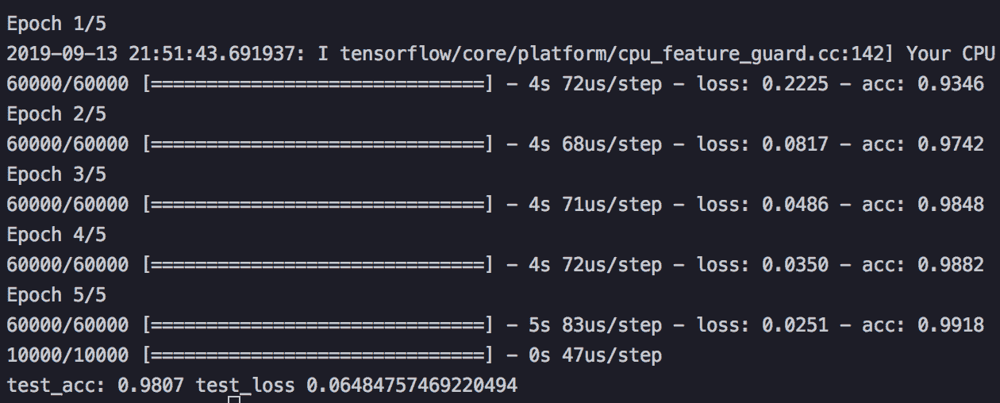

# 使用 Keras 编写不到 30 行代码的第一个神经网络

> 原文：[`www.kdnuggets.com/2019/10/writing-first-neural-net-less-30-lines-code-keras.html`](https://www.kdnuggets.com/2019/10/writing-first-neural-net-less-30-lines-code-keras.html)

评论

**作者 [David Gündisch](https://www.linkedin.com/in/david-gundisch/)，云架构师**


[`unsplash.com/@tvick`](https://unsplash.com/@tvick)

回忆起我刚开始探索人工智能的旅程时，我记得有些概念看起来是多么令人畏惧。阅读关于神经网络是什么的简单解释，很快就会引导你进入一篇每第二句都是你从未见过的符号的科学论文。虽然这些论文包含了不可思议的见解和深度，帮助你建立专业知识，但编写第一个神经网络比听起来要简单得多！

### 好吧……但什么是神经网络呢???

好问题！在我们开始编写自己的简单神经网络（简称 NN）的 Python 实现之前，我们应该先了解它们是什么，以及它们为什么如此令人兴奋！


HNC Software 联合创始人 Robert Hecht-Nielsen 博士简单地阐述了这一点。

> *“…一个由若干简单的、高度互联的处理元素组成的计算系统，通过对外部输入的动态状态响应来处理信息。 — *《神经网络入门：第一部分》，Maureen Caudill，人工智能专家，1989 年 2 月

实质上，神经网络是一组数学表达式，它们非常擅长识别信息或数据中的模式。神经网络通过一种模拟人类感知的方式实现这一点，但与人类通过视觉识别图像不同，神经网络将这些信息以数值形式包含在向量或标量中（一个仅包含一个数字的向量）。

神经网络将信息通过各层传递，其中一层的输出作为下一层的输入。在这些层中，输入通过权重和偏置进行修改，并送入激活函数以映射输出。然后，通过成本函数进行学习，该函数比较实际输出和期望输出，从而帮助函数通过反向传播过程调整权重和偏置，以最小化成本。

我强烈建议你观看下面的视频，以获得深入且直观的解释。

3Blue1Brown 关于神经网络的视频

在我们的示例神经网络实现中，我们将使用 MNIST 数据集。


MNIST 示例数据集

MNIST 可以被视为“Hello World”数据集，因为它能够简洁地展示神经网络的能力。该数据集由手写数字组成，我们将训练我们的神经网络来识别和分类这些数字。

### 进入 Keras

为了便利实现，我们将使用 Keras 框架。Keras 是一个用 Python 编写的高级 API，运行在流行的框架如 TensorFlow、Theano 等之上，提供了一个抽象层，以减少编写神经网络的固有复杂性。

我鼓励你深入了解 Keras 的 [文档](https://keras.io/)，以真正熟悉 API。此外，我强烈推荐 Francois Chollet 的 *Deep Learning with Python* 一书，这本书启发了本教程。

### 是时候烧掉一些 GPU 了。

对于本教程，我们将使用带有 TensorFlow 后端的 Keras，因此如果你还没有安装这两个工具，现在是一个好时机。你可以通过在终端中运行这些命令来完成这一安装。当你超越简单的入门示例时，最好设置你的 [Anaconda](https://docs.anaconda.com/anaconda/) 环境，并用 conda 安装下面的内容。

```py
pip3 install Keras
pip3 install Tensorflow
```

现在你已经安装了所有工具，打开你最喜欢的 IDE，让我们开始导入所需的 Python 模块吧！

```py
from keras.datasets import mnist
from keras import models
from keras import layers
from keras.utils import to_categorical
```

Keras 有许多数据集可以帮助你学习，幸运的是，MNIST 是其中之一！模型和层都是帮助我们构建神经网络的模块，而 to_categorical 用于数据编码……但稍后会详细介绍！

现在我们已经导入了所需的模块，我们需要将数据集拆分为训练集和测试集。这可以通过以下几行代码简单完成。

```py
(train_images, train_labels), (test_images, test_labels) = mnist.load_data()
```

在这个示例中，我们的神经网络通过将输出与标记数据进行比较来学习。你可以把它想象成让神经网络猜测大量手写数字，然后将猜测与实际标签进行比较。这一结果将决定模型如何调整其权重和偏差，以最小化总体成本。

在设置了训练和测试数据集之后，我们现在准备构建我们的模型。

```py
network = models.Sequential()
network.add(layers.Dense(784, activation='relu', input_shape=(28 * 28,)))
network.add(layers.Dense(784, activation='relu', input_shape=(28 * 28,)))network.add(layers.Dense(10, activation='softmax'))network.compile(optimizer='adam', loss='categorical_crossentropy', metrics=['accuracy'])
```

我知道……我知道……这可能看起来很多，但让我们一起拆解它！我们初始化一个名为 network 的顺序模型。

```py
network = models.Sequential()
```

然后我们添加我们的神经网络层。在这个示例中，我们将使用密集层。密集层意味着每个神经元都从前一层的所有神经元接收输入。[784] 和 [10] 代表输出空间的维度，我们可以将其视为后续层的输入数量，由于我们正在尝试解决一个有 10 个可能类别（数字 0 到 9）的分类问题，因此最终层有 10 个单元的潜在输出。激活参数指我们想使用的激活函数，本质上，激活函数基于给定的输入计算输出。最后，[28 * 28] 的输入形状指的是图像的像素宽度和高度。

```py
network.add(layers.Dense(784, activation='relu', input_shape=(28 * 28,)))
network.add(layers.Dense(784, activation='relu', input_shape=(28 * 28,)))
network.add(layers.Dense(10, activation='softmax'))
```

一旦我们的模型定义完毕，并且我们添加了神经网络层，我们只需使用选择的优化器、选择的损失函数和评估指标来编译模型。

```py
network.compile(optimizer='adam', loss='categorical_crossentropy', metrics=['accuracy'])
```

恭喜！！！你刚刚构建了第一个神经网络！！

现在你可能还有一些问题，例如；什么是 relu 和 softmax？还有，谁是 adam？这些都是有效的问题……这些问题的深入解释稍微超出了我们最初进入神经网络的范围，但我们会在后续的文章中进行讲解。

在将数据输入到新创建的模型之前，我们需要将输入数据重新调整为模型可以读取的格式。我们输入数据的原始形状是[60000, 28, 28]，这本质上表示 60000 张像素高度和宽度为 28 x 28 的图像。我们可以重新调整数据形状，并将其分为训练用的[60000]张图像和测试用的[10000]张图像。

```py
train_images = train_images.reshape((60000, 28 * 28))
train_images = train_images.astype('float32') / 255
test_images = test_images.reshape((10000, 28 * 28))
test_images = test_images.astype('float32') / 255
```

除了重新调整数据外，我们还需要对其进行编码。在这个示例中，我们将使用分类编码，本质上将多个特征转化为数值表示。

```py
train_labels = to_categorical(train_labels)
test_labels = to_categorical(test_labels)
```

由于我们的数据集被分为训练集和测试集，模型已经编译，并且数据已经重新调整和编码，我们现在准备训练神经网络！为此，我们将调用*fit*函数，并传入所需的参数。

```py
network.fit(train_images, train_labels, epochs=5, batch_size=128)
```

我们传入训练图像及其标签，以及 epoch，这决定了前向传播和反向传播的次数，还有 batch_size，这表示每次前向/反向传播的训练样本数量。

我们还需要设置性能测量参数，以便识别模型的表现如何。

```py
test_loss, test_acc = network.evaluate(test_images, test_labels)
print('test_acc:', test_acc, 'test_loss', test_loss)
```

然后，瞧！！！你刚刚编写了自己的神经网络，重新调整和编码了数据集，并使模型进行训练！当你第一次运行 Python 脚本时，Keras 将下载 MNIST 数据集并开始训练 5 个周期！



训练周期与测试输出

对于你的测试准确率，你应该得到大约 98%的准确度，这意味着模型在测试时 98%的情况下预测了正确的数字，对于你的第一个神经网络来说，这并不差！实际上，你还需要查看测试和训练结果，以便更好地判断你的模型是否过拟合/欠拟合。

我鼓励你尝试调整层数、优化器和损失函数，以及 epoch 和 batch_size，以查看每个因素对模型整体性能的影响！

你刚刚迈出了在漫长而激动人心的学习旅程中的困难第一步！如果需要任何额外的澄清或反馈，请随时联系！

感谢阅读——保持好奇！????

**Bio: David Gündisch** 是一位云架构师。他对研究人工智能在哲学、心理学和网络安全领域的应用充满热情。

[原文](https://towardsdatascience.com/writing-your-first-neural-net-in-less-than-30-lines-of-code-with-keras-18e160a35502)。经许可转载。

**相关内容：**

+   人工神经网络简介

+   温和介绍 PyTorch 1.2

+   TensorFlow 与 PyTorch 与 Keras 在自然语言处理中的对比

* * *

## 我们的三大课程推荐

 1\. [Google 网络安全证书](https://www.kdnuggets.com/google-cybersecurity) - 快速进入网络安全职业生涯。

 2\. [Google 数据分析专业证书](https://www.kdnuggets.com/google-data-analytics) - 提升你的数据分析技能

 3\. [Google IT 支持专业证书](https://www.kdnuggets.com/google-itsupport) - 支持你的组织的 IT 需求

* * *

### 更多相关话题

+   [少于 15 行代码的多模态深度学习](https://www.kdnuggets.com/2023/01/predibase-multi-modal-deep-learning-less-15-lines-code.html)

+   [使用 TensorFlow 和 Keras 构建和训练你的第一个神经网络](https://www.kdnuggets.com/2023/05/building-training-first-neural-network-tensorflow-keras.html)

+   [一分钟内解释的机器学习算法](https://www.kdnuggets.com/2022/07/machine-learning-algorithms-explained-less-1-minute.html)

+   [KDnuggets 新闻，7 月 20 日：机器学习算法解释…](https://www.kdnuggets.com/2022/n29.html)

+   [在不到 6 个月的时间内成为商业智能分析师](https://www.kdnuggets.com/become-a-business-intelligence-analyst-in-less-than-6-months)

+   [掌握 Python：编写清晰、组织良好的代码的 7 个策略](https://www.kdnuggets.com/mastering-python-7-strategies-for-writing-clear-organized-and-efficient-code)
