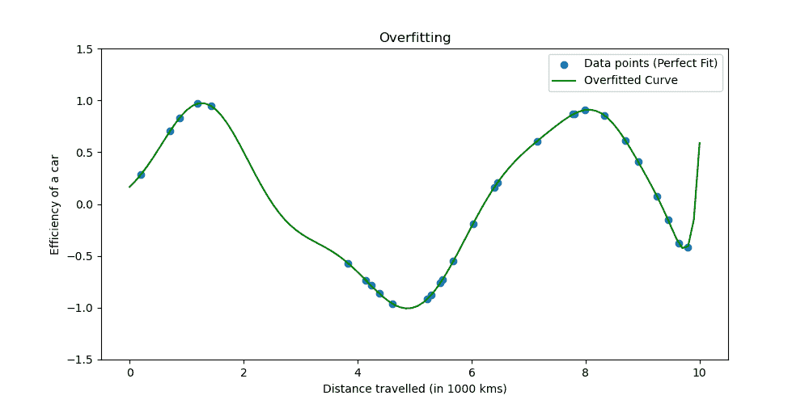
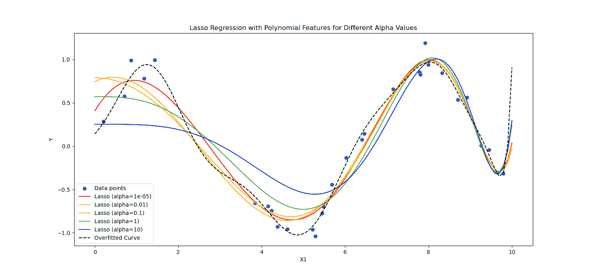
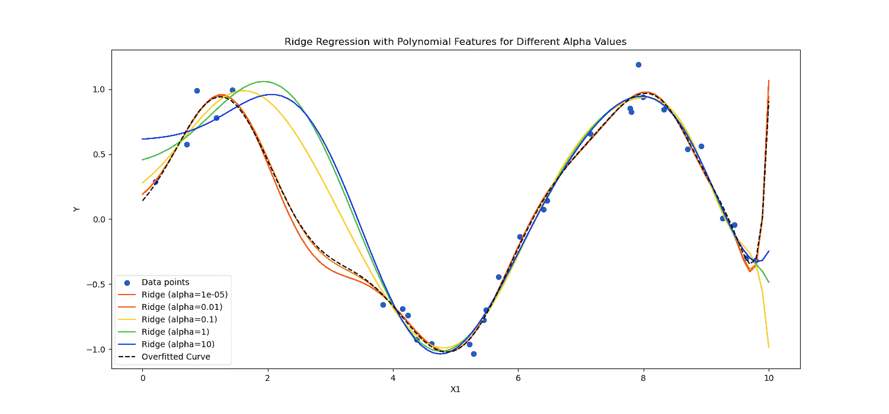
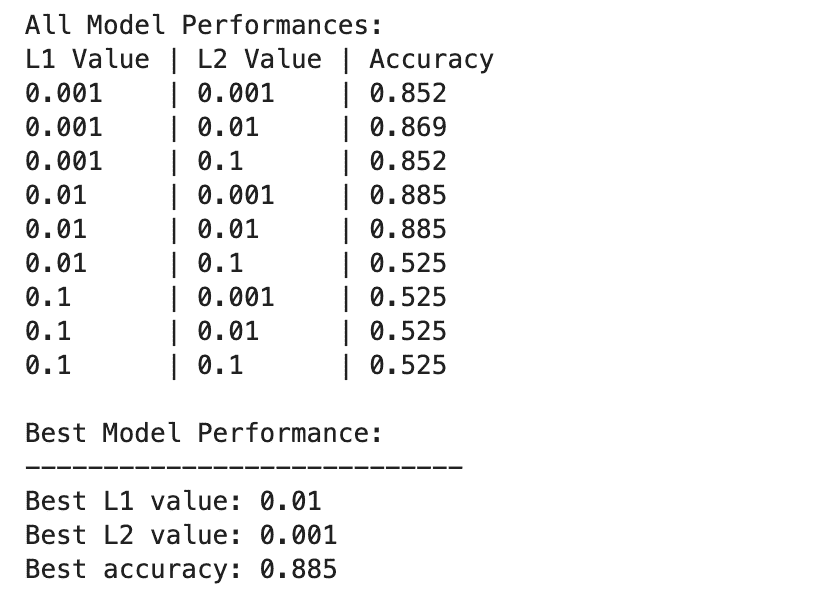

# 正则化是什么以及有什么用？

> 原文：[`www.kdnuggets.com/wtf-is-regularization-and-what-is-it-for`](https://www.kdnuggets.com/wtf-is-regularization-and-what-is-it-for)


“预防胜于治疗”这句古老的谚语提醒我们，防止问题发生比在问题发生后修复更容易。

* * *

## 我们的前三大课程推荐

 1\. [谷歌网络安全证书](https://www.kdnuggets.com/google-cybersecurity) - 快速入门网络安全职业生涯。

 2\. [谷歌数据分析专业证书](https://www.kdnuggets.com/google-data-analytics) - 提升你的数据分析技能

 3\. [谷歌 IT 支持专业证书](https://www.kdnuggets.com/google-itsupport) - 支持你组织的 IT 部门

* * *

在人工智能（AI）时代，这句谚语强调了通过正则化等技术避免潜在陷阱（如过拟合）的重要性。

在这篇文章中，我们将从正则化的基本原理入手，探讨其在 Sci-kit Learn（机器学习）和 Tensorflow（深度学习）中的应用，并通过比较这些结果来见证其在真实数据集上的变革性力量。让我们开始吧！

# 什么是正则化？

正则化是机器学习和深度学习中的一个关键概念，旨在防止模型过拟合。

过拟合发生在模型对训练数据学习得过于充分时。这种情况表明你的模型好得令人难以置信。

让我们看看过拟合的表现。



正则化技术调整学习过程，以简化模型，确保其在训练数据上表现良好，并且能够很好地泛化到新数据。我们将探讨两种著名的方法。

# 正则化类型

在机器学习中，正则化通常应用于线性模型，如线性回归和逻辑回归。在这种情况下，最常见的正则化形式是：

+   L1 正则化（Lasso 回归）

+   L2 正则化（岭回归）

**Lasso 正则化**通过允许某些系数值为零，鼓励模型只使用最重要的特征，这对特征选择特别有用。




另一方面，**岭回归正则化**通过惩罚系数值的平方来抑制显著系数。




简而言之，它们的计算方式不同。

让我们将这些应用于心脏病患者数据，以查看其在深度学习和机器学习中的效果。

# 正则化的力量：分析心脏病患者数据

现在，我们将应用正则化来分析心脏病患者数据，以展示正则化的效果。你可以从[这里](https://www.kaggle.com/datasets/arezaei81/heartcsv?resource=download)获取数据集。

为了应用机器学习，我们将使用 Scikit-learn；为了应用深度学习，我们将使用 TensorFlow。开始吧！

## 机器学习中的正则化

Scikit-learn 是最受欢迎的[Python 库](https://www.stratascratch.com/blog/top-18-python-libraries-a-data-scientist-should-know/?utm_source=blog&utm_medium=click&utm_campaign=kdn+regularization)之一，提供简单高效的数据分析和建模工具。

它包括了各种正则化技术的实现，特别是针对线性模型。

在这里，我们将探讨如何应用 L1（Lasso）和 L2（Ridge）正则化。

在下面的代码中，我们将使用 Ridge（L2）和 Lasso（L1）正则化技术训练逻辑回归。最后，我们将看到详细的报告。让我们看一下代码。

```py
from sklearn.model_selection import train_test_split
from sklearn.preprocessing import StandardScaler
from sklearn.linear_model import LogisticRegression
from sklearn.metrics import accuracy_score, classification_report

# Assuming heart_data is already loaded
X = heart_data.drop('target', axis=1)
y = heart_data['target']

# Split the data into training and testing sets
X_train, X_test, y_train, y_test = train_test_split(X, y, test_size=0.2, random_state=42)

# Standardize the features
scaler = StandardScaler()
X_train_scaled = scaler.fit_transform(X_train)
X_test_scaled = scaler.transform(X_test)

# Define regularization values to explore
regularization_values = [0.001, 0.01, 0.1]

# Placeholder for storing performance metrics
performance_metrics = []

# Iterate over regularization values for L1 and L2
for C_value in regularization_values:
    # Train and evaluate L1 model
    log_reg_l1 = LogisticRegression(penalty='l1', C=C_value, solver='liblinear')
    log_reg_l1.fit(X_train_scaled, y_train)
    y_pred_l1 = log_reg_l1.predict(X_test_scaled)
    accuracy_l1 = accuracy_score(y_test, y_pred_l1)
    report_l1 = classification_report(y_test, y_pred_l1)
    performance_metrics.append(('L1', C_value, accuracy_l1))

    # Train and evaluate L2 model
    log_reg_l2 = LogisticRegression(penalty='l2', C=C_value, solver='liblinear')
    log_reg_l2.fit(X_train_scaled, y_train)
    y_pred_l2 = log_reg_l2.predict(X_test_scaled)
    accuracy_l2 = accuracy_score(y_test, y_pred_l2)
    report_l2 = classification_report(y_test, y_pred_l2)
    performance_metrics.append(('L2', C_value, accuracy_l2))

# Print the performance metrics for all models
print("Model Performance Evaluation:")
print("--------------------------------")
for metric in performance_metrics:
    reg_type, C_value, accuracy = metric
    print(f"Regularization: {reg_type}, C: {C_value}, Accuracy: {accuracy:.2f}") 
```

这是输出结果。


让我们评估结果。

### L1 正则化

+   在 C=0.001 时，准确率显著较低（48%）。这表明模型存在欠拟合，正则化过强。

+   随着 C 增加到 0.01，L1 的准确率保持不变，这表明模型仍然存在欠拟合或正则化过强。

+   在 C=0.1 时，准确率显著提高至 87%，这表明减少正则化强度使模型能够更好地从数据中学习。

### L2 正则化

总的来说，L2 正则化表现一致良好，C=0.001 时准确率为 87%，C=0.01 时略微提高至 89%，然后在 C=0.1 时稳定在 87%。

这表明 L2 正则化通常在逻辑回归模型中对这个数据集更宽容、更有效，可能与其性质有关。

## 深度学习中的正则化

深度学习中使用了几种正则化技术，包括 L1（Lasso）和 L2（Ridge）正则化、丢弃法和提前停止。

在这里，为了重复之前机器学习示例中的操作，我们将应用 L1 和 L2 正则化。这次让我们定义一系列 L1 和 L2 正则化值。

然后，对于所有这些值，我们将训练和评估我们的深度学习模型，并在最后评估结果。

让我们看一下代码。

```py
from tensorflow.keras.regularizers import l1_l2
import numpy as np

# Define a list/grid of L1 and L2 regularization values
l1_values = [0.001, 0.01, 0.1]
l2_values = [0.001, 0.01, 0.1]

# Placeholder for storing performance metrics
performance_metrics = []

# Iterate over all combinations of L1 and L2 values
for l1_val in l1_values:
    for l2_val in l2_values:
        # Define model with the current combination of L1 and L2
        model = Sequential([
            Dense(128, activation='relu', input_shape=(X_train_scaled.shape[1],), kernel_regularizer=l1_l2(l1=l1_val, l2=l2_val)),
            Dropout(0.5),
            Dense(64, activation='relu', kernel_regularizer=l1_l2(l1=l1_val, l2=l2_val)),
            Dropout(0.5),
            Dense(1, activation='sigmoid')
        ])

        model.compile(optimizer='adam', loss='binary_crossentropy', metrics=['accuracy'])

        # Train the model
        history = model.fit(X_train_scaled, y_train, validation_split=0.2, epochs=100, batch_size=10, verbose=0)

        # Evaluate the model
        loss, accuracy = model.evaluate(X_test_scaled, y_test, verbose=0)

        # Store the performance along with the regularization values
        performance_metrics.append((l1_val, l2_val, accuracy))

# Find the best performing model
best_performance = max(performance_metrics, key=lambda x: x[2])
best_l1, best_l2, best_accuracy = best_performance

# After the loop, to print all performance metrics
print("All Model Performances:")
print("L1 Value | L2 Value | Accuracy")
for metrics in performance_metrics:
    print(f"{metrics[0]:<8} | {metrics[1]:<8} | {metrics[2]:.3f}")

# After finding the best performance, to print the best model details
print("\nBest Model Performance:")
print("----------------------------")
print(f"Best L1 value: {best_l1}")
print(f"Best L2 value: {best_l2}")
print(f"Best accuracy: {best_accuracy:.3f}") 
```

这是输出结果。



深度学习模型的性能在不同的 L1 和 L2 正则化值组合下差异较大。

最佳性能出现在 L1=0.01 和 L2=0.001 时，准确率为 88.5%，这表明平衡的正则化防止了过拟合，同时允许模型捕捉数据中的潜在模式。

较高的正则化值，特别是在 L1=0.1 或 L2=0.1 时，会大幅降低模型准确性到 52.5%，这表明过度正则化严重限制了模型的学习能力。

## 机器学习与深度学习中的正则化

让我们比较一下机器学习和深度学习之间的结果。

**正则化的有效性**：在机器学习和深度学习的背景下，适当的正则化有助于减轻过拟合，但过度正则化会导致欠拟合。最佳正则化强度因情况而异，深度学习模型可能由于其更高的复杂性需要更细致的平衡。

**性能：** 表现最佳的机器学习模型（L2 与 C=0.01，89%准确率）和表现最佳的深度学习模型（L1=0.01，L2=0.001，88.5%准确率）达到了类似的准确性，证明了两种方法都可以有效正则化，以在该数据集上实现高性能。

**正则化策略：** L2 正则化在逻辑回归模型中似乎更有效且对 C 的选择不那么敏感，而 L1 和 L2 正则化的组合在深度学习中提供了最佳结果，提供了特征选择和权重惩罚之间的平衡。

正则化的选择和强度应谨慎调整，以平衡学习复杂性与过拟合或欠拟合的风险。

# 结论

在这一探索过程中，我们揭示了正则化的神秘面纱，展示了它在防止过拟合和确保我们的模型能良好泛化到未见数据中的作用。

应用正则化技术将使你更接近机器学习和深度学习的精通，巩固你的数据科学家工具包。

进入数据项目，尝试在不同场景中对数据进行正则化，例如[交付时间预测](https://platform.stratascratch.com/data-projects/delivery-duration-prediction?utm_source=blog&utm_medium=click&utm_campaign=kdn+regularization)。我们在这个数据项目中使用了机器学习和深度学习模型。然而，最后我们也提到可能还有改进的空间。那么，为什么不在那里尝试正则化，看看是否有帮助呢？

[](https://twitter.com/StrataScratch)****[内特·罗斯迪](https://twitter.com/StrataScratch)****是一位数据科学家和产品策略专家。他还是一名兼职教授，教授分析学，并且是 StrataScratch 的创始人，该平台帮助数据科学家通过顶级公司真实面试问题准备面试。内特撰写关于职业市场的最新趋势，提供面试建议，分享数据科学项目，并涵盖所有 SQL 内容。

### 相关主题

+   [GBM 和 XGBoost 之间的区别是什么？](https://www.kdnuggets.com/wtf-is-the-difference-between-gbm-and-xgboost)

+   [什么是张量？！?](https://www.kdnuggets.com/2018/05/wtf-tensor.html)

+   [L1 和 L2 正则化的区别](https://www.kdnuggets.com/2022/08/difference-l1-l2-regularization.html)

+   [2022 年及以后最顶尖的 AI 和数据科学工具与技术](https://www.kdnuggets.com/2022/03/nvidia-0317-top-ai-data-science-tools-techniques-2022-beyond.html)

+   [如何使用 [ ]、.loc、iloc、.at 等在 Pandas 中选择行和列](https://www.kdnuggets.com/2019/06/select-rows-columns-pandas.html)

+   [最先进的深度学习解释性预测和现在预测](https://www.kdnuggets.com/2021/12/sota-explainable-forecasting-and-nowcasting.html)
