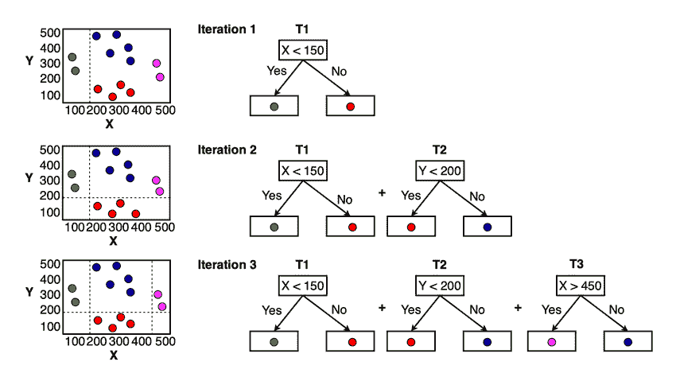

# GBM 和 XGBoost 之间的区别是什么？

> 原文：[`www.kdnuggets.com/wtf-is-the-difference-between-gbm-and-xgboost`](https://www.kdnuggets.com/wtf-is-the-difference-between-gbm-and-xgboost)

图片由[upklyak](https://www.freepik.com/free-vector/business-startup-project-launch-successful-idea_29222778.htm#query=boost&position=4&from_view=search&track=sph&uuid=b8330f52-58e3-4628-830f-2673f9ab16e6)提供，来源于[Freepik](https://www.freepik.com/)。

我相信每个人都知道 GBM 和 XGBoost 这两个算法。它们是许多实际应用和竞赛中的首选算法，因为它们的度量输出通常优于其他模型。

* * *

## 我们的前三大课程推荐

 1\. [Google 网络安全证书](https://www.kdnuggets.com/google-cybersecurity) - 快速进入网络安全职业道路。

 2\. [Google 数据分析专业证书](https://www.kdnuggets.com/google-data-analytics) - 提升你的数据分析技能

 3\. [Google IT 支持专业证书](https://www.kdnuggets.com/google-itsupport) - 支持你的组织的 IT 需求

* * *

对于那些不了解 GBM 和 XGBoost 的人，GBM（梯度提升机）和 XGBoost（极端梯度提升）是集成学习方法。集成学习是一种机器学习技术，通过训练和组合多个“弱”模型（通常是决策树）来实现进一步的目的。

该算法基于其名称所示的集成学习提升技术。提升技术是一种方法，试图顺序地结合多个弱学习器，每一个都修正其前任。每个学习器都会从之前的错误中学习并纠正前一个模型的错误。

这就是 GBM 和 XGB 之间的基本相似之处，但差异如何呢？我们将在本文中讨论这一点，让我们深入了解一下吧。

# GBM（梯度提升机）

如上所述，GBM 基于提升方法，尝试通过顺序迭代弱学习器以从错误中学习并开发出一个稳健的模型。GBM 通过使用梯度下降法来最小化损失函数，从而在每次迭代中开发出更好的模型。梯度下降是一个在每次迭代中寻找最小函数（例如损失函数）的概念。迭代将持续进行，直到达到停止标准。

关于 GBM 的概念，你可以在下图中查看。

GBM 模型概念（[Chhetri *et al.* (2022)](https://www.researchgate.net/publication/358924681_A_Combined_System_Metrics_Approach_to_Cloud_Service_Reliability_Using_Artificial_Intelligence)）

你可以在上面的图像中看到，对于每次迭代，模型试图最小化损失函数并从之前的错误中学习。最终模型将是所有弱学习器的总和，汇总了模型的所有预测。

# XGB（eXtreme Gradient Boosting）及其与 GBM 的不同

XGBoost 或 eXtreme Gradient Boosting 是一种基于梯度提升算法的机器学习算法，由 [Tiangqi Chen 和 Carlos Guestrin 于 2016 年开发](https://arxiv.org/pdf/1603.02754.pdf)。从基本层面来看，该算法仍遵循一种顺序策略，以基于梯度下降改进下一个模型。然而，XGBoost 的一些差异使其在性能和速度方面成为最优秀的模型之一。

## 1\. 正则化

正则化是一种机器学习技术，用于避免过拟合。它是一组约束模型过度复杂化并具有差劲泛化能力的方法。由于许多模型对训练数据的拟合过好，正则化成为了一种重要的技术。

GBM 的算法中没有实现正则化，这使得算法只关注于达到最小损失函数。与 GBM 相比，XGBoost 实施了正则化方法来惩罚过拟合的模型。

XGBoost 可以应用两种正则化：L1 正则化（Lasso）和 L2 正则化（Ridge）。L1 正则化试图将特征权重或系数最小化为零（有效地进行特征选择），而 L2 正则化则试图均匀缩小系数（帮助处理多重共线性）。通过实施这两种正则化，XGBoost 可以比 GBM 更好地避免过拟合。

## 2\. 并行化

GBM 的训练时间通常比 XGBoost 慢，因为后者在训练过程中实现了并行化。尽管提升技术可能是顺序的，但并行化仍然可以在 XGBoost 过程中进行。

并行化旨在加速树构建过程，主要是在拆分事件期间。通过利用所有可用的处理核心，XGBoost 的训练时间可以缩短。

说到加速 XGBoost 过程，开发者还将数据预处理为他们开发的数据格式 DMatrix，以提高内存效率和训练速度。

## 3\. 缺失数据处理

我们的训练数据集可能包含缺失数据，我们必须在将其传递给算法之前明确处理。然而，XGBoost 具有内置的缺失数据处理器，而 GBM 没有。

XGBoost 实现了处理缺失数据的技术，称为“感知稀疏拆分”。对于 XGBoost 遇到的任何稀疏数据（缺失数据、密集零值、OHE），模型会从这些数据中学习，并找到最优的拆分点。模型会在拆分过程中确定缺失数据应放置的位置，并查看哪个方向可以最小化损失。

## 4\. 树修剪

GBM 的增长策略是在算法达到负损失时停止分裂。这个策略可能导致次优结果，因为它仅基于局部优化，可能忽视了整体情况。

XGBoost 试图避免 GBM 策略，继续增长树直到设置参数最大深度开始向后剪枝。负损失的分裂会被剪枝，但在某些情况下，负损失分裂未被移除。当分裂达到负损失，但进一步分裂为正时，如果总体分裂为正，仍会保留该分裂。

## 5\. 内置交叉验证

交叉验证是一种评估模型泛化能力和鲁棒性的技术，通过在多个迭代过程中系统地拆分数据来实现。综合结果将显示模型是否过拟合。

通常，机器算法需要外部帮助来实现交叉验证，但 XGBoost 具有内置的交叉验证，可以在训练过程中使用。交叉验证将在每次提升迭代中执行，并确保生成的树是鲁棒的。

# 结论

GBM 和 XGBoost 是许多实际案例和竞赛中的热门算法。从概念上讲，这两者都是使用弱学习器来实现更好模型的提升算法。然而，它们在算法实现上有一些差异。XGBoost 通过嵌入正则化、执行并行化、改进缺失数据处理、不同的树剪枝策略以及内置交叉验证技术来增强算法。

**[Cornellius Yudha Wijaya](https://www.linkedin.com/in/cornellius-yudha-wijaya/)**是一名数据科学助理经理和数据撰稿人。在全职工作于 Allianz Indonesia 期间，他喜欢通过社交媒体和写作媒体分享 Python 和数据技巧。Cornellius 在各种 AI 和机器学习话题上撰写文章。

### 更多相关话题

+   [SQL 与对象关系映射（ORM）之间的区别是什么？](https://www.kdnuggets.com/2022/02/difference-sql-object-relational-mapping-orm.html)

+   [数据分析师和数据科学家之间的区别是什么？](https://www.kdnuggets.com/2022/03/difference-data-analysts-data-scientists.html)

+   [效率决定了生物神经元和……之间的区别](https://www.kdnuggets.com/2022/11/efficiency-spells-difference-biological-neurons-artificial-counterparts.html)

+   [L1 和 L2 正则化之间的区别](https://www.kdnuggets.com/2022/08/difference-l1-l2-regularization.html)

+   [机器学习中训练数据和测试数据之间的区别](https://www.kdnuggets.com/2022/08/difference-training-testing-data-machine-learning.html)

+   [正则化是什么？它的用途是什么？](https://www.kdnuggets.com/wtf-is-regularization-and-what-is-it-for)
