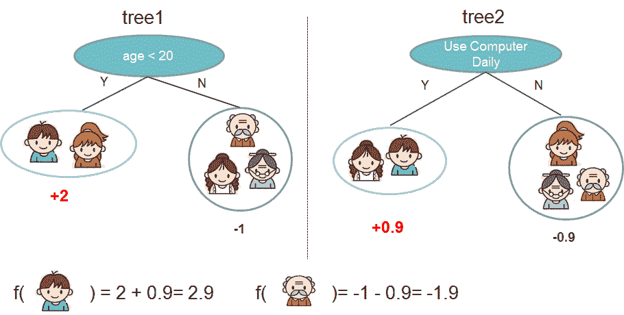

# XGBoost: 简明技术概述

> 原文：[`www.kdnuggets.com/2017/10/xgboost-concise-technical-overview.html`](https://www.kdnuggets.com/2017/10/xgboost-concise-technical-overview.html)

### 介绍

> “我们的单一 XGBoost 模型可以进入前三名！我们的最终模型只是对不同随机种子的 XGBoost 模型进行平均。”
> 
> - [Dmitrii Tsybulevskii & Stanislav Semenov](https://blog.kaggle.com/2016/08/24/avito-duplicate-ads-detection-winners-interview-1st-place-team-devil-team-stanislav-dmitrii/)，Avito 重复广告检测 Kaggle 比赛的获胜者。

随着整个[博客](https://blog.kaggle.com/tag/xgboost/)专注于如何仅仅使用 XGBoost 就能提升 Kaggle 比赛中的排名，现在是时候深入探讨 XGBoost 的概念了。

Bagging 算法控制模型的高方差。然而，提升算法被认为更有效，因为它们同时处理偏差和方差（偏差-方差权衡）。

XGBoost 是梯度提升机器（GBM）的实现，用于监督学习。XGBoost 是一个开源的机器学习库，支持 Python、R、Julia、Java、C++、Scala。其突出的特点有：

1.  速度

1.  对稀疏数据的认识

1.  单机、分布式系统及外部计算的实现

1.  并行化

### 工作原理

要理解 XGBoost，我们必须首先理解梯度下降和梯度提升。

**a) 梯度下降：**

成本函数衡量预测值与实际值的接近程度。理想情况下，我们希望预测值和实际值之间的差异尽可能小。因此，我们希望将成本函数最小化。

与训练模型相关的权重使得模型预测的值接近实际值。因此，与模型相关的权重越好，预测值就越准确，成本函数也就越低。随着训练集记录的增加，权重被学习并更新。

梯度下降是一个迭代优化算法。它是一种用于最小化具有多个变量的函数的方法。因此，梯度下降可以用来最小化成本函数。它首先用初始权重运行模型，然后通过在多个迭代中更新权重来最小化成本函数。

**b) 梯度提升：**

提升：构建一个由弱学习器组成的集成，其中被误分类的记录被赋予更大的权重（‘提升’），以便在后续模型中正确预测它们。这些弱学习器随后被组合成一个强学习器。有许多提升算法，如 AdaBoost、梯度提升和 XGBoost。后两者是基于树的模型。图 1 展示了一个树集成模型。

图 1：树集成模型预测给定用户是否喜欢计算机游戏。+2，+0.1，-1，+0.9，-0.9 是每个叶子中的预测分数。给定用户的最终预测是每棵树的预测总和。[来源](http://xgboost.readthedocs.io/en/latest/model.html)

梯度提升将梯度下降和提升的原则应用于监督学习。梯度提升模型（GBM）是按顺序、串行构建的树。在 GBM 中，我们取多个模型的加权和。

+   每个新模型使用**梯度下降**优化来更新/修正模型需要学习的权重，以达到成本函数的局部最小值。

+   分配给每个模型的权重向量不是通过前一个模型的误分类及其导致的权重增加得出的，而是通过梯度下降优化的权重，以最小化成本函数。梯度下降的结果是模型的相同函数，只是具有更好的参数。

+   梯度**提升**在每一步中向现有函数添加一个新函数以预测输出。梯度提升的结果是一个完全不同的函数，因为结果是多个函数的加和。

**c) XGBoost：**

XGBoost 的设计旨在推动提升树计算资源的极限。XGBoost 是 GBM 的一个实现，具有显著改进。GBM 按顺序构建树，而 XGBoost 则是并行化的，这使得 XGBoost 更快。

### XGBoost 的特点：

XGBoost 在分布式和内存有限的设置中都具有可扩展性。这种可扩展性归因于多个算法优化。

**1. 分裂查找算法：近似算法：**

要找到连续特征的最佳分裂，需要将数据排序并完全加载到内存中。如果数据集很大，这可能成为一个问题。

为此使用了一种近似算法。基于特征分布的百分位数提出候选分裂点。连续特征被分箱为基于候选分裂点的桶。通过对桶的汇总统计选择候选分裂点的最佳解决方案。

**2. 并行学习的列块：**

数据排序是树学习中最耗时的方面。为了减少排序成本，数据存储在称为“块”的内存单位中。每个块的数据显示列按相应的特征值排序。此计算仅需在训练前完成一次，并可在之后重复使用。

块的排序可以独立完成，并可以在 CPU 的并行线程之间分配。分裂查找可以并行化，因为对每一列的统计收集是并行进行的。

**3. 用于近似树学习的加权分位数草图：**

为了在加权数据集中提出候选分割点，使用了加权分位数草图算法。它对数据的分位数摘要执行合并和修剪操作。

**4\. 稀疏感知算法：**

输入可能由于独热编码、缺失值和零值条目等原因而稀疏。XGBoost 了解数据中的稀疏模式，并仅访问每个节点中的默认方向（非缺失条目）。

**5\. 缓存感知访问：**

为了防止在分割查找过程中出现缓存未命中并确保并行化，每个块选择 2¹⁶ 个示例。

**6\. 核外计算：**

对于不能容纳在主内存中的数据，将数据划分为多个块，并将每个块存储在磁盘上。按列压缩每个块，并在磁盘读取时由独立线程即时解压缩。

**7\. 正则化学习目标：**

要衡量给定一组参数下模型的性能，我们需要定义目标函数。目标函数必须始终包含两个部分：训练损失和正则化。正则化项对模型的复杂性进行惩罚。

Obj(Θ)=L(θ)+ Ω(Θ)

其中 Ω 是正则化项，大多数算法在目标函数中忘记包括该项。然而，XGBoost 包含正则化，从而控制模型的复杂性并防止过拟合。

上述 6 个特性可能在某些算法中单独存在，但 XGBoost 结合了这些技术，形成一个端到端的系统，提供可扩展性和有效的资源利用。

### Python 和 R 的实现代码：

这些链接为使用 Python 和 [R](https://rpubs.com/mharris/multiclass_xgboost) 实现 XGBoost 提供了良好的起点。

以下 Python 代码在 [Pima 印第安人糖尿病数据集](https://archive.ics.uci.edu/ml/datasets/pima+indians+diabetes) 上运行。它预测 Pima 印第安人遗传背景的患者是否会发生糖尿病。该代码受到 [Jason Brownlee](https://machinelearningmastery.com/start-here/) 教程的启发。

### 结论

你可以参考 [这篇论文](https://arxiv.org/pdf/1603.02754.pdf)，这是 XGBoost 开发者撰写的，以了解其详细工作原理。你还可以在 [Github](https://github.com/dmlc/xgboost) 上找到该项目，并查看 [这里](https://github.com/dmlc/xgboost/tree/master/demo#machine-learning-challenge-winning-solutions) 的教程和用例。

然而，XGBoost 不应被视为万灵药。最佳结果可以通过与出色的数据探索和特征工程相结合获得。

**相关：**

+   XGBoost，Kaggle 上的顶级机器学习方法解析

+   XGBoost，将 Kaggle 上获胜的算法在 Spark 和 Flink 中实现

+   使用鸢尾花数据集的简单 XGBoost 教程

* * *

## 我们的三大课程推荐

 1\. [谷歌网络安全证书](https://www.kdnuggets.com/google-cybersecurity) - 快速进入网络安全职业生涯。

 2\. [谷歌数据分析专业证书](https://www.kdnuggets.com/google-data-analytics) - 提升你的数据分析技能

 3\. [谷歌 IT 支持专业证书](https://www.kdnuggets.com/google-itsupport) - 支持你的组织的 IT 工作

* * *

### 更多相关主题

+   [停止学习数据科学以寻找目标，并通过寻找目标来…](https://www.kdnuggets.com/2021/12/stop-learning-data-science-find-purpose.html)

+   [一个 90 亿美元的 AI 失败案例分析](https://www.kdnuggets.com/2021/12/9b-ai-failure-examined.html)

+   [学习数据科学统计的顶级资源](https://www.kdnuggets.com/2021/12/springboard-top-resources-learn-data-science-statistics.html)

+   [成功的数据科学家的五个特征](https://www.kdnuggets.com/2021/12/5-characteristics-successful-data-scientist.html)

+   [是什么让 Python 成为初创公司的理想编程语言](https://www.kdnuggets.com/2021/12/makes-python-ideal-programming-language-startups.html)

+   [每位数据科学家都应了解的三个 R 语言库（即使你使用 Python）](https://www.kdnuggets.com/2021/12/three-r-libraries-every-data-scientist-know-even-python.html)
