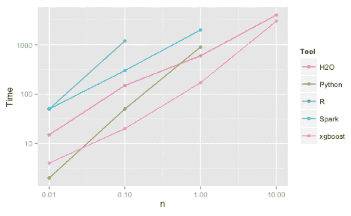

# XGBoost，Kaggle 上的顶级机器学习方法解析

> 原文：[`www.kdnuggets.com/2017/10/xgboost-top-machine-learning-method-kaggle-explained.html`](https://www.kdnuggets.com/2017/10/xgboost-top-machine-learning-method-kaggle-explained.html)

*什么是 XGBoost？*

* * *

## 我们的三大课程推荐

 1\. [谷歌网络安全证书](https://www.kdnuggets.com/google-cybersecurity) - 快速开启网络安全职业生涯。

 2\. [谷歌数据分析专业证书](https://www.kdnuggets.com/google-data-analytics) - 提升你的数据分析技能

 3\. [谷歌 IT 支持专业证书](https://www.kdnuggets.com/google-itsupport) - 支持你的组织的 IT 需求

* * *

XGBoost 已成为 Kaggle 竞争者和工业界数据科学家广泛使用且非常流行的工具，因为它在大规模问题上的生产环境中经过了实战测试。它是一个高度灵活和多功能的工具，可以处理大多数回归、分类和排序问题以及用户自定义目标函数。作为一个开源软件，它易于访问，可以通过不同的平台和接口使用。该系统的惊人可移植性和兼容性允许在 Windows、Linux 和 OS X 三大操作系统上使用。它还支持在如 AWS、Azure、GCE 等分布式云平台上训练，并且可以轻松连接到如 Flink 和 Spark 等大规模云数据流系统。尽管它是由其创建者（Tianqi Chen）在命令行界面（CLI）中构建和最初使用的，但也可以在 Python、C++、R、Julia、Scala 和 Java 等各种语言和接口中加载和使用。

它的名称代表**极端梯度提升**，由 Tianqi Chen 开发，现在是 Distributed Machine Learning Community (DMLC)开发的开源库集合的一部分。XGBoost 是梯度提升机器的可扩展且准确的实现，它已被证明能够推动提升树算法计算能力的极限，因为它是为了模型性能和计算速度的目的而构建和开发的。具体而言，它被设计用于充分利用每一位内存和硬件资源来提升树算法。

XGBoost 的实现提供了多种先进的模型调优、计算环境和算法增强功能。它能够执行三种主要形式的梯度提升（梯度提升（GB）、随机 GB 和正则化 GB），并且足够稳健，支持精细调节和正则化参数的添加。根据 Tianqi Chen 的说法，这正是它优于其他库的原因。

> “……xgboost 使用了更规范化的模型形式来控制过拟合，这使其表现更佳。”- Tianqi Chen 在[Quora](https://www.quora.com/What-is-the-difference-between-the-R-gbm-gradient-boosting-machine-and-xgboost-extreme-gradient-boosting)

从系统角度来看，该库的可移植性和灵活性允许使用各种计算环境，例如树构建的 CPU 核心并行化；大模型的分布式计算；外存计算；以及缓存优化，以提高硬件使用和效率。

该算法的开发目的是有效减少计算时间，并优化内存资源的使用。实现的重要特性包括处理缺失值（稀疏感知）、支持树构建并行化的块结构以及在训练模型后对新数据进行拟合和提升的能力（持续训练）。

*为什么使用 XGBoost？*

正如我们之前提到的，这个库的关键特性依赖于*模型性能和执行速度*。由[Szilard Pafka](http://datascience.la/benchmarking-random-forest-implementations/)进行的结构化基准测试，展示了 XGBoost 如何超越几种其他知名的梯度树提升实现。

图 1 中的比较帮助我们掌握工具的强大性能，并查看其好处的平衡，即它似乎没有在速度和准确性之间做出牺牲。越来越多的 Kagglers 每天使用它，逐渐明白为什么，它在性能和时间效率之间达到了半完美的平衡。

*它是如何工作的？*

在深入算法细节之前，让我们设定一些基本定义，以便更容易理解，并对这个流行工具有一个直观和完整的了解。

首先，让我们澄清“boosting”的概念。这是一种集成方法，旨在基于“弱”分类器创建一个强大的分类器（模型）。在这个上下文中，弱和强是指学习者与实际目标变量的相关程度。通过迭代地将模型叠加在一起，前一个模型的错误会被下一个预测器纠正，直到训练数据被模型准确预测或重现。如果你想更深入地了解 boosting，可以查看有关一种流行实现叫做 AdaBoost（自适应提升）的信息，[点击这里](https://machinelearningmastery.com/boosting-and-adaboost-for-machine-learning/)。

现在，梯度提升还包括一种集成方法，它顺序地添加预测器并纠正先前的模型。然而，与每次迭代后给分类器分配不同权重的方法不同，这种方法将新模型拟合到先前预测的新残差中，然后在添加最新预测时最小化损失。因此，最终你是使用梯度下降来更新你的模型，因此得名梯度提升。这适用于回归和分类问题。XGBoost 特别实现了这个算法，用于决策树提升，并在目标函数中增加了额外的自定义正则化项。

*开始使用 XGBoost*

无论你使用的是哪个接口，你都可以下载并安装 XGBoost。要了解如何在每个平台上使用它，请按照此链接中的说明操作。你还可以在 [这里](https://xgboost.readthedocs.io/en/latest/get_started/index.html) 找到官方文档和教程。

有关源代码和示例的更多信息，你可以访问这个 [DMLC GitHub 仓库](https://github.com/dmlc/xgboost)。

关于提升和梯度提升的更多信息，以下资源可能会有所帮助：

+   由 Tianqi Chen 发布的官方论文可以从 [Arxiv](https://arxiv.org/abs/1603.02754) 下载。

+   官方文档 [XGBoost 页面](http://xgboost.readthedocs.io/en/latest/model.html)

+   [这里](http://www.ccs.neu.edu/home/vip/teach/MLcourse/4_boosting/slides/gradient_boosting.pdf) 是一份很好的演示文稿，它以非常直观的方式总结了数学原理

+   一些 [维基百科文章](https://en.wikipedia.org/wiki/Gradient_boosting) 对于算法的历史和数学原理提供了很好的概述：

感谢 Jason Brownlee 为这篇文章提供的灵感，更多关于 Boosting 和 XGBoost 的资源可以在 [他的文章](https://machinelearningmastery.com/gentle-introduction-xgboost-applied-machine-learning/) 中找到。

**相关：**

+   从基准测试快速机器学习算法中得到的经验教训

+   使用鸢尾花数据集的简单 XGBoost 教程

+   XGBoost：在 Spark 和 Flink 中实现最成功的 Kaggle 算法

### 更多相关话题

+   [数据科学统计学习的顶级资源](https://www.kdnuggets.com/2021/12/springboard-top-resources-learn-data-science-statistics.html)

+   [停止学习数据科学以寻找目的，并找到目的去……](https://www.kdnuggets.com/2021/12/stop-learning-data-science-find-purpose.html)

+   [一项 90 亿美元的 AI 失败，分析](https://www.kdnuggets.com/2021/12/9b-ai-failure-examined.html)

+   [成功数据科学家的 5 个特征](https://www.kdnuggets.com/2021/12/5-characteristics-successful-data-scientist.html)

+   [是什么让 Python 成为初创企业理想的编程语言](https://www.kdnuggets.com/2021/12/makes-python-ideal-programming-language-startups.html)

+   [每个数据科学家都应该了解的三个 R 库（即使你使用 Python）](https://www.kdnuggets.com/2021/12/three-r-libraries-every-data-scientist-know-even-python.html)
