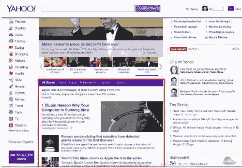

# Yahoo 发布了有史以来最大的机器学习数据集供研究人员使用

> 原文：[`www.kdnuggets.com/2016/01/yahoo-largest-machine-learning-dataset.html`](https://www.kdnuggets.com/2016/01/yahoo-largest-machine-learning-dataset.html)

**苏朱·拉詹**，Yahoo。

数据是机器学习研究的命脉。然而，真正大规模的数据集的访问权传统上一直是大型公司中的机器学习研究人员和数据科学家的特权，而大多数学术研究人员则无法获得。

Yahoo Labs 的研究科学家们长期以来一直致力于解决受消费者产品启发的大规模机器学习问题。这使我们能够在搜索排名、计算广告、信息检索和核心机器学习等领域推进思维。外部研究社区感兴趣的一个关键方面是将新算法和方法应用于生产流量和从真实产品中收集的大规模数据集。

今天，我们自豪地宣布向研究社区公开发布有史以来最大的机器学习数据集。该数据集包含大约~110B 事件（13.5TB 未压缩）的匿名用户新闻项互动数据，这些数据通过记录大约 2000 万用户从 2015 年 2 月到 2015 年 5 月的用户新闻项互动来收集。

[Yahoo 新闻订阅数据集](http://webscope.sandbox.yahoo.com/catalog.php?datatype=r&did=75)是基于一组匿名用户与多个 Yahoo 网站新闻订阅的互动样本，包括 Yahoo 首页、Yahoo 新闻、Yahoo 体育、Yahoo 财经、Yahoo 电影和 Yahoo 房地产。

*Yahoo 主页上的新闻订阅。*

我们的目标是促进大规模机器学习和推荐系统领域的独立研究，并帮助缩小工业和学术研究之间的差距。该数据集作为 Yahoo Labs [Webscope](http://webscope.sandbox.yahoo.com/) 数据共享计划的一部分提供，Webscope 是一个包含匿名用户数据的科学有用数据集的参考库，供非商业用途使用。

除了互动数据外，我们还为一部分匿名用户提供了分类的人口统计信息（年龄范围、性别和一般地理数据）。在项方面，我们发布了相关新闻文章的标题、摘要和关键词。互动数据以相关本地时间进行时间戳，并且还包含有关用户访问新闻订阅的设备的部分信息，这使得在上下文推荐和时间数据挖掘方面进行有趣的工作成为可能。

Yahoo Labs 的个性化科学团队在处理 Yahoo 新闻提要数据集的全面版本时非常愉快，这引发了一些引人注目的想法（例如 [鸟类、应用程序和用户：可扩展的因子分解机](https://yahoolabs.tumblr.com/post/133013312756/birds-apps-and-users-scalable-factorization) 和 [科学推动产品和个性化：超越点击](https://yahoolabs.tumblr.com/post/99405569711/science-powering-product-and-personalization)），涉及行为建模、推荐系统、大规模和分布式机器学习、排名、在线算法、内容建模和时间序列挖掘等领域。

我们希望此次数据发布同样能够激励我们的研究同行、数据科学家以及学术界的机器学习爱好者，并帮助他们在广泛的“真实世界”数据集上验证他们的模型。我们坚信，这个数据集可以成为大规模机器学习和推荐系统的基准，我们期待着社区关于我们数据应用的反馈。

祝 2016 年大规模机器学习愉快！

*关于我们对用户隐私的处理说明：我们的用户每天都信任我们，我们努力赢得这种信任。我们热忱保护用户的隐私，并 [负责任和透明地使用及保护用户个人信息](https://policies.yahoo.com/us/en/yahoo/privacy/index.htm)。因此，我们在本项目中发布的数据集已被匿名化。*

相关：

+   有趣的社交媒体数据集

+   初学者指南：使用 Apache Spark 进行大数据机器学习

+   前 10 大数据挖掘算法，解析

### 更多相关主题

+   [Nota AI 发布了 NetPresso 模型搜索的 beta 版本，…](https://www.kdnuggets.com/2022/04/nota-ai-releases-beta-version-netpresso-model-search-hardwareaware-automl-tool.html)

+   [用 AI 阅读思维：研究人员将脑波翻译为图像](https://www.kdnuggets.com/2023/03/reading-minds-ai-researchers-translate-brain-waves-images.html)

+   [如何从大型数据集中正确选择样本进行机器学习](https://www.kdnuggets.com/2019/05/sample-huge-dataset-machine-learning.html)

+   [如何为机器学习创建数据集](https://www.kdnuggets.com/2022/02/create-dataset-machine-learning.html)

+   [无监督解缠表示学习在类别不平衡数据集中的应用…](https://www.kdnuggets.com/2023/01/unsupervised-disentangled-representation-learning-class-imbalanced-dataset-elastic-infogan.html)

+   [为你的数据集选择合适的聚类算法](https://www.kdnuggets.com/2019/10/right-clustering-algorithm.html)
