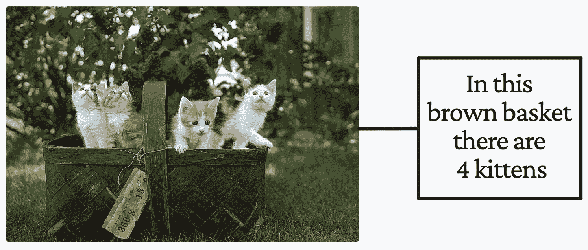
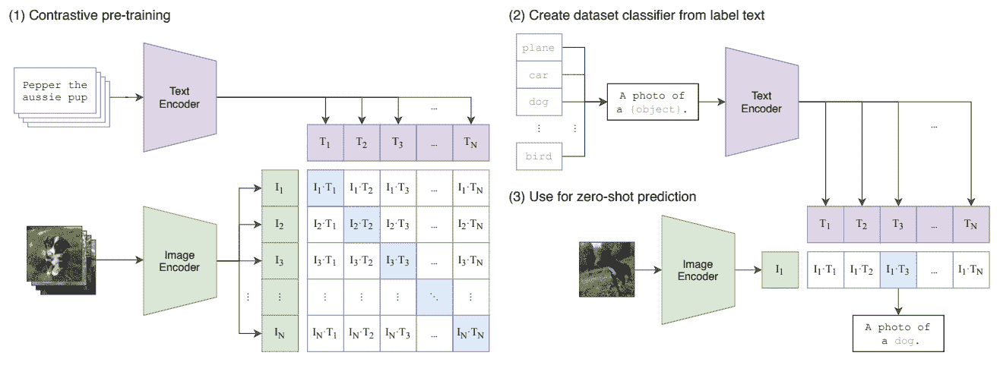

# 零样本学习解释

> 原文：[`www.kdnuggets.com/2022/12/zeroshot-learning-explained.html`](https://www.kdnuggets.com/2022/12/zeroshot-learning-explained.html)

[布鲁斯·沃灵顿](https://unsplash.com/@brucebmax) 通过 Unsplash

机器学习模型之所以变得更智能，是因为它们依赖于使用标记数据来帮助它们区分两个相似的物体。

* * *

## 我们的前三大课程推荐

 1\. [谷歌网络安全证书](https://www.kdnuggets.com/google-cybersecurity) - 快速进入网络安全职业生涯。

 2\. [谷歌数据分析专业证书](https://www.kdnuggets.com/google-data-analytics) - 提升你的数据分析技能

 3\. [谷歌 IT 支持专业证书](https://www.kdnuggets.com/google-itsupport) - 支持你所在组织的 IT 工作

* * *

然而，在没有这些标记数据集的情况下，你在创建最有效和可信赖的机器学习模型时会遇到重大障碍。模型训练阶段的标记数据集是重要的。

深度学习已被广泛用于解决计算机视觉等任务，采用监督学习。然而，就像生活中的许多事物一样，它也有其限制。监督分类需要大量高质量的标记训练数据，以产生一个强健的模型。这意味着分类模型无法处理未见过的类别。

我们都知道训练深度学习模型需要多少计算能力、再训练、时间和金钱。

但是，一个模型是否仍然能够在没有使用训练数据的情况下区分两个物体？是的，这就是所谓的零样本学习。零样本学习是指一个模型在没有收到或使用任何训练示例的情况下完成任务的能力。

人类天生具备零样本学习的能力，不需要付出太多努力。我们的脑海中已经储存了词典，并且能够通过观察物体的物理属性来区分物体，这是由于我们现有的知识基础。我们可以利用这一知识基础来查看物体之间的相似性和差异性，并找到它们之间的联系。

例如，假设我们正在尝试建立一个动物物种的分类模型。根据 [OurWorldInData](https://ourworldindata.org/biodiversity-and-wildlife)，2021 年计算出有 213 万种物种。因此，如果我们想为动物物种创建最有效的分类模型，我们需要 213 万种不同的类别。同时也需要大量数据。高质量和数量的数据很难获得。

那么零样本学习如何解决这个问题呢？

因为零样本学习不要求模型学习训练数据和分类类别，它使我们可以减少对模型需要标注数据的依赖。

# 零样本学习过程

以下是你的数据需要包含的内容，以便进行零样本学习。

### 已见类别

这包括那些以前用于训练模型的数据类别。

### 未见类别

这包括那些没有用来训练模型的数据类别，新零样本学习模型将进行泛化。

### 辅助信息

由于未见类别中的数据没有标签，零样本学习将需要辅助信息以便进行学习，发现关联、链接和属性。这可以是词嵌入、描述和语义信息的形式。

## 零样本学习方法

零样本学习通常用于：

+   基于分类器的方法

+   基于实例的方法

## 阶段

零样本学习用于为不使用标注数据进行训练的类别构建模型，因此它需要这两个阶段：

### 1\. 训练

训练阶段是学习方法尽可能多地捕捉数据特征的过程。我们可以将其视为学习阶段。

### 2\. 推断

在推断阶段，所有从训练阶段学到的知识都会被应用和利用，以便将样本分类到新的类别集合中。我们可以将其视为预测阶段。

## 其工作原理是什么？

从已见类别中获得的知识将被转移到未见类别中，这发生在一个高维向量空间中；这被称为语义空间。例如，在图像分类中，语义空间以及图像将经历两个步骤：

### 1\. 联合嵌入空间

这是语义向量和视觉特征向量被投射到的地方。

### 2\. 最高相似度

这是特征与未见类别的特征进行匹配的地方。

# 图像分类中的零样本学习阶段

为了帮助理解这两个阶段（训练和推断）的过程，我们将它们应用于图像分类。

## 训练

[Jari Hytönen](https://unsplash.com/@jarispics) 通过 Unsplash

作为人类，如果你阅读上图右侧的文本，你会立即认为有 4 只小猫在一个棕色的篮子里。但假设你对“小猫”没有任何概念。你会假设篮子里有 4 样东西，被称为“小猫”。一旦你看到更多包含类似“小猫”的图像，你就能够区分“小猫”和其他动物。

当你使用 [对比语言-图像预训练](https://openai.com/blog/clip/)（CLIP）进行图像分类的零样本学习时，就会发生这种情况。这被称为辅助信息。

你可能会想，“那只是标记数据”。我理解你为什么会这么想，但它们并不是。辅助信息不是数据的标签，而是一种监督方式，帮助模型在训练阶段进行学习。

当一个零样本学习模型看到足够数量的图像-文本配对时，它将能够区分和理解短语及其如何与图像中的某些模式相关联。通过使用 CLIP 技术的“对比学习”，零样本学习模型已经积累了良好的知识基础，从而能够在分类任务上进行预测。

这是 CLIP 方法的总结，其中训练了一个图像编码器和一个文本编码器，以预测一批（图像，文本）训练示例的正确配对。请参见下图：

[从自然语言监督中学习可转移的视觉模型](https://arxiv.org/pdf/2103.00020.pdf)

## 推断

一旦模型完成了训练阶段，它就具备了图像-文本配对的良好知识基础，并且现在可以用来进行预测。但在我们真正开始预测之前，我们需要通过创建一个可能的标签列表来设置分类任务。

例如，继续进行动物物种的图像分类任务，我们需要一个所有动物物种的列表。这些标签中的每一个都将被编码，从 T?到 T?，使用在训练阶段发生的预训练文本编码器。

一旦标签被编码，我们可以通过预训练的图像编码器输入图像。我们将使用距离度量余弦相似度来计算图像编码与每个文本标签编码之间的相似性。

图像的分类是基于与图像最相似的标签进行的。这就是零样本学习在图像分类中的实现方式。

# 零样本学习的重要性

## 数据稀缺性

如前所述，高数量和高质量的数据很难获得。与已经具备零样本学习能力的人类不同，机器需要输入标记数据以进行学习，然后才能适应可能自然发生的变化。

如果我们看动物物种的例子，会发现有很多种。随着不同领域类别数量的不断增长，跟上收集标注数据的工作将会非常繁重。

因此，零样本学习对我们变得越来越有价值。越来越多的研究人员对自动属性识别感兴趣，以弥补数据缺乏的问题。

## 数据标注

零样本学习的另一个好处是其数据标注特性。数据标注可能非常耗费劳力且十分枯燥，因此在过程中可能会导致错误。数据标注需要专家，比如在生物医学数据集上工作的医疗专业人士，这既昂贵又耗时。

# 总结

零样本学习因数据的上述限制而变得越来越流行。如果你对其能力感兴趣，我推荐你阅读以下几篇论文：

+   [从自然语言监督中学习可转移的视觉模型](https://arxiv.org/pdf/2103.00020.pdf)

+   [通过度量学习改进零样本分类的一致性](https://arxiv.org/pdf/1607.08085.pdf)

+   [学习用于零样本学习的深度嵌入模型](https://arxiv.org/pdf/1611.05088.pdf)

**[Nisha Arya](https://www.linkedin.com/in/nisha-arya-ahmed/)** 是一位数据科学家和自由技术撰稿人。她特别关注提供数据科学职业建议或教程，以及围绕数据科学的理论知识。她还希望探索人工智能在延长人类生命方面的不同方式。她是一个热衷于学习的人，寻求拓宽她的技术知识和写作技能，同时帮助指导他人。

### 更多相关主题

+   [机器学习关键术语解析](https://www.kdnuggets.com/2016/05/machine-learning-key-terms-explained.html)

+   [深度学习关键术语解析](https://www.kdnuggets.com/2016/10/deep-learning-key-terms-explained.html)

+   [KDnuggets 新闻，11 月 16 日：LinkedIn 如何使用机器学习 •…](https://www.kdnuggets.com/2022/n45.html)

+   [7 个最佳机器学习库解析](https://www.kdnuggets.com/2023/01/7-best-libraries-machine-learning-explained.html)

+   [5 种机器学习模型在 5 分钟内解析](https://www.kdnuggets.com/5-machine-learning-models-explained-in-5-minutes)

+   [每个机器学习算法在 1 分钟内解析](https://www.kdnuggets.com/2022/07/machine-learning-algorithms-explained-less-1-minute.html)
